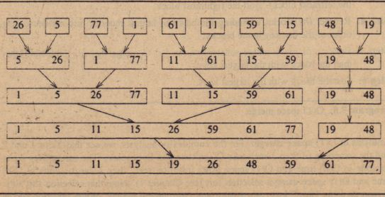

# Merge Sort (Iterative)

## Background

The iterative implementation of MergeSort takes a bottom-up approach, where the sorting process starts by merging
intervals of size 1. Intervals of size 1 are trivially in sorted order. The algorithm then proceeds to merge
adjacent sorted intervals, doubling the interval size with each merge step, until the entire array is fully sorted.

    
     
    <em>Source: <a href="https://www.chelponline.com/iterative-merge-sort-12243">CHelpOnline</a></em>

### Implementation Invariant

At each iteration of the merging process, the main array is divided into sub-arrays of a certain interval
size. Each of these sub-arrays is sorted within itself. The last sub-array may not be of full interval size,
but it is still sorted since its size is necessarily less than the interval.

## Complexity Analysis

| Metric | Complexity | Notes |
|--------|------------|-------|
| Time (all cases) | `O(n log n)` | `log n` levels, each level does `O(n)` work |
| Space | `O(n)` | Temporary array for merging (no recursion stack) |

<b>Detailed Analysis</b>

Given two sorted arrays of size p and q, merging takes `O(p + q)` time.

- At level 1: n sub-arrays of size 1 --> `O(n)` total merge work
- At level 2: n/2 sub-arrays of size 2 --> `O(n)` total merge work
- At level k: n/2^(k-1) sub-arrays of size 2^(k-1) --> `O(n)` total merge work

Since the interval doubles each iteration, there are `log n` levels. Each level takes `O(n)` time,
giving `O(n log n)` overall.

## Notes

1. **No recursion stack**: Unlike the recursive version, iterative merge sort uses `O(n)` space
   total (just the temp array), avoiding the `O(log n)` call stack overhead.

2. **Better cache locality**: Bottom-up merging accesses memory more sequentially, which can
   improve cache performance compared to the top-down recursive approach.

3. **Same stability**: Like recursive merge sort, the iterative version is stable when using
   `<=` in comparisons to prefer elements from the left sub-array.

4. **Identical time complexity**: Both recursive and iterative versions have the same `O(n log n)`
   time complexity - the difference is only in constant factors and space usage.

## Applications

| Use Case | Why Iterative Merge Sort? |
|----------|---------------------------|
| Memory-constrained systems | Avoids recursion stack overhead |
| Cache-sensitive applications | Better memory access patterns |
| Embedded systems | No risk of stack overflow |
| External sorting | Naturally fits bottom-up file merging |

**Interview tip:** Know the difference between top-down (recursive) and bottom-up (iterative) merge sort.
Both are `O(n log n)` time and `O(n)` space for the temp array, but iterative avoids recursion overhead
and has better cache locality. In practice, the performance difference is usually minimal.
