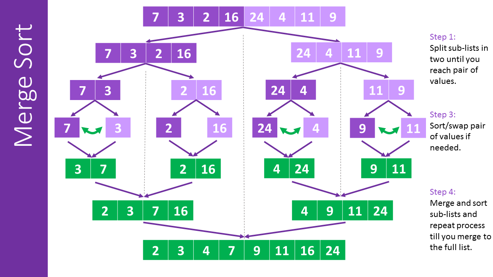

# Merge Sort (Recursive)

## Background

MergeSort is a divide-and-conquer sorting algorithm. The recursive implementation takes a top-down approach by
recursively dividing the array into two halves, sorting each half separately, and then merging the sorted halves
to produce the final sorted output.

    
     
    <em>Source: <a href="https://www.101computing.net/merge-sort-algorithm/">101 Computing</a></em>

### Implementation Invariant (for the merging subroutine)

The sub-array temp[start, (k-1)] consists of the (k−start) smallest elements of arr[start, mid] and
arr[mid + 1, end], in sorted order.

## Complexity Analysis

| Metric | Complexity | Notes |
|--------|------------|-------|
| Time (all cases) | `O(n log n)` | `T(n) = 2T(n/2) + O(n)` - always divides and merges |
| Space | `O(n)` | Temporary array for merging + `O(log n)` recursion stack |

Merging two sorted sub-arrays of size n/2 requires `O(n)` time. Regardless of input order, MergeSort
always performs the same divide-and-conquer strategy, so time complexity is `O(n log n)` for all cases.

## Notes

1. **Stability**: MergeSort is stable - when elements are equal, we prefer the one from the left
   sub-array (using `<=` in comparisons), preserving relative order.

2. **Not in-place**: Requires `O(n)` auxiliary space for the temporary array during merging.

3. **Predictable performance**: Unlike quicksort, merge sort guarantees `O(n log n)` regardless of input.
   No worst-case degradation to `O(n²)`.

4. **Cache performance**: The recursive version has worse cache locality than iterative due to
   non-sequential memory access patterns during recursion.

## Applications

| Use Case | Why Merge Sort? |
|----------|-----------------|
| External sorting (files) | Sequential access pattern suits disk I/O |
| Linked list sorting | No random access needed; `O(1)` space possible |
| Stable sort required | Guaranteed stability unlike quicksort |
| Worst-case guarantee needed | `O(n log n)` always, no `O(n²)` risk |
| Parallel sorting | Independent sub-problems merge well |

**Interview tip:** Merge sort is the standard answer when asked for a stable `O(n log n)` sort or when
worst-case performance matters. Know that it's preferred over quicksort for linked lists (no random access
needed) and external sorting (sequential access). The trade-off is `O(n)` extra space vs quicksort's `O(log n)`.
