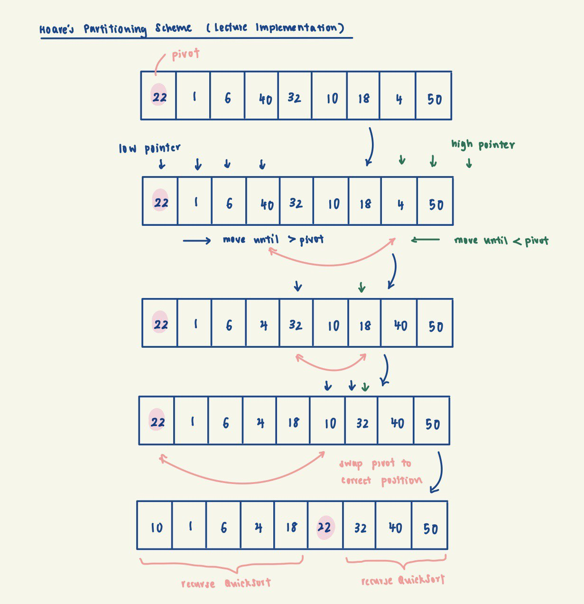
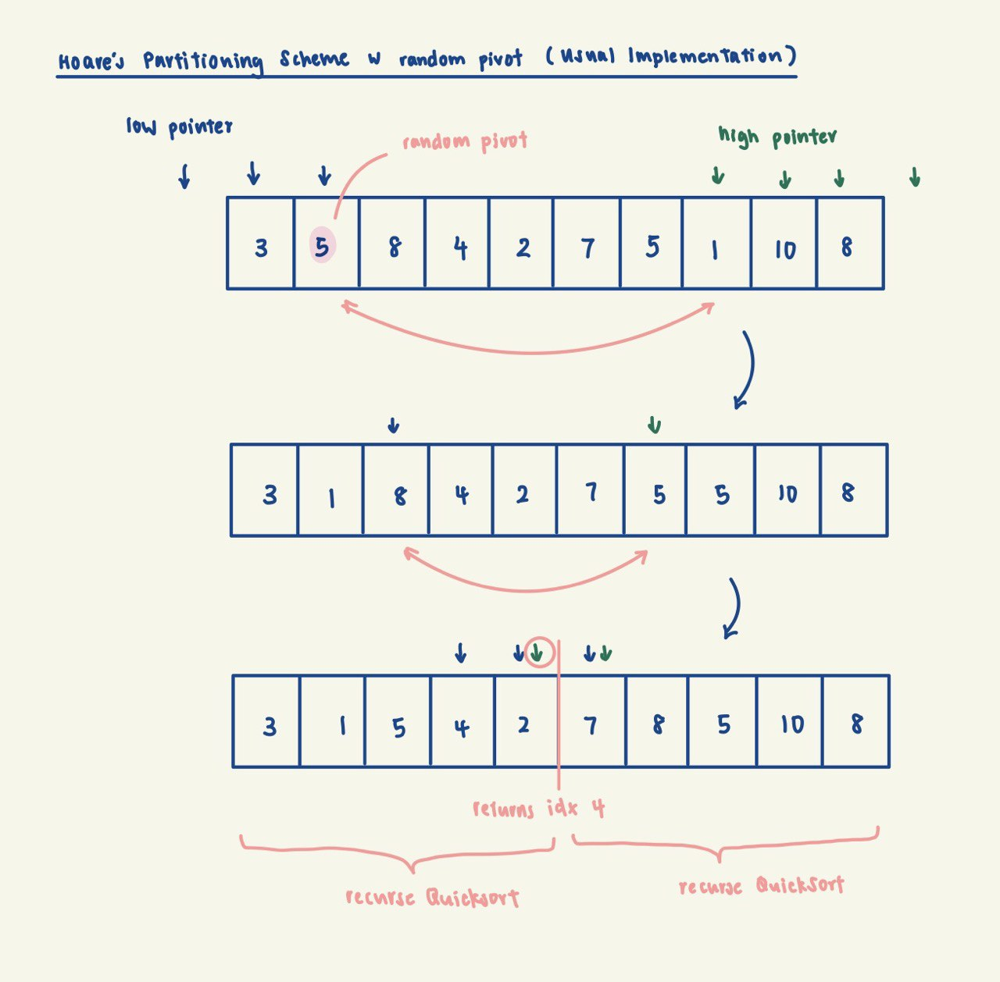

# Hoare's QuickSort

Our description, analysis and implementation of Hoare's Quicksort here will follow that of lecture implementation.
Note that the usual Hoare's QuickSort differs slightly from lecture implementation, see more under Notes.

This implementation handles duplicates by packing them to the left of the pivot (`<=`). However, many duplicates cause unbalanced partitions and `O(n²)` performance. For duplicate-heavy arrays, consider [Three-Way Partitioning QuickSort](../threeWayPartitioning) instead.

## Background

QuickSort is a sorting algorithm based on the divide-and-conquer strategy. It works by selecting a pivot element from
the array and rearranging the elements such that all elements less than the pivot are on its left, and
all elements greater than the pivot are on its right. This effectively partitions the array into two parts. The same
process is then applied recursively to the two partitions until the entire array is sorted.

## Implementation Invariant:

The pivot is in the correct position, with elements to its left being < it, and elements to its right being > it.

Example Credits: Prof Seth/Lecture Slides

## Complexity Analysis

| Metric | Complexity | Notes |
|--------|------------|-------|
| Time (Best/Average) | `O(n log n)` | `T(n) = 2T(n/2) + O(n)` with balanced pivot |
| Time (Worst) | `O(n²)` | Fixed pivot on sorted array, or many duplicates |
| Space | `O(log n)` | Call stack; partitioning is in-place |

*This analysis is based on fixed index pivot selection. Complexity is the same as Lomuto's.*

In the best case of a balanced pivot, the array is divided in half at each level, giving `log n` levels of
recursion. Each partition subroutine takes `O(m)` for a sub-array of length m.

Even fractional splits give `O(n log n)`: e.g., `T(n) = T(n/10) + T(9n/10) + O(n)`.

Using a fixed pivot (e.g., first element) leads to worst-case `O(n²)` when the array is already sorted or
has a specific pattern that causes highly unbalanced partitions.

## Notes

### Presence of Duplicates

Our implementation packs all elements equal to the pivot to the left (using `<=` in the partition condition).
For example, with array `{1, 1, 1, 1}`, the 1st pivot ends up at index 3, the 2nd at index 2, and so on.
This causes extremely unbalanced partitions, degrading to `O(n²)` time complexity with many duplicates.

### Usual Implementation of Hoare's QuickSort

The usual implementation of Hoare's partition scheme does not necessarily put the pivot in its correct position. It
merely partitions the array into <= pivot and >= pivot portions.

Brief Description:

Hoare's QuickSort operates by selecting a pivot element from the input array and rearranging the elements such
that all elements in A[start, returnIdx] are <= pivot and all elements in A[returnIdx + 1, end] are >= pivot,
where returnIdx is the index returned by the sub-routine partition.

After partitioning, the algorithm recursively applies the same process to the left and right sub-arrays, effectively
sorting the entire array.

The Hoare's partition scheme works by initializing two pointers that start at two ends. The two pointers move toward
each other until an inversion is found. This inversion happens when the left pointer is at an element >= pivot, and
the right pointer is at an element <= pivot. When an inversion is found, the two values are swapped and the pointers
continue moving towards each other.

Implementation Invariant:

All elements in A[start, returnIdx] are <= pivot and all elements in A[returnIdx + 1, end] are >= pivot.

### Hoare's vs Lomuto's QuickSort

Hoare's partition scheme is in contrast to Lomuto's partition scheme. Hoare's uses two pointers, while Lomuto's uses
one. Hoare's partition scheme is generally more efficient as it requires less swaps. See more at
https://www.geeksforgeeks.org/hoares-vs-lomuto-partition-scheme-quicksort/.

