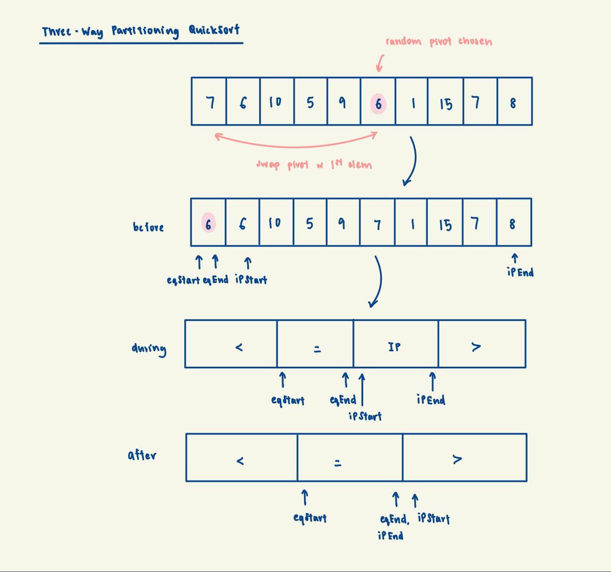

# Three-Way Partitioning

## Background
Three-way partitioning is an improved partitioning scheme, used in QuickSort, to tackle the scenario where there are 
many duplicate elements. This partitioning scheme will resolve the infinite loop error possibly faced by 
Paranoid Quicksort.

The idea behind three-way partitioning is to divide the array into three sections: elements less than the pivot,
elements equal to the pivot, and elements greater than the pivot. By doing so, we can avoid unnecessary comparisons
and swaps with duplicate elements, making the sorting process more efficient.

Note that during the partitioning process, there would be a 4th region - 'In Progress' region that will hold elements
that haven't yet been placed in the right section (see below).

    

## Implementation Invariant

The pivot and any element numerically equal to the pivot will be in their correct positions in the array.
Elements to their left are `<` them and elements to their right are `>` them.

## Complexity Analysis

| Metric | Complexity | Notes |
|--------|------------|-------|
| Time (all cases) | `O(n log n)` | Duplicates are excluded from recursion |
| Space | `O(log n)` | Call stack; partitioning is in-place |

Unlike standard partitioning, three-way partitioning excludes all elements equal to the pivot from further
recursion. This means:
- For arrays with many duplicates, recursion depth is reduced significantly
- An all-duplicates array is sorted in `O(n)` (single partition, no recursion needed)
- The good pivot check now ignores the `= pivot` segment, avoiding infinite loops

## Notes

1. **Dutch National Flag Problem**: Three-way partitioning is also known as the Dutch National Flag
   algorithm, named after Dijkstra's formulation of the problem.

2. **Four regions during partitioning**: The algorithm maintains four regions: `< pivot`, `= pivot`,
   `in-progress` (unprocessed), and `> pivot`. The in-progress region shrinks to zero upon completion.

3. **Best for duplicate-heavy data**: When many elements are equal, three-way partitioning significantly
   outperforms standard two-way partitioning.

4. **Combined with Paranoid**: Our implementation combines three-way partitioning with paranoid pivot
   selection for guaranteed `O(n log n)` performance without the infinite loop issue.

