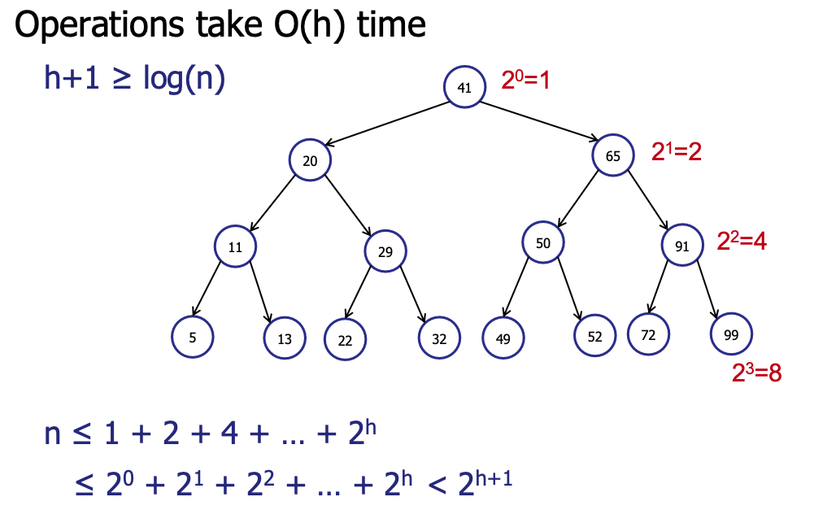
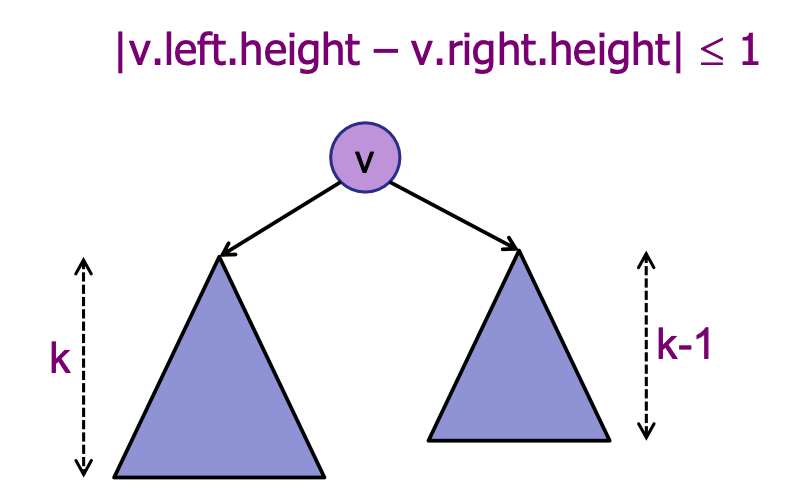
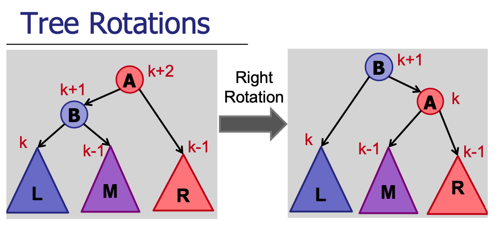

# AVL Trees

## Background
Say you want to search of a data in an array. If the array were sorted, lucky you! You can do it with binary search in `O(logn)` time. But if the array wasn't sorted, you can't avoid that `O(n)` linear search loop. Now, one idea is to first sort the array, and incur a 1-time cost of `O(n)` and subsequent search operations can enjoy that `O(logn)` query cost. This is all gucci, but it assumes that there will be no additional data streaming in. If incoming data is not infrequent, you'll have to incur `O(n)` insertion cost each time to maintain sorted order, and this can undermine 
performance as a whole. If only there were some structure that allows us to enjoy `O(logn)` operations across..

We have seen binary search trees (BSTs), which always maintains data in sorted order. This allows us to avoid the
overhead of sorting before we search. However, we also learnt that unbalanced BSTs can be incredibly inefficient for
insertion, deletion and search operations, which are O(height) in time complexity (in the case of degenerate trees, 
i.e. linked list, operations can go up to `O(n)`).

Here we discuss a type of self-balancing BST, known as the AVL tree, that avoids the worst case `O(n)` performance 
across the operations by ensuring careful updating of the tree's structure whenever there is a change 
(e.g. insert or delete).

<details>
<summary> <b>Terminology</b> </summary>
<li>
Level: Refers to the number of edges from the root to that particular node. Root is at level 0.
</li>
<li>
Depth: The depth of a node is the same as its level; i.e. how far a node is from the root of the tree.
</li>
<li>
Height: The number of edges on the longest path from that node to a leaf. A leaf node has height 0.
</li>
</details>

### Definition of Balanced Trees
Balanced trees are a special subset of trees with **height in the order of `log(n)`**, where `n` is the number of nodes.
<br> 
This choice is not an arbitrary one. It can be mathematically shown that a binary tree of `n` nodes has height of at least `log(n)` (in the case of a complete binary tree). So, it makes intuitive sense to give trees whose heights are roughly in the order of `log(n)` the desirable 'balanced' label.

<div align="center">
    
    <br/>
    <em>Source: CS2040S Lecture 9</em>
</div>

### Height-Balanced Property of AVL Trees
There are several ways to achieve a balanced tree. Red-black tree, B-Trees, Scapegoat and AVL trees ensure balance 
differently. Each of them relies on some underlying 'good' property to maintain balance - a careful segmenting of nodes 
in the case of RB-trees and enforcing a depth constraint for B-Trees. Go check them out in the other folders! <br>
What is important is that this **'good' property holds even after every change** (insert/update/delete).

The 'good' property in AVL Trees is the **height-balanced** property. Height-balanced on a node is defined as  
**difference in height between the left and right child node being not more than 1**. <br>
We say the tree is height-balanced if every node in the tree is height-balanced. Be careful not to conflate 
the concept of "balanced tree" and "height-balanced" property. They are not the same; the latter is used to achieve the former.

<details>
<summary> <b>Ponder..</b> </summary>
Can a tree exists where there exists 2 leaf nodes whose depths differ by more than 1? What about 2? 10?
<details>
<summary> <b>Answer</b> </summary>
Yes! In fact, you can always construct a large enough AVL tree where their difference in depth is > some arbitrary x!
</details>
</details>

It can be mathematically shown that a **height-balanced tree with n nodes, has at most height <= `2log(n)`** (
in fact, using the golden ratio, we can achieve a tighter bound of ~`1.44log(n)`).
Therefore, following the definition of a balanced tree, AVL trees are balanced.

<div align="center">
    
    <br/>
    <em>Source: CS2040S Lecture 9</em>
</div>

### Balance Factor
To detect imbalance, each node tracks a **balance factor**:

```
balance factor = height(left subtree) - height(right subtree)
```

A node is height-balanced if its balance factor is in `{-1, 0, 1}`. When `|balance factor| > 1`, rebalancing is required.

- **Positive** balance factor → left-heavy
- **Negative** balance factor → right-heavy

## Complexity Analysis
**Time:**
| Operation | Complexity |
|-----------|------------|
| Search | `O(log n)` |
| Insert | `O(log n)` |
| Delete | `O(log n)` |
| Predecessor/Successor | `O(log n)` |
| Single Rotation | `O(1)` |

**Space**: `O(n)` where `n` is the number of elements

## Operations
An AVL tree supports the standard **insert**, **delete**, and **search** operations.
**Update** can be simulated by deleting the old key and inserting the new one.

Insertions and deletions can violate the height-balanced property. To restore it, we use **rotations**.

<div align="center">
    
    <br/>
    <em>Source: CS2040S Lecture 10</em>
</div>

### The 4 Rotation Cases
After an insert or delete, we walk back up to the root, checking balance factors. When a node has `|balance factor| > 1`, one of four cases applies:

| Case | Condition | Fix |
|------|-----------|-----|
| **Left-Left (LL)** | Left-heavy, left child is left-heavy or balanced | Single right rotation |
| **Right-Right (RR)** | Right-heavy, right child is right-heavy or balanced | Single left rotation |
| **Left-Right (LR)** | Left-heavy, left child is right-heavy | Left rotate left child, then right rotate node |
| **Right-Left (RL)** | Right-heavy, right child is left-heavy | Right rotate right child, then left rotate node |

<details>
<summary><b>How to identify the case</b></summary>

1. Node has balance factor `> 1` (left-heavy):
   - If left child's balance factor `>= 0` → **LL case**
   - If left child's balance factor `< 0` → **LR case**

2. Node has balance factor `< -1` (right-heavy):
   - If right child's balance factor `<= 0` → **RR case**
   - If right child's balance factor `> 0` → **RL case**

</details>

**Interview tip:** Rotations are `O(1)` - just pointer updates. The `O(log n)` cost of insert/delete comes from traversing the height of the tree, not from rotations.

Prof Seth explains it best! For visual demonstrations, see [Prof Seth's lecture 10](https://www.youtube.com/watch?v=dS02_IuZPes&list=PLgpwqdiEMkHA0pU_uspC6N88RwMpt9rC8&index=9) on trees.

## Notes
1. **Height guarantee**: AVL trees have height at most `~1.44 log(n)`, tighter than Red-Black trees' `2 log(n)`. This makes AVL faster for lookup-heavy workloads.

2. **Rebalancing frequency**: AVL may rotate more often than RB-trees on insert/delete since it enforces stricter balance. This is the trade-off for faster lookups.

3. **Duplicate keys**: The implementation here does not support duplicate keys. To handle duplicates, you could store a count in each node or use a list as the value.

4. **Augmentation**: AVL trees are a great base for augmented structures. Store additional info (e.g., subtree size for order statistics) and update it during rotations.

## Applications
AVL trees offer excellent lookup times due to strict balancing, but the overhead of maintaining balance
can make them less preferred when insertions/deletions vastly outnumber lookups.

| Use Case | Best Choice | Why |
|----------|-------------|-----|
| Lookup-heavy workloads | AVL | Stricter balance → faster search |
| Insert/delete-heavy | Red-Black | Fewer rotations on average |
| Disk-based storage | B-tree | Optimized for block I/O |
| In-memory databases | AVL or RB | Both work well |

**Interview tip:** "When would you choose AVL over Red-Black?" → When reads dominate writes, AVL's tighter height bound (`1.44 log n` vs `2 log n`) gives faster lookups.

AVL trees are also commonly used as a base for augmented structures:
- **Order Statistics Tree** - find k-th smallest element in `O(log n)`
- **Interval Tree** - find all intervals overlapping a point
- **Orthogonal Range Tree** - 2D range queries
