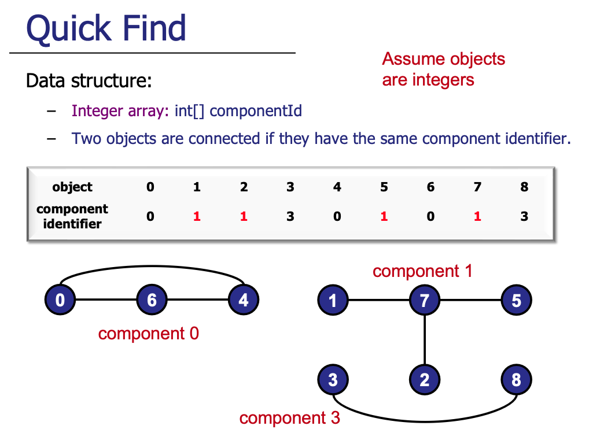

# Quick Find

## Background
Every object will be assigned a component identity. The implementation of Quick Find often involves
an underlying array or hash map that tracks the component identity of each object. 
Our implementation uses a hash map (to easily handle the case when objects aren't integers).

    
     
    Credits: CS2040s Lecture Slides

### Union
Between the two components, decide on the component d, to represent the combined set. Let the other
component's identity be d'. Simply iterate over the component identifier array / map, and for any element with
identity d', assign it to d.

### Find
Simply use the component identifier array to query for the component identity of the two elements
and check if they are equal. This is why this implementation is known as "Quick Find".

## Complexity Analysis

| Operation | Time | Notes |
|-----------|------|-------|
| Find | `O(1)` | Direct lookup in map |
| Union | `O(n)` | Must scan all elements to update identifiers |

**Space**: `O(n)` for the component identifier map

## Notes

1. **When to use**: Quick Find is suitable when finds vastly outnumber unions. If you have many union operations, consider Weighted Union instead.

2. **HashMap vs Array**: Our implementation uses `HashMap<T, Integer>` to support arbitrary object types. If elements are integers `0` to `n-1`, a simple array suffices and is faster.

3. **Union cost adds up**: Performing `n` union operations costs `O(n²)` total, which becomes prohibitive for large datasets. This is the main limitation of Quick Find.