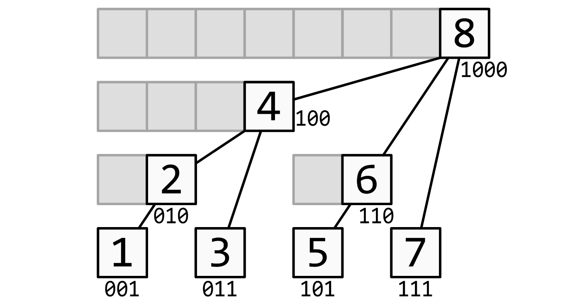

# Fenwick Tree (Binary Indexed Tree)

## Background

A **Fenwick Tree** (also called **Binary Indexed Tree** or **BIT**) is a data structure that efficiently supports **prefix sum queries** and **point updates** in `O(log n)` time. It was invented by Peter Fenwick in 1994.


<sub>Image credit: [OI Wiki](https://en.oi-wiki.org/ds/fenwick/)</sub>

The diagram shows a Fenwick Tree for an array of size 8. Each node represents a 1-indexed position in the BIT array. Notice:
- **Nodes at powers of 2** (1, 2, 4, 8) lie on the leftmost path
- **Invariant**: Each node stores the sum of array values at indices in its **left subtree (including itself)**

For example, node 6 has node 5 in its left subtree, so `tree[6] = arr[5] + arr[6]`. Node 4 has nodes 1, 2, 3 in its left subtree, so `tree[4] = arr[1] + arr[2] + arr[3] + arr[4]`.

### Intuition

The key insight is that any integer can be represented as a sum of powers of 2. Fenwick Tree exploits this by storing partial sums at strategic positions, where each position is responsible for a range determined by its lowest set bit.

For an array `[1, 2, 3, 4, 5, 6, 7, 8]` (1-indexed), the tree structure looks like:

```
Index (binary)    Range covered    Stores sum of
─────────────────────────────────────────────────
1    (0001)       [1, 1]           arr[1]
2    (0010)       [1, 2]           arr[1..2]
3    (0011)       [3, 3]           arr[3]
4    (0100)       [1, 4]           arr[1..4]
5    (0101)       [5, 5]           arr[5]
6    (0110)       [5, 6]           arr[5..6]
7    (0111)       [7, 7]           arr[7]
8    (1000)       [1, 8]           arr[1..8]
```

**Pattern**: Each index `i` stores the sum of `LSB(i)` elements ending at index `i`, where `LSB(i) = i & (-i)` is the **Lowest Set Bit** (the rightmost 1-bit in the binary representation).

### Why 1-indexed?

Fenwick Tree uses 1-based indexing because the bit manipulation relies on powers of 2:

- All powers of 2 (1, 2, 4, 8, ...) have exactly one bit set
- Index 0 in binary is `0000` - the formula `i & (-i)` returns 0, breaking the traversal
- With 1-indexing, every index has at least one set bit, ensuring proper navigation

### Visualizing as a Tree

It helps to visualize a **perfect binary tree** where each node is labeled by its 1-indexed position. The Fenwick Tree isn't stored as a tree, nor must it be perfect, but thinking of it this way clarifies the parent-child relationships:

```
                        8
                       /
                      4
                     / \
                    2   6
                   /|   |\
                  1 3   5 7
```

- **Nodes at powers of 2** (1, 2, 4, 8) lie on the leftmost path
- The "parent" of node `i` (for updates) is `i + LSB(i)`
- Each node covers a range of size equal to its `LSB(i)` (i.e., its left subtree + itself)

| Node | Binary | LSB | Range covered | Parent |
|------|--------|-----|---------------|--------|
| 1 | 0001 | 1 | `[1,1]` | 2 |
| 2 | 0010 | 2 | `[1,2]` | 4 |
| 3 | 0011 | 1 | `[3,3]` | 4 |
| 4 | 0100 | 4 | `[1,4]` | 8 |
| 5 | 0101 | 1 | `[5,5]` | 6 |
| 6 | 0110 | 2 | `[5,6]` | 8 |
| 7 | 0111 | 1 | `[7,7]` | 8 |
| 8 | 1000 | 8 | `[1,8]` | 16 |

## Complexity Analysis

| Operation | Time | Notes |
|-----------|------|-------|
| Build | `O(n)` | Each element propagates to parent once |
| Prefix Query | `O(log n)` | At most `log n` bits to clear |
| Point Update | `O(log n)` | At most `log n` ancestors |
| Range Query | `O(log n)` | Two prefix queries |

**Space**: `O(n)` - just one array of size `n + 1`

## Operations

### Construction (O(n) Build)

The naive approach calls `update()` for each element, giving `O(n log n)`. A smarter approach:

1. Copy elements to the tree array (adjusting for 1-indexing)
2. For each index `i`, add its value to its parent at `i + LSB(i)`

```java
for (int i = 1; i <= n; i++) {
    tree[i] = nums[i - 1];
}
for (int i = 1; i <= n; i++) {
    int parent = i + (i & -i);
    if (parent <= n) {
        tree[parent] += tree[i];
    }
}
```

Each element contributes to exactly one parent, so this is `O(n)`.

### Prefix Query

To compute the sum of elements `[0, idx]`:

1. Start at `idx + 1` (convert to 1-indexed)
2. Add `tree[idx]` to the sum
3. Move to the next range by clearing the lowest set bit: `idx -= (idx & -idx)`
4. Repeat until `idx == 0`

```
Query prefix sum [0, 6] (1-indexed: [1, 7]):

idx = 7 (0111) → add tree[7], then 7 - 1 = 6
idx = 6 (0110) → add tree[6], then 6 - 2 = 4
idx = 4 (0100) → add tree[4], then 4 - 4 = 0
idx = 0 → done

Sum = tree[7] + tree[6] + tree[4]
    = arr[7] + arr[5..6] + arr[1..4]
    = arr[1..7]
```

<details>
<summary><b>Why does subtracting LSB work?</b></summary>

Each index `i` stores the sum of a range ending at `i` with length `LSB(i)`. When we subtract `LSB(i)`, we jump to the end of the previous non-overlapping segment.

**Key insight**: Index `i` covers the range `(i - LSB(i), i]`. In binary, this is clear:

```
Index 12 = 01100
LSB(12)  = 00100 (= 4)

tree[12] covers (01000, 01100] = indices 9 to 12
                  ↑      ↑
            01100 - 00100  01100
```

The range starts right after we "turn off" the lowest set bit. So `01100` covers everything from `01001` to `01100`.

**Why prefix query works**: When we query prefix sum up to index 11 (01011):

```
idx = 11 (01011): covers (01010, 01011] = [11,11]  → arr[11]
idx = 10 (01010): covers (01000, 01010] = [9,10]   → arr[9..10]
idx =  8 (01000): covers (00000, 01000] = [1,8]    → arr[1..8]
idx =  0 → done

Sum = arr[11] + arr[9..10] + arr[1..8] = arr[1..11] ✓
```

Each subtraction of LSB lands exactly where the previous range ended, giving non-overlapping segments that perfectly partition `[1, idx]`.

</details>

### Point Update

To add `delta` to index `idx`:

1. Start at `idx + 1` (convert to 1-indexed)
2. Add `delta` to `tree[idx]`
3. Move to parent: `idx += (idx & -idx)`
4. Repeat while `idx <= n`

```
Update index 3 (1-indexed: 4):

idx = 4 (0100) → update tree[4], then 4 + 4 = 8
idx = 8 (1000) → update tree[8], then 8 + 8 = 16
idx = 16 > n → done
```

### Range Query

Range sum `[left, right]` is computed using two prefix queries:

```java
rangeQuery(left, right) = prefixQuery(right) - prefixQuery(left - 1)
```

<details>
<summary><b>Note</b></summary>
When `left == 0`, `prefixQuery(-1)` returns 0, which is correct.
</details>

## Fenwick Tree vs Segment Tree

| Feature | Fenwick Tree | Segment Tree |
|---------|--------------|--------------|
| Operations | Prefix sums, point updates | Any associative operation |
| Range queries | Via prefix sum difference | Direct range queries |
| Range updates | Limited (requires 2 BITs) | Supported (lazy propagation) |
| Space | `n + 1` | `4n` |
| Code complexity | ~10 lines | ~50 lines |
| Constant factor | Lower | Higher |

**When to use Fenwick Tree**:
- You only need prefix sums or range sums (not min/max/GCD)
- You want simpler, shorter code
- Memory or constant factors matter

**When to use Segment Tree**:
- You need range min/max, GCD, or other non-invertible operations
- You need range updates (update all elements in `[L, R]`)
- You need to query arbitrary ranges without relying on subtraction

### Why Fenwick Tree Fails for Range Minimum

Fenwick Tree relies on the fact that `rangeSum(L, R) = prefixSum(R) - prefixSum(L-1)`. This works because addition has an **inverse** (subtraction).

For range minimum, there's no inverse operation:
```
prefixMin(5) = 2    (minimum of arr[1..5])
prefixMin(2) = 3    (minimum of arr[1..2])
rangeMin(3, 5) = ?  (minimum of arr[3..5])

We can't compute rangeMin(3, 5) from prefixMin(5) and prefixMin(2)!
The minimum of [1..5] might be in [1..2], and subtracting doesn't help.
```

**Rule of thumb**: Fenwick Tree works for operations with inverses (sum, XOR). For min/max/GCD, use Segment Tree.

**Interview tip**: If you see "prefix sum + point update" or "count inversions", think Fenwick Tree. It's faster to code and less error-prone than segment tree for these specific cases.

## Applications

| Problem Type | How Fenwick Tree Helps |
|--------------|------------------------|
| Range sum queries | Direct application of prefix queries |
| Count inversions | Track count of elements seen, query how many are greater |
| Count smaller elements after self | Similar to inversions, process right-to-left |
| 2D range sum queries | Use 2D Fenwick Tree (nested BITs) |
| Dynamic frequency counting | Track counts, query cumulative frequency |

### Common LeetCode Problems

| Problem | Pattern |
|---------|---------|
| [307. Range Sum Query - Mutable](https://leetcode.com/problems/range-sum-query-mutable/) | Classic Fenwick Tree application |
| [315. Count of Smaller Numbers After Self](https://leetcode.com/problems/count-of-smaller-numbers-after-self/) | Coordinate compression + BIT |
| [493. Reverse Pairs](https://leetcode.com/problems/reverse-pairs/) | Modified merge sort or BIT |
| [327. Count of Range Sum](https://leetcode.com/problems/count-of-range-sum/) | Prefix sums + BIT with compression |

**Interview tip**: Fenwick Tree problems often involve coordinate compression when values are large but the count of distinct values is small. Compress values to `[1, n]` range first.

## Notes

1. **2D Fenwick Tree**: Extend to 2D for matrix prefix sums. Each operation becomes `O(log n x log m)`.

2. **Range Update + Point Query**: Use a difference array with BIT. Store differences, query gives actual value.

3. **Range Update + Range Query**: Requires two Fenwick Trees. The idea is to represent range updates as two point updates on a difference array, but to support range queries we need to track additional information.

   <details>
   <summary><b>How it works</b></summary>

   To add `v` to all elements in `[L, R]`, we want `prefixSum(i)` to increase by:
   - `0` if `i < L`
   - `v * (i - L + 1)` if `L <= i <= R`
   - `v * (R - L + 1)` if `i > R`

   We maintain two BITs, `B1` and `B2`, and compute:
   ```
   prefixSum(i) = B1.query(i) * i - B2.query(i)
   ```

   For a range update `add(L, R, v)`:
   ```
   B1.update(L, v)
   B1.update(R + 1, -v)
   B2.update(L, v * (L - 1))
   B2.update(R + 1, -v * R)
   ```

   This gives `O(log n)` for both range updates and range queries.

   </details></br>

4. **Finding k-th smallest**: With BIT storing frequencies, use binary search on prefix sums to find the k-th element in `O(log² n)` or `O(log n)` with careful implementation.
