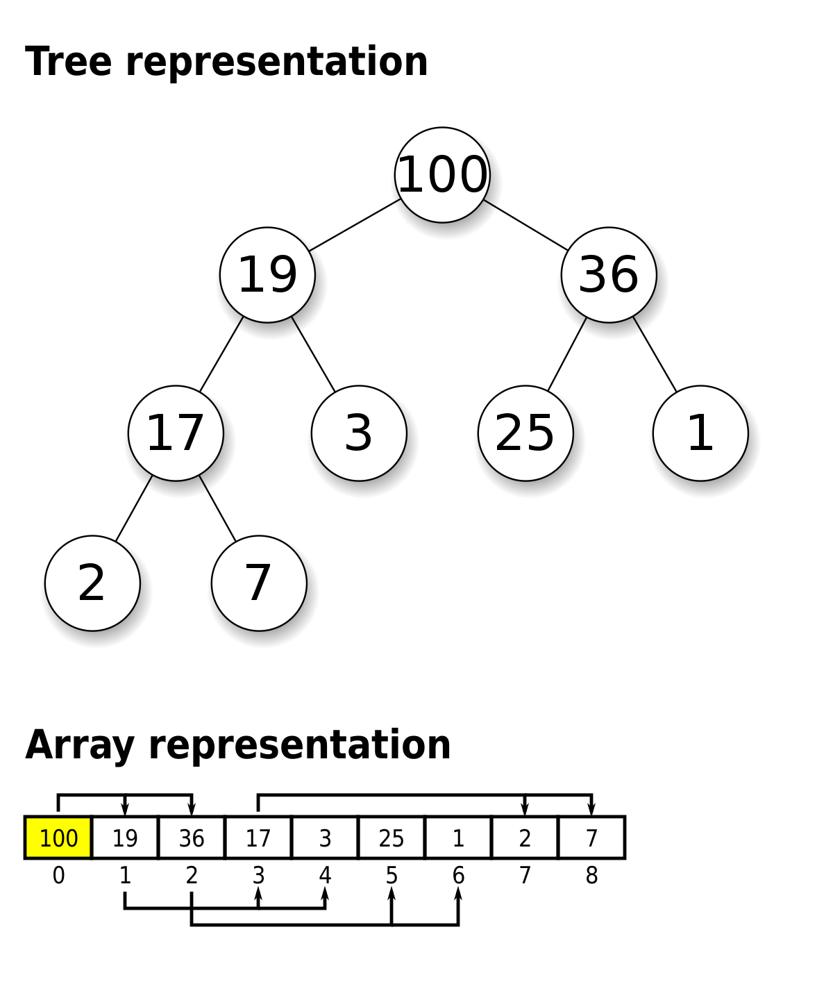

# Heap

## Background

### Binary Heap

A binary heap is often used to introduce the concept of heaps. It is a tree-based data structure that satisfies the
following properties:

1. Complete binary tree - every level, except possibly the last, is completely filled
2. Max (min) heap property - the value of every vertex in the binary tree is >= (<=) than that of its child nodes

This makes it a powerful data structure that provides efficient access to the highest (or lowest) priority element,
making it suitable as an underlying implementation of the ADT, priority queue.

### Array-based Heap

The complete binary tree property actually allows the heap to be implemented as a contiguous array (since no gaps!).
The parent-child relationships are derived based on the indices of the elements.

Theoretically, there isn't any fundamental difference in order of growth for either implementation.
Both implementation provide the same asymptotic time complexity, and supports most operations in O(log(n)).

That said, in practice, the array-based implementation of a heap often provides better performance as opposed to the
former, in cache efficiency and memory locality. This is due to its contiguous memory layout. As such,
the implementation shown here is a 0-indexed array-based heap.

 <b>Index Calculation for Child Nodes</b> 

Suppose the parent node is captured at index `i` of the array (1-indexed).
**1-indexed**:  
Left Child: `i x 2`  
Right Child:  `i x 2 + 1`  

The 1-indexed calculation is intuitive. So, when dealing with 0-indexed representation (as in our implementation),
one option is to convert 0-indexed to 1-indexed representation, do the above calculations, and revert.  
(Note: Now, we assume parent node is captured at index `i` (0-indexed))

**0-indexed**:  
Left Child: `(i + 1) x 2 - 1`  = `i x 2 + 1`  
Right Child: `(i + 1) x 2 + 1 - 1` = `i x 2 + 2`  

### Relevance of increaseKey and decreaseKey operations

The decision not to include explicit "decrease key" and "increase key" operations in the standard implementations of
heaps in Python and Java is primarily due to design choices and considerations of the typical intended use cases.
Further, this operation, without augmentation, would take O(n) due to having to search for the object to begin with
(see under Notes).

One can circumvent the lack of such operations by simply removing and re-inserting (albeit, still O(n) due to removing 
of arbitrary node).

**This is worth a mention:**  
In cases like Dijkstra algorithm, there is no need to strictly maintain V nodes in the priority queue for O(nlogn).
One can just insert all edges rather than constantly updating (hence, no need for updateKey operations).  
After all, the log factor in the order of growth will turn log(E) = log(V^2) in the worst case of a complete graph,
to 2log(V) = O(log(V)).

### Heapify - Choice between bubbleUp and bubbleDown
Heapify converts an unordered array into a heap. Two approaches exist:

1. **Naive approach**: Insert elements one by one using `offer()` → `O(n log n)`
2. **Efficient approach**: BubbleDown from back to front → `O(n)`

The efficient approach is implemented with bubbleDown from the back fo the array. You could also implement with bubbleUp from the front of the array. No issue with the resulting heap structure. The issue lies with efficiency. Here's why:

<b>Why bubbleDown gives O(n) but bubbleUp gives O(n log n)</b>

The key insight is the **distribution of nodes by level** in a complete binary tree:
- ~`n/2` nodes are at the bottom level (leaves)
- ~`n/4` nodes are one level up
- ~`n/8` nodes are two levels up
- ... and so on
- 1 node at the root

**BubbleUp from front** (like repeated insertions):
- Level 0: 1 node, travels 0 levels
- Level 1: 2 nodes, each travels up to 1 level
- Level 2: 4 nodes, each travels up to 2 levels
- ...
- Level `log(n)`: **`n/2` nodes, each travels up to `log(n)` levels**

The bottom half alone contributes `(n/2) * log(n)` = **O(n log n)**

**BubbleDown from back**:
- Level `log(n)` (leaves): **`n/2` nodes, travel 0 levels** (already valid)
- Level `log(n)-1`: `n/4` nodes, each travels at most 1 level
- ...
- Level 0 (root): 1 node, travels at most `log(n)` levels

Total: `Σ (n/2^(k+1)) * k` for k from 0 to log(n) → converges to **O(n)**

The difference: bubbleDown makes the **many** leaf nodes do **zero** work, while bubbleUp makes them do the **most** work.

**Interview tip:** "Why is heapify O(n)?" → Most nodes are near the bottom and do little or no work with bubbleDown. The sum converges to O(n), not O(n log n).

## Complexity Analysis

**Time:**
| Operation | Complexity | Notes |
|-----------|------------|-------|
| `peek()` | `O(1)` | Access root |
| `offer()` | `O(log n)` | Insert + bubbleUp |
| `poll()` | `O(log n)` | Remove root + bubbleDown |
| `remove(obj)` | `O(log n)` | With Map augmentation (otherwise `O(n)`) |
| `updateKey()` | `O(log n)` | With Map augmentation |
| `heapify()` (bubbleDown) | `O(n)` | Efficient approach |
| `heapify()` (bubbleUp) | `O(n log n)` | Naive approach |

**Space**: `O(n)` where n is the number of elements (whatever the structure, it must store at least `n` nodes)

## Notes

1. **Max vs Min heap**: This implementation is a max-heap. To convert to min-heap, simply negate the key values or reverse the comparator.

2. **Map augmentation**: The implementation uses a `Map<T, Integer>` to track element positions, enabling `O(log n)` removal and key updates. Standard library heaps (Java's `PriorityQueue`, Python's `heapq`) lack this - their `remove()` is `O(n)` due to linear search.
   - **Trade-off**: Duplicate elements are not supported since the Map requires unique keys.

3. **updateKey in practice**: The implementation provides `increaseKey()` and `decreaseKey()` separately for educational purposes (they bubble in opposite directions). In practice, a unified `updateKey()` that determines the direction automatically is often sufficient.

4. **ArrayList vs array**: We use `ArrayList` for dynamic resizing. A fixed-size array would require manual resizing logic.

5. **Further reading**: [Why is building a heap O(n)?](https://stackoverflow.com/questions/9755721/how-can-building-a-heap-be-on-time-complexity) - good explanation of the heapify complexity analysis.

## Applications

Heaps are the underlying data structure for **priority queues**, enabling efficient access to the highest (or lowest) priority element.

| Use Case | Why Heap? |
|----------|-----------|
| Dijkstra's shortest path | Extract min-distance vertex in `O(log V)` |
| Huffman encoding | Build optimal prefix codes by repeatedly merging smallest frequencies |
| K largest/smallest elements | Maintain a heap of size k while streaming |
| Median maintenance | Use two heaps (max-heap for lower half, min-heap for upper half) |
| Task scheduling | Priority-based job scheduling |

**Interview tip:** For "find k largest elements in a stream", use a **min-heap** of size k. When a new element arrives, if it's larger than the heap's min, replace the min. The heap always contains the k largest seen so far.
