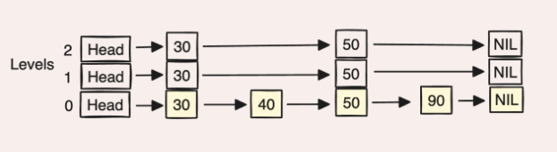

# Linked List

## Background

A **linked list** is a linear data structure where elements (nodes) are connected via pointers rather than stored contiguously in memory.

    
     
    <em>Source: GeeksForGeeks</em>

Each node contains:
- **Data**: The value stored
- **Next pointer**: Reference to the next node (and optionally **prev** for doubly-linked)

### Linked List vs Array

| Aspect | Array | Linked List |
|--------|-------|-------------|
| Memory layout | Contiguous | Scattered (pointer-connected) |
| Size | Fixed at creation | Dynamic |
| Random access | `O(1)` | `O(n)` |
| Insert/delete at ends | `O(n)` or `O(1)` amortized | `O(1)` with tail pointer |
| Insert/delete middle | `O(n)` | `O(1)` if node reference known |
| Memory overhead | None | Pointer(s) per node |
| Cache performance | Excellent | Poor (pointer chasing) |

    
     
    <em>Source: BeginnersBook</em>

## Complexity Analysis

| Operation | Time | Notes |
|-----------|------|-------|
| `insertFront()` | `O(1)` | Update head |
| `insertEnd()` | `O(n)` | Must traverse (or `O(1)` with tail pointer) |
| `insert(idx)` | `O(n)` | Traverse to position |
| `remove(idx)` | `O(n)` | Traverse to position |
| `get(idx)` | `O(n)` | Traverse to position |
| `search(val)` | `O(n)` | Linear search |
| `reverse()` | `O(n)` | Single pass |
| `sort()` | `O(n log n)` | Merge sort |

**Space**: `O(n)` for n elements, plus pointer overhead

**Interview tip:** Know why merge sort is preferred for linked lists - random access is `O(n)`, so quicksort's partition and heapsort's heapify become `O(n²)`.

## Notes

1. **Our implementation**: Singly-linked with head pointer only. Adding a tail pointer would make `insertEnd()` `O(1)`.

2. **Sorting linked lists**: Merge sort is ideal because it:
   - Only needs sequential access (no random access)
   - Merging is `O(1)` extra space (just pointer manipulation)
   - Maintains `O(n log n)` time

3. **Reversing in-place**: Classic interview question. Iterate once, reversing pointers as you go.

4. **Used in hash tables**: Linked lists are the classic data structure for [hash table chaining](../hashSet/chaining/) - each bucket stores a linked list of elements that hash to that index.

## Variants

### Doubly Linked List

    
     
    <em>Source: GeeksForGeeks</em>

Each node has **prev** and **next** pointers, enabling:
- `O(1)` delete when given node reference (no need to find predecessor)
- Bidirectional traversal
- Clean implementation of [LRU Cache](../lruCache/) and [Deque](../queue/Deque/)

**Trade-off**: Extra pointer per node.

### Skip List

    

A **skip list** is a sorted linked list augmented with several layers of "express lanes" stacked above the base list. The bottom layer (level 0) contains every element. Each higher layer contains a sparse subset of the layer below it, so a level-`k` node can "skip" over many level-`k-1` nodes in a single hop.

**The intuition**: walking a sorted linked list to find a value is `O(n)` because every step advances by one. If we add a second list that contains every other node, each hop on that list covers two base nodes — search becomes `O(n/2)`. Add another layer that keeps every fourth node and we get `O(n/4)`, and so on. With `log n` such layers, search collapses to `O(log n)`. A skip list is the same idea, but the layering is decided **probabilistically** instead of by a fixed stride, which removes the need to rebalance on every insert.

**Level assignment (the "skip" part)**: when a new node is inserted, we flip a fair coin until it comes up tails. The number of heads is the node's level. So roughly:
- 1/2 of nodes live only on level 0
- 1/4 reach level 1
- 1/8 reach level 2
- ...

The expected number of levels for `n` nodes is `O(log n)`, and the expected number of nodes at each level halves as you go up — exactly the geometric thinning the express-lane intuition needs.

**Search**: start at the top-left. At each node, look right; if the next node's key is `<= target`, hop right, otherwise drop down a level. Repeat until you bottom out at level 0. Each step either moves right past `O(1)` expected nodes or drops a level, so search is `O(log n)` expected.

**Insert/delete**: search for the position (recording the "drop-down" point at every level along the way), flip coins to pick the new node's level, then splice it into every level up to that height. Both are `O(log n)` expected.

Skip lists are popular as a simpler alternative to balanced BSTs (AVL, Red-Black) — no rotations, no rebalancing logic, easy to make concurrent — at the cost of probabilistic (rather than worst-case) guarantees. Used in Redis sorted sets and LevelDB's memtable.

### Unrolled Linked List

    
     
    <em>Source: Brilliant</em>

Each node stores a small **array of elements** (a "chunk") instead of a single element. A chunk is typically sized to fit in a cache line, so iterating through the elements of one node is essentially a contiguous-array walk before jumping to the next pointer.

**Why it helps**: a regular linked list pays a cache miss on almost every step because consecutive elements live in arbitrary memory locations. By packing many elements per node, an unrolled list amortizes that cache miss across an entire chunk, recovering most of the array's locality benefit while still allowing `O(1)` splice-style insertion at known positions.

**Trade-offs**: insertion and deletion need to handle chunks that overflow (split into two) or underflow (merge with a neighbor or rebalance), so the bookkeeping is more involved than a vanilla linked list. In return you get materially faster traversal on modern hardware and lower per-element pointer overhead.

**Where you see it**: used in rope data structures (gap buffers in text editors), some implementations of `std::deque`, and various STL-like sequence containers where iteration speed matters.

## Applications

| Use Case | Why Linked List? |
|----------|------------------|
| Hash table chaining | Dynamic bucket sizes, `O(1)` insert at front |
| LRU Cache | `O(1)` move-to-front with doubly-linked |
| Undo/Redo stacks | Dynamic size, only access ends |
| Memory allocators | Free lists track available blocks |
| Polynomial arithmetic | Sparse representation, easy term insertion |

**Interview tip:** When choosing between array and linked list, consider: Do you need random access? Is size fixed? Are insertions/deletions frequent and at known positions? Arrays win on cache performance; linked lists win on dynamic insert/delete.
