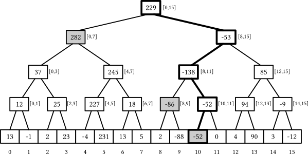

# Segment Tree

## Background

A **Segment Tree** is a binary tree used for answering **range queries** on an array while supporting **point updates**. Queries can compute sum, minimum, maximum, GCD, or any associative operation over a contiguous subarray.



### Structure

For an array of size n:
- **Leaf nodes**: Each represents a single array element (n leaves)
- **Internal nodes**: Each stores the aggregate (e.g., sum) of its children's range
- **Root**: Represents the entire array `[0, n-1]`
- **Height**: `O(log n)`

```
Array: [2, 5, 1, 4, 9, 3]

                [24]              ← sum of [0,5]
              /      \
          [8]          [16]       ← sum of [0,2], [3,5]
         /   \        /    \
       [7]   [1]    [13]   [3]    ← sum of [0,1], [2,2], [3,4], [5,5]
       / \          /  \
     [2] [5]      [4]  [9]        ← individual elements
```

### Segment Tree vs Fenwick Tree (BIT)

Segment Tree is more general than [Fenwick Tree](https://en.wikipedia.org/wiki/Fenwick_tree) (Binary Indexed Tree). Both support `O(log n)` point updates, but:

| Feature | Segment Tree | Fenwick Tree |
|---------|--------------|--------------|
| Range queries | Any associative operation (sum, min, max, GCD) | Primarily prefix sums |
| Point updates | `O(log n)` | `O(log n)` |
| Range updates | Supported (with lazy propagation) | Limited |
| Space | `O(n)` | `O(n)` |
| Implementation | More complex | Simpler |

**When to use which**: If you only need prefix sums or point updates on cumulative data, Fenwick Tree is simpler and has lower constant factors. For range min/max, GCD, or range updates, use Segment Tree.

## Complexity Analysis

| Operation | Time | Notes |
|-----------|------|-------|
| Build | `O(n)` | Visit each node once |
| Query | `O(log n)` | At most 2 nodes per level |
| Update | `O(log n)` | Path from leaf to root |

**Space**: `O(n)` - but array implementation uses `4n` slots (explained below)

## Operations

### Construction

Build recursively using divide-and-conquer:
1. **Base case**: Single element → create leaf node with that element's value
2. **Recursive case**: Split range in half, build left and right children subtrees, then set current node's (aka parent) value as `left.sum + right.sum`

### Query (Range Sum)

To query sum of `[L, R]`, starting from root:
1. If node's range is **completely inside** `[L, R]` → return this node's sum directly
2. If node's range is **completely outside** `[L, R]` → return 0 (doesn't contribute)
3. If **partial overlap** → recurse on both children and sum their results

### Update (Point Update)

To update index `i` to value `v`:
1. Traverse down to the leaf representing index `i`
2. Update the leaf's value to `v`
3. Backtrack up, updating each ancestor: `parent.sum = left.sum + right.sum`

## Array-based Implementation

Instead of explicit nodes with pointers, store the tree in an array using heap-like indexing.

### Why 4n Space?

The key insight is that we need `n` leaf nodes (one per array element), but to capture tree structure in array representation may require more space.

**Step 1: Leaf nodes need a power of 2**

With array-based indexing, we don't know exactly where the n leaves will land, we must allocate enough space for the **worst case**: the last level being completely full.

A full last level requires the number of leaves to be a power of 2. To use simple indexing, we conceptually round n up to the next power of 2:

```
n = 6 elements → need 8 leaf slots (next power of 2)
n = 5 elements → need 8 leaf slots
n = 8 elements → need 8 leaf slots (already power of 2)
```

**Step 2: Upper bound on leaf slots**

The next power of 2 after n is at most `2n`:
```
2^ceil(log₂(n)) ≤ 2n
```

**Step 3: Why multiply by 2 again for internal nodes?**

For a complete binary tree, the number of internal nodes equals the number of leaves minus 1. This follows from the geometric series:

```
Level 0 (root):     1 node
Level 1:            2 nodes
Level 2:            4 nodes
...
Level h-1:          2^(h-1) nodes  (last internal level)
Level h:            2^h leaves

Internal nodes = 1 + 2 + 4 + ... + 2^(h-1) = 2^h - 1

Since 2^h = number of leaves:
Internal nodes = leaves - 1
```

So total nodes = `leaves + (leaves - 1)` = `2 × leaves - 1`.

**Step 4: Total bound**

With at most `2n` leaves:
```
Total nodes ≤ 2(2n) - 1 = 4n - 1 < 4n
```

So `4n` is a safe upper bound.

### Gaps in the Array

Unlike a [heap](../heap/) which is a **complete binary tree** (all levels filled left-to-right), a segment tree may have **gaps** in its array representation when n is not a power of 2. Some array indices will be unused. The tree for `Array: [2, 5, 1, 4, 9, 3]` shown above is an example.

This is why we can't assume compact heap-like storage.

<details>
<summary><b>Index Calculation for Child Nodes</b></summary>

For 0-indexed array (our implementation):
- **Left child**: `2*i + 1`
- **Right child**: `2*i + 2`
- **Parent**: `(i - 1) / 2`

Derivation from 1-indexed (more intuitive):
- 1-indexed: left = `2i`, right = `2i + 1`
- Convert: 0-indexed `i` → 1-indexed `i + 1`
- Left: `2(i+1) - 1 = 2i + 1`
- Right: `2(i+1) = 2i + 2`

</details>

## Notes

1. **Lazy Propagation**: For range updates (update all elements in `[L, R]`), use lazy propagation to achieve `O(log n)` per update instead of `O(n)`.

2. **Persistent Segment Tree**: Create new nodes on update instead of modifying in-place. Enables queries on any historical version of the array.

3. **2D Segment Tree**: Nest segment trees for 2D range queries on matrices.

## Applications

| Use Case | Query Type |
|----------|------------|
| Range sum queries | Sum of elements in `[L, R]` |
| Range min/max queries | Minimum/maximum in `[L, R]` |
| Count of elements in range | With coordinate compression |
| Rectangle area union | 2D segment tree |
| Interval scheduling | Find overlapping intervals |

**Interview tip:** When you see "range query + point update" with `O(log n)` requirement, think segment tree. For simpler prefix-sum queries, consider Fenwick Tree first. For range updates (updating a range of values at once), add lazy propagation to your segment tree.

