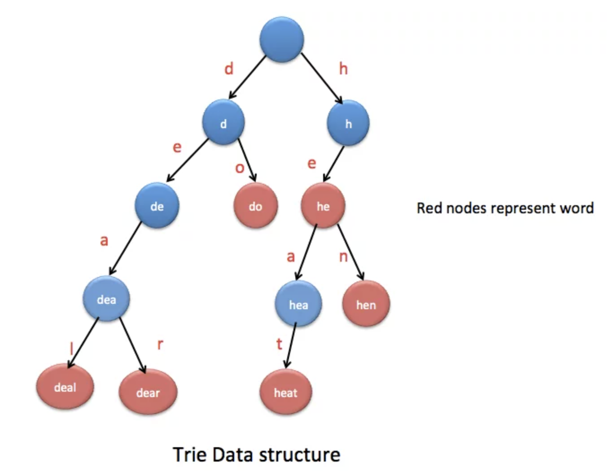

# Trie

## Background
A trie (pronounced as 'try') also known as a prefix tree, is often used for handling textual data, especially in 
scenarios involving prefixes. In fact, the term 'trie' comes from the word 'retrieval'.

Like most trees, a trie is composed of nodes and edges. But, unlike binary trees, its node can have more than 
2 children. A trie stores words by breaking down into characters and organising these characters within a hierarchical 
tree. Each node represents a single character, except the root, which does not represent any character 
but acts as a starting point for all the words stored. A path in the trie, which is a sequence of connected nodes 
from the root, represents a prefix or a whole word. Shared prefixes of different words are represented by common paths.

To distinguish complete words from prefixes within the trie, nodes are often implemented with a boolean flag. 
This flag is set to true for nodes that correspond to the final character of a complete word and false otherwise.

    
     
    <em>Source: <a href="https://java2blog.com/trie-data-structure-in-java/">Java2Blog</a></em>

### TrieNode
A TrieNode represents a single node within a trie, which is a specialized tree-like data structure 
used primarily for storing strings in a compact format. It typically encapsulates the following:

1. Some kind of data structure to track children nodes; usually a HashMap or an array where indices represent 
alphabets (e.g. an array of size 26 for chars a-z)
   - Our implementation uses HashMap which is more versatile since it doesn't restrict the type of characters. But
   it is not uncommon to see nodes with int or char array. In fact, PS5 of CS2040s does this!
2. Boolean flag to denote the end of a sequence of characters.
3. Optional: Additional fields to augment the trie. For instance, one can track the weight of the subtree rooted at each node to
easily query the number of words with some prefix.
4. Optional: Parent pointer. Some trie implementations include a back-pointer to the node's parent. This is not required
for basic trie operations but can be useful for certain algorithms that require traversing the trie in reverse, 
such as deletions or suffix trie constructions.
   - Our implementation features one such method where we prune the trie. But we used an array to track past nodes seen
   rather than rely on parent pointers.

 
 <b>Interpretation of Trie and TrieNode</b> 

Several students have asked about the semantic interpretation of a Trie:
*Do the edges or the nodes represent the characters?*

Both interpretations are valid, and you can argue from either perspective.

Personally, I tend to think of the nodes as representing the characters. 
For example, retrieving a child node with the key 'b' would give you the 'b' node.
The node itself may also contain additional fields, such as a flag 
indicating whether the concatenation of characters up to the current node forms a valid word in the trie's vocabulary.

Another view is that edges represent characters. In this interpretation, 
traversing an edge labeled 'b' from one node to another means you're adding the character 'b' to the word being formed.

## Complexity Analysis
Let `L` be the length of the word (or longest word), and `N` be the number of words.

| Operation | Time | Notes |
|-----------|------|-------|
| `insert()` | `O(L)` | Traverse/create nodes for each character |
| `search()` | `O(L)` | Traverse nodes for each character |
| `delete()` | `O(L)` | Traverse and unmark end flag |
| `deleteAndPrune()` | `O(L)` | Traverse twice (down then up for pruning) |
| `wordsWithPrefix()` | `O(L + M)` | `L` to reach prefix, `M` = total chars in matching words |

**Space**: `O(N * L)` in the worst case, when words have minimal overlap and every character needs its own node.

<b>Space usage in practice</b>

The `O(N * L)` bound assumes each word contributes all its characters as separate nodes. In practice, shared prefixes reduce this (e.g., "app", "apple", "application" share the "app" path).

A theoretical maximum for a trie structure is `O(26^L)` - this would occur if the trie stored *every possible string* of length up to `L` (all combinations of 26 letters). This is only relevant for complete/exhaustive tries, not for storing a specific vocabulary of `N` words.

Using a HashMap for children (as in our implementation) only allocates space for existing children, avoiding the cost of 26-element arrays at each node.

## Operations 
Here we briefly discuss the typical operations supported by a trie. 

### Insert
Starting at the root, iterate over the characters and move down the trie to the respective nodes, creating missing
ones in the process. Once the end of the word is reached, the node representing the last character will set its 
boolean flag to true

### Search
Starting at the root, iterate over the characters and move down the trie to the respective nodes. 
If at any point the required character node is missing, return false. Otherwise, continue traversing until the end of
the word and check if the current node has its boolean flag set to true. If not, the word is not captured in the trie.

### Delete
Starting at the root, iterate over the characters and move down the trie to the respective nodes.
If at any point the required character node is missing, then the word does not exist in the trie and the process 
is terminated. Otherwise, continue traversing until the end of the word and un-mark boolean flag of the current node 
to false.

### Delete With Pruning
Sometimes, a trie can become huge. Deleting old words would still leave redundant nodes hanging around. These can 
accumulate over time, so it is crucial we prune away unused nodes.

Continuing off the delete operation, trace the path back to the root, and if any redundant nodes are found (nodes 
that aren't the end flag for a word and have no descendant nodes), remove them.

### Augmentation
Just like how Orthogonal Range Searching can be done by augmenting the usual balanced BSTs, a  trie can be augmented 
with additional variables captured in the TrieNode to speed up queries of a certain kind. For instance, if one wishes
to quickly find out how many complete words stored in a trie have a given prefix, one can track the number of 
descendant nodes whose boolean flag is set to true at each node.

## Notes

1. **Case sensitivity**: Our implementation converts all words to lowercase. To support case-sensitive storage, remove the `toLowerCase()` calls.

2. **HashMap vs Array**: We use `HashMap<Character, TrieNode>` for children, which supports arbitrary characters (Unicode, spaces, etc.). An alternative is a fixed-size array (e.g., `TrieNode[26]` for lowercase letters), which is faster but wastes space when nodes have few children.

3. **Pruning**: The basic `delete()` only unmarks the end flag - the nodes remain. For long-running applications, use `deleteAndPrune()` to reclaim memory.

4. **Trie vs HashMap**: For simple word lookup, a `HashSet<String>` is `O(L)` time and simpler. Tries shine when you need prefix operations (autocomplete, prefix counting) or lexicographic ordering.

**Interview tip:** When asked "why use a trie instead of a hash table?", emphasize prefix operations. A HashSet can check if "apple" exists, but cannot efficiently find all words starting with "app".

## Applications
- [Auto-completion](https://medium.com/geekculture/how-to-effortlessly-implement-an-autocomplete-data-structure-in-javascript-using-a-trie-ea87a7d5a804) - find all words with a given prefix
- [Spell-checker](https://medium.com/@vithusha.ravirajan/enhancing-spell-checking-with-trie-data-structure-eb649ee0b1b5) - suggest corrections by finding similar words
- [Prefix matching](https://medium.com/@shenchenlei/how-to-implement-a-prefix-matcher-using-trie-tree-1aea9a01013) - IP routing, longest prefix match
- Lexicographic sorting - in-order traversal yields sorted words
- Word games - Boggle solvers, Scrabble word validators