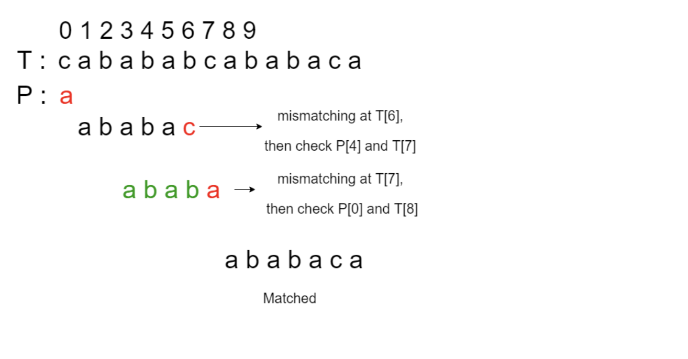

# Knuth-Moris-Pratt Algorithm

KMP match is a type of pattern-searching algorithm.
Pattern-searching problems is prevalent across many fields of CS, for instance,
in text editors when searching for a pattern, in computational biology sequence matching problems,
in NLP problems, and even for looking for file patterns for effective file management.
It is hence crucial that we develop an efficient algorithm.

Image Source: GeeksforGeeks

## Analysis
**Time complexity**:

Naively, we can look for patterns in a given sequence in O(nk) where n is the length of the sequence and k
is the length of the pattern. We do this by iterating every character of the sequence, and look at the 
immediate k-1 characters that come after it. This is not a big issue if k is known to be small, but there's
no guarantee this is the case.

KMP does this in O(n+k) by making use of previously identified sub-patterns. It identifies sub-patterns
by first processing the pattern input in O(k) time, allowing identification of patterns in
O(n) traversal of the sequence. More details found in the src code.

**Space complexity**: O(k) auxiliary space to store suffix that matches with prefix of the pattern string

## Notes
A detailed illustration of how the algorithm works is shown in the code. 
But if you have trouble understanding the implementation, 
here is a good [video](https://www.youtube.com/watch?v=EL4ZbRF587g) as well. 
