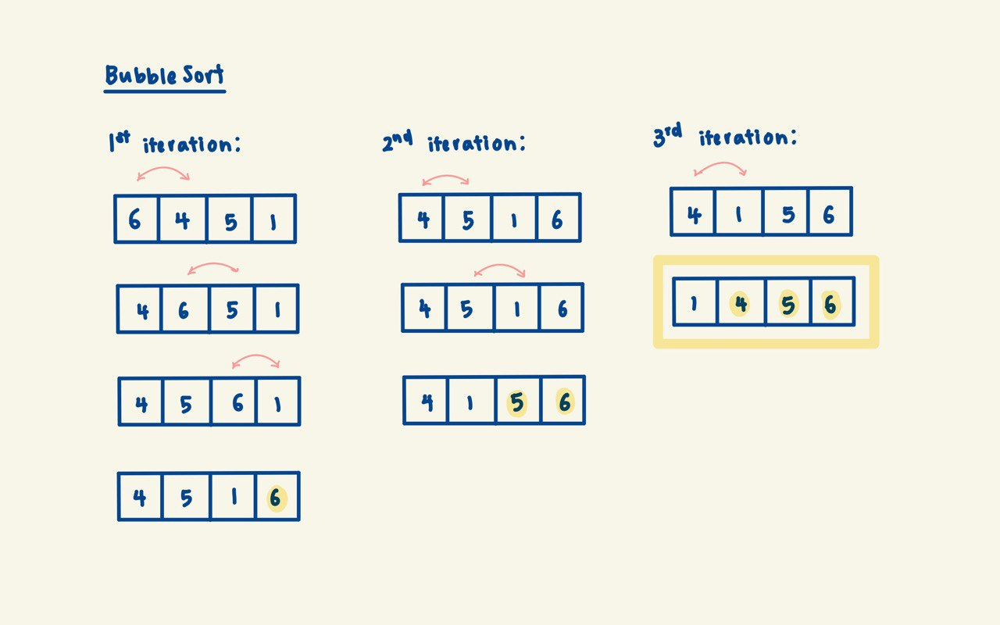

# Bubble Sort
Bubble sort is one of the more intuitive comparison-based sorting algorithms.
It makes repeated comparisons between neighbouring elements, 'bubbling' (side-by-side swaps)
largest (or smallest) element in the unsorted region to the sorted region (often the front or the back).

## Complexity Analysis
**Time**:
  - Worst case (reverse sorted array): O(n^2)
  - Average case: O(n^2)
  - Best case (sorted array): O(n)

In the worst case, during each iteration of the outer loop, the number of adjacent comparisons is upper-bounded
by n. Since BubbleSort requires (n-1) iterations of the outer loop to sort the entire array, the total number
of comparisons performed can be upper-bounded by (n-1) * n ≈ n^2.

This implementation of BubbleSort terminates the outer loop once there are no swaps within one iteration of the
outer loop. This improves the best case time complexity to O(n) for an already sorted array.

**Space**: O(1) since sorting is done in-place
