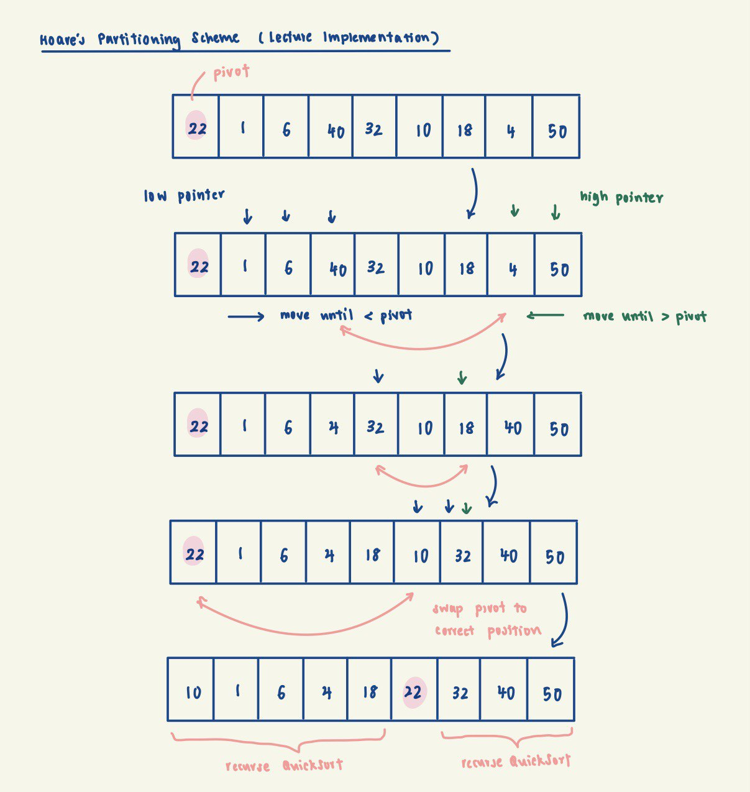
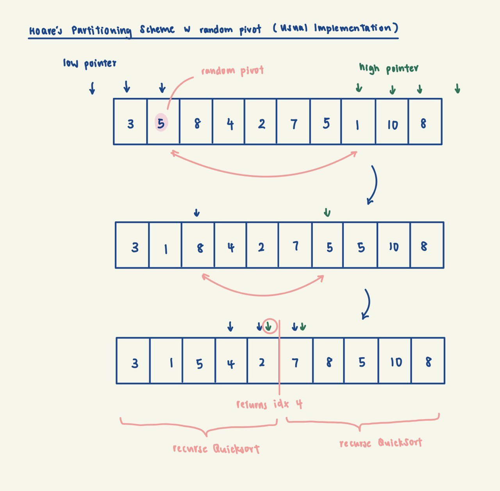

# Hoare's QuickSort

Our description, analysis and implementation of Hoare's Quicksort here will follow that of lecture implementation.
Note that the usual Hoare's QuickSort differs slightly from lecture implementation, see more under Notes.

This version of QuickSort assumes the **absence of duplicates** in our array.

QuickSort is a sorting algorithm based on the divide-and-conquer strategy. It works by selecting a pivot element from 
the array and rearranging the elements such that all elements less than the pivot are on its left, and 
all elements greater than the pivot are on its right. This effectively partitions the array into two parts. The same 
process is then applied recursively to the two partitions until the entire array is sorted.

Implementation Invariant:

The pivot is in the correct position, with elements to its left being < it, and elements to its right being > it.

Example Credits: Prof Seth/Lecture Slides

## Complexity Analysis
Complexity Analysis: (this analysis is based on fixed index pivot selection)

Time:
- Expected worst case (poor choice of pivot): O(n^2)
- Expected average case: O(nlogn)
- Expected best case (balanced pivot): O(nlogn)

In the best case of a balanced pivot, the partitioning process divides the array in half, which leads to log n
levels of recursion. Given a sub-array of length m, the time complexity of the partition subroutine is O(m) as we 
need to iterate through every element in the sub-array once.
Therefore, the recurrence relation is: T(n) = 2T(n/2) + O(n) => O(nlogn).

Even in the average case where the chosen pivot partitions the array by a fraction, there will still be log n levels
of recursion. (e.g. T(n) = T(n/10) + T(9n/10) + O(n) => O(nlogn))

However, using a fixed pivot, such as always choosing the first element as the pivot, can lead to worst-case behavior, 
especially when the array is already sorted or has a specific pattern. This is because in such cases, the partitioning 
might create highly unbalanced sub-arrays, causing the algorithm to degrade to O(n^2) time complexity.

Space:
- O(1) excluding memory allocated to the call stack, since partitioning is done in-place

## Notes

### Presence of Duplicates
The above analysis assumes the absence of duplicates in our array. We can change the implementation slightly to keep 
all elements = pivot to the left of the pivot element. In this case, if there are many duplicates in the array, 
e.g. {1, 1, 1, 1}, the 1st pivot will be placed in the 3rd idx, and 2nd pivot in 2nd idx, 3rd pivot in the 1st idx and 
4th pivot in the 0th idx. As we observe, the presence of many duplicates in the array leads to extremely unbalanced 
partitioning, leading to a O(n^2) time complexity.

### Usual Implementation of Hoare's QuickSort
The usual implementation of Hoare's partition scheme does not necessarily put the pivot in its correct position. It 
merely partitions the array into <= pivot and >= pivot portions.

Brief Description:

Hoare's QuickSort operates by selecting a pivot element from the input array and rearranging the elements such
that all elements in A[start, returnIdx] are <= pivot and all elements in A[returnIdx + 1, end] are >= pivot,
where returnIdx is the index returned by the sub-routine partition.

After partitioning, the algorithm recursively applies the same process to the left and right sub-arrays, effectively
sorting the entire array.

The Hoare's partition scheme works by initializing two pointers that start at two ends. The two pointers move toward
each other until an inversion is found. This inversion happens when the left pointer is at an element >= pivot, and
the right pointer is at an element <= pivot. When an inversion is found, the two values are swapped and the pointers
continue moving towards each other.

Implementation Invariant:

All elements in A[start, returnIdx] are <= pivot and all elements in A[returnIdx + 1, end] are >= pivot.

## Hoare's vs Lomuto's QuickSort
Hoare's partition scheme is in contrast to Lomuto's partition scheme. Hoare's uses two pointers, while Lomuto's uses 
one. Hoare's partition scheme is generally more efficient as it requires less swaps. See more at
https://www.geeksforgeeks.org/hoares-vs-lomuto-partition-scheme-quicksort/.

