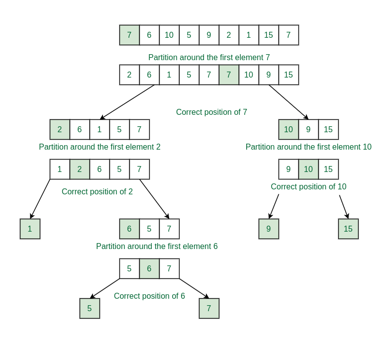
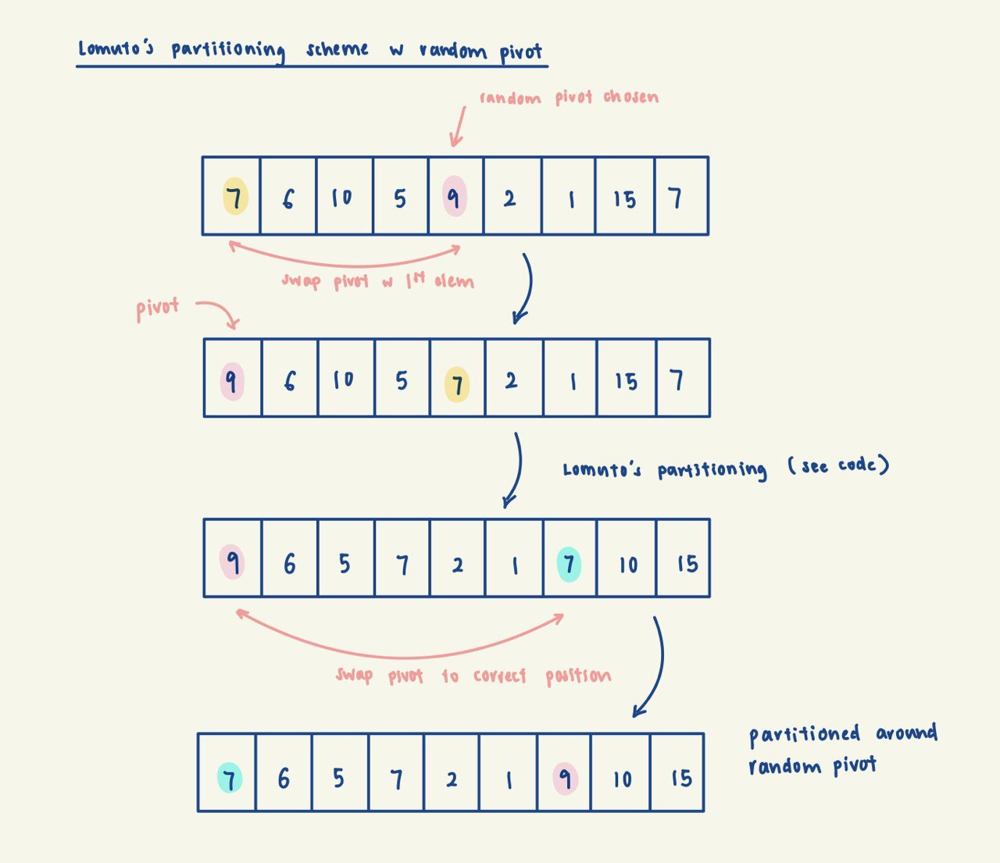

This is how QuickSort works if we always pick the first element as the pivot. 

Image Source: https://www.geeksforgeeks.org/implement-quicksort-with-first-element-as-pivot/

If we use randomised pivot selection, the idea is very similar to the above implementation. All we 
need to do is to swap the random pivot to the first element in the array, then partition as per usual, 
then swap the pivot back to its correct position. Below is an illustration: 

