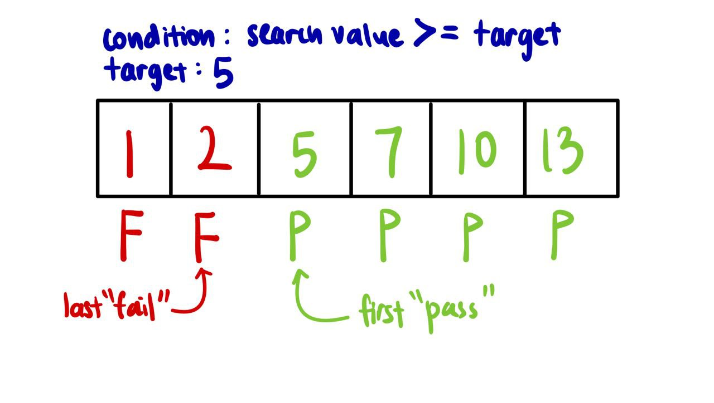

# Binary Search
Binary search is a search algorithm that finds the position of a target value within a sorted array or list. It compares 
the target value to the middle element of the search range, then, based on the comparison, narrows the search to the 
upper or lower half of the current search range.

Two versions of binary search has been implemented in this repository - BinarySearch and BinarySearchTemplated.

## BinarySearch

Image Source: GeeksforGeeks

BinarySearch is a more straightforward and intuitive version of the binary search algorithm. In this approach, after the
mid-value is calculated, the high or low pointer is adjusted by just one unit. From the above example, after mid points 
to index 4 in the first search, the low pointer moves to index 5 (+1 from 4) when narrowing the search. Similarly, when 
mid points to index 7 in the second search, the high pointer shifts to index 6 (-1 from 7) when narrowing the search. 
This prevents any possibility of infinite loops. During the search, the moment mid-value is equal to the target value, 
the search ends prematurely. Note that there is no need for a "condition" method as the condition is already captured
in the predicates of the if-else blocks.

## BinarySearchTemplated

BinarySearchTemplated removes the condition that checks if the current mid-value is equal to the target (which helps to
end the search the moment the target is found). The template adds a "condition" method which will be modified based on
the requirements of the implementation.

The narrowing of the search space differs from BinarySearch - only the high pointer will be adjusted by one unit.

This template will work for most binary search problems and will only require the following changes:
- Search space (high and low)
- Condition method
- Returned value (low or low - 1)

### Search Space (Requires change)
Simply modify the initialisation of the high and low pointer according to the [search space](#search-space-adjustment).

### Condition (Requires change)
We assume that when the condition returns true, the current value "passes" and when the condition returns false, the 
current value "fails".

Note that in this template, the conditional blocks
```
if (condition(x)) {
   high = mid;
} else {
   low = mid + 1;
}
```
requires elements that "fail" the condition to be on the left of the elements that "pass" the condition, see below, in a
sorted array due to the way the high and low pointers are reassigned.


Hence, we will need to implement a condition method that is able to discern between arrays that "pass" and "fail"
accurately and also place them in the correct relative positions i.e. "fail" on the left of "pass". Suppose we change 
the condition method implementation in BinarySearchTemplated from `value >= target` to `value <= target`, what will 
happen? 
<details>
<summary> <b>what will happen?</b> </summary>
The array becomes "P P F F F F" and the low and high pointers are now reassigned wrongly.
</details>

### Returned Value (Requires change)
In this implementation of BinarySearchTemplated, we return the first "pass" in the array with `return low`. This is
because our condition method implementation encompasses the target value that we are finding i.e. when 
`value == target`.

```java
public static boolean condition(int value, int target) {
    return value >= target;
}
```


However, if we want to return the last "fail" in the array, we will `return low - 1`.

Suppose now we modify the condition to be `value > target`, how can we modify our BinarySearchTemplated to still work as
expected?
<details>
<summary> <b>value > target?</b> </summary>
Replace `return low` with `return low - 1` and replace arr[low] with arr[low - 1] as now the target value is the last 
"fail".
</details>


### Search Space Adjustment
What should be the search space adjustment? Why is only low reassigned with an increment and not high?

Due to the nature of floor division in Java's \ operator, if there are two mid-values within the search range, which is
when the number of elements is even, the first mid-value will be selected. Suppose we do not increment the low pointer
during reassignment, `low = mid`, let us take a look at the following example:


The search space has been narrowed down to the range of index 1 (low) to 2 (high). The mid-value is calculated, 
`mid = (1 + 2) / 2`, to be 1 due to floor division. Since `2 < 5`, we enter the else block where there is reassignment 
of `low = mid`. This means that the low pointer is still pointing to index 1 and the high pointer remains unchanged at
index 2. This results in an infinite loop as the search range is not narrowed down.

To resolve this issue, we need `low = mid + 1`, which will result in the low pointer pointing to index 2 in this 
scenario. We still ensure correctness because the mid-value is not the target value, as the mid-value < target, and we 
can safely exclude it from the search range.

Why do we not need to increment the high pointer during reassignment? This is because the mid-value could be the target
as the condition implemented is `value >= target`, hence, we cannot exclude it from the search range.

See [here](binarySearchTemplated/binarySearchTemplatedExamples/README.md) to use the template for other problems

Credits: [Powerful Ultimate Binary Search Template](https://leetcode.com/discuss/general-discussion/786126/python-powerful-ultimate-binary-search-template-solved-many-problems)

## Complexity Analysis
**Time**:
- Worst case: O(log n)
- Average case: O(log n)
- Best case: 
  - BinarySearch O(1)
  - BinarySearchTemplated O(log n)

BinarySearch:
In the worst case, the target is either in the first index or does not exist in the array at all.
In the best case, the target is the middle (odd number of element) or the first middle element (even number of elements)
if floor division is used to determine the middle.

BinaryTemplated:
In all cases, O(log n) iterations will be required as there is no condition to exit the loop prematurely.

**Space**: O(1) since no new data structures are used and searching is only done within the array given
