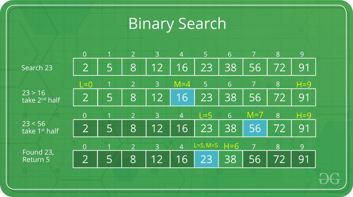

# BinarySearch

The standard binary search implementation for finding an exact match. Uses `low <= high` with early exit when target is found.

See [parent README](../README.md) for detailed tips, tricks, and complexity analysis.

## Illustration

*Source: GeeksforGeeks*

After `mid` points to index 4, the `low` pointer moves to index 5 (`mid + 1`) when narrowing the search. When `mid` points to index 7, the `high` pointer shifts to index 6 (`mid - 1`). Both pointers always exclude `mid` because we've already checked it isn't the target.

## Complexity

| Case | Time | Space |
|------|------|-------|
| Best | `O(1)` | `O(1)` |
| Average/Worst | `O(log n)` | `O(1)` |

Best case: target is at the first `mid` position checked.
