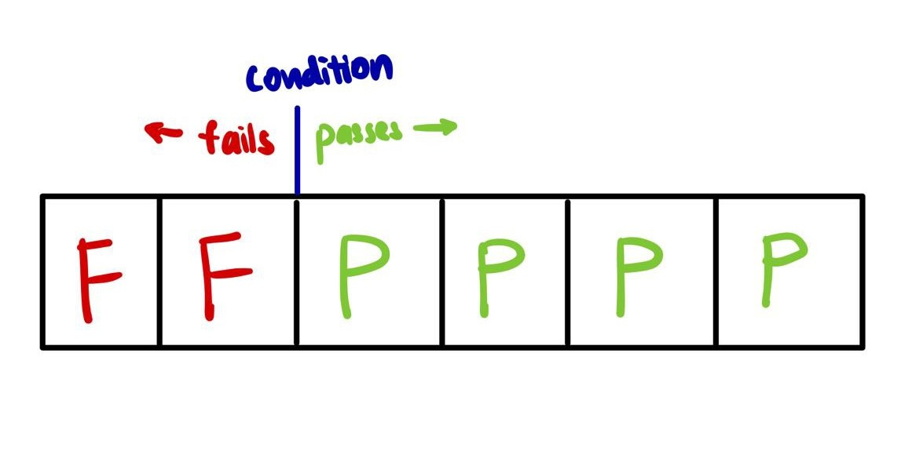
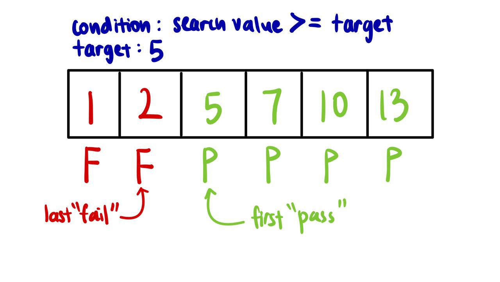
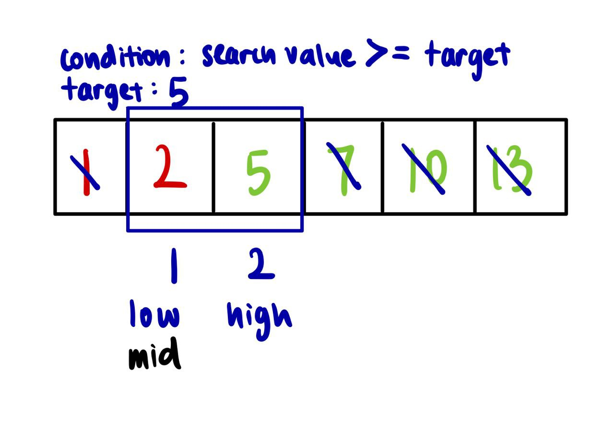

# BinarySearchTemplated

## Background

BinarySearchTemplated is a more generalised algorithm of [BinarySearch](../binarySearch) that removes the condition that
checks if the current mid-value is equal to the target (which helps to end the search the moment the target is found). 
The template adds a "condition" method which will be modified based on the requirements of the implementation.

The narrowing of the search space differs from BinarySearch - only the high pointer will be adjusted by one unit.

This template will work for most binary search problems and will require the following changes when used for different 
problems:
- Search space (high and low pointers)
- Condition method
- Returned value (low or low - 1)

### Search Space (Requires change)
Initialise the boundary values of the high and low pointers to include all possible elements in the search space.

### Condition (Requires change)
We assume that when the condition returns true, the current value "passes" and when the condition returns false, the
current value "fails".

Note that in this template, the conditional blocks
```
if (condition(x)) {
   high = mid;
} else {
   low = mid + 1;
}
```
requires elements that "fail" the condition to be on the left of the elements that "pass" the condition, see below, in a
sorted array due to the way the high and low pointers are reassigned.



Hence, we will need to implement a condition method that is able to discern between arrays that "pass" and "fail"
accurately and also place them in the correct relative positions i.e. "fail" on the left of "pass". Suppose we change
the condition method implementation by inverting the inputs that "pass" the condition, i.e, inputs that "fail" now
"pass" and vice-versa, what will happen?
<details>
<summary> <b>what will happen?</b> </summary>
The array becomes "P P F F F F" and our current template will not work as expected. This is because the low and high
pointers are now reassigned wrongly - the loop invariant is broken as the search space is narrowed down in the wrong
direction. 

To resolve this issue, there are two fixes:
1. Swap the conditional blocks of low = mid + 1 and high = mid.
**OR**
2. Simply add a "not" in front of the condition, converting "P P F F F F" back to "F F P P P P".

Note that some conditions may be easier to define with "pass" elements being on the left of "fail" elements, i.e.
"P P F F F F", hence, it is important to adjust the code with the above fixes accordingly.
</details>

### Returned Value (Requires change)
In this implementation of BinarySearchTemplated, we return the first "pass" in the array with `return low`. This is
because our condition method implementation encompasses the target value that we are finding i.e. when
`value == target`.

```java
public static boolean condition(int value, int target) {
    return value >= target;
}
```


However, if we want to return the last "fail" in the array, we will `return low - 1`.

Suppose now we modify the condition to be `value > target`, how can we modify our BinarySearchTemplated to still work as
expected?
<details>
<summary> <b>value > target?</b> </summary>
Replace `return low` with `return low - 1` and replace arr[low] with arr[low - 1] as now the target value is the last 
"fail".
</details>


### Search Space Adjustment
What should be the search space adjustment? Why is only low reassigned with an increment and not high?

Due to the nature of floor division in Java's \ operator, if there are two mid-values within the search range, which is
when the number of elements is even, the first mid-value will be selected. Suppose we do not increment the low pointer
during reassignment, `low = mid`, let us take a look at the following example:



The search space has been narrowed down to the range of index 1 (low) to 2 (high). The mid-value is calculated,
`mid = (1 + 2) / 2`, to be 1 due to floor division. Since `2 < 5`, we enter the else block where there is reassignment
of `low = mid`. This means that the low pointer is still pointing to index 1 and the high pointer remains unchanged at
index 2. This results in an infinite loop as the search range is not narrowed down.

To resolve this issue, we need `low = mid + 1`, which will result in the low pointer pointing to index 2 in this
scenario. We still ensure correctness because the mid-value is not the target value, as the mid-value < target, and we
can safely exclude it from the search range.

Why should we not decrement the high pointer during reassignment? This is because the mid-value could be the target
as the condition implemented is `value >= target`, hence, we cannot exclude it from the search range.

Note that if ceiling division is used instead, `high = mid - 1` will be required to prevent an infinite loop. Both
`low = mid + 1` and `low = mid` will work in this case.

See [here](binarySearchTemplatedExamples/README.md) to use the template for other problems.

Credits: [Powerful Ultimate Binary Search Template](https://leetcode.com/discuss/general-discussion/786126/python-powerful-ultimate-binary-search-template-solved-many-problems)


## Complexity Analysis
**Time**:
- Worst case: O(log n)
- Average case: O(log n)
- Best case: O(log n)

In all cases, O(log n) iterations will be required as there is no condition to exit the loop prematurely.

**Space**: O(1)

Since no new data structures are used and searching is only done within the array given.