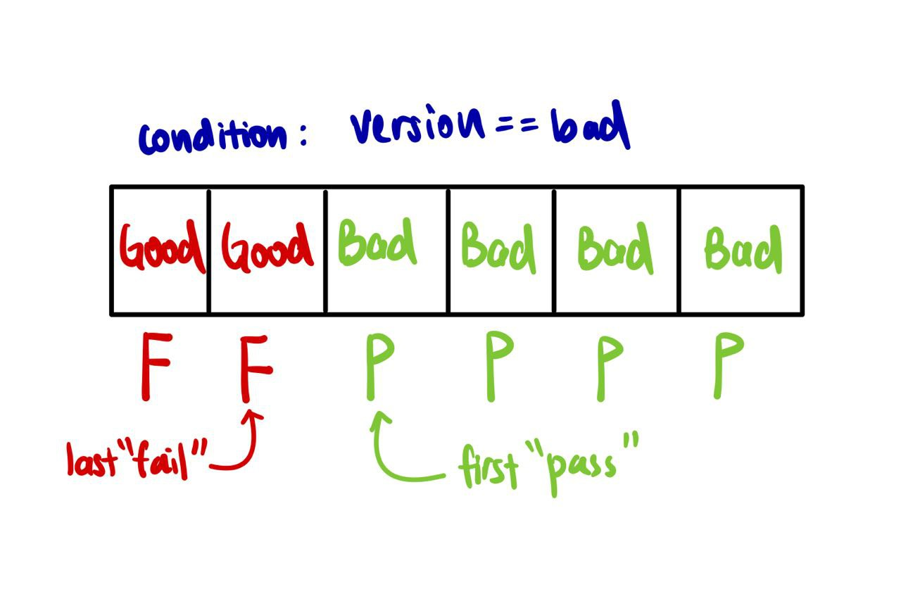

# BinarySearchTemplated Examples

We will be utilising the BinarySearchTemplated implementation to solve some problems.

The following will differ between problems:

- Search Space
- Condition
- Returned Value

<b> How do we know if a problem can be solved with this template? </b>

A problem is well-suited for this approach when it meets the following criteria:

- <b> Clear Distinction Between Categories: </b> There should be a definitive way to categorize elements into two 

groups: "pass" and "fail".

- <b> Grouped Categories: </b> All the elements in one category should be grouped together without interspersion. This 

implies that if we move from a "fail" element to a "pass" one, all subsequent elements will be "pass".

- <b> Monotonic Property: </b> There needs to be a consistent, unidirectional trend or property in the search space. 

This means the condition being checked either consistently increases or decreases. For the classical binary search on a
sorted array, this monotonic property is the sorted order of the elements, where the array elements increase
(or decrease) consistently.

## 1. First Bad Version [Easy]

### Problem:

You are a product manager and currently leading a team to develop a new product. Unfortunately, the latest version of
your product fails the quality check. Since each version is developed based on the previous version, all the versions
after a bad version are also bad.

Suppose you have `n` versions `[1, 2, ..., n]` and you want to find out the first bad one, which causes all the
following ones to be bad.

You are given an API bool `isBadVersion(version)` which returns whether `version` is bad. Implement a function to find
the first bad version. You should minimize the number of calls to the API.

Example 1:

```
Input: n = 5, bad = 4
Output: 4
Explanation:
call isBadVersion(3) -> false
call isBadVersion(5) -> true
call isBadVersion(4) -> true
Then 4 is the first bad version.
```

### Solution:

<b> Search Space </b>

The search space includes all possible values.

```java
high = n - 1;
low = 0;
```

<b> Condition </b>

The condition has already been implemented. But we need to check if the elements that pass the condition will be on the
right of those that fail! Since "all the versions after a bad version are also bad", our template will work.

<b> Returned Value </b>

Since we want to return the first bad version, we will return low.



<b> Full Solution: </b>

```java
public int firstBadVersion(int n) {
    int high = n - 1; // max index for n elements
    int low = 0;
    while (low < high) {
        int mid = low + (high - low) / 2;
        if (isBadVersion(mid)) { // condition is isBadVersion
            high = mid;
        } else {
            low = mid + 1;
        }
    }
    
    return low; // return first "pass"
}
```

## 2. Capacity To Ship Packages Within D Days [Medium]

### Problem:

A conveyor belt has packages that must be shipped from one port to another within `days` days.

The `ith` package on the conveyor belt has a weight of `weights[i]`. Each day, we load the ship with packages on the
conveyor belt (in the order given by `weights`). We may not load more weight than the maximum weight capacity of the
ship.

Return the least weight capacity of the ship that will result in all the packages on the conveyor belt being shipped
within `days` days.

Example 1:

```
Input: weights = [1,2,3,4,5,6,7,8,9,10], days = 5
Output: 15
Explanation: A ship capacity of 15 is the minimum to ship all the packages in 5 days like this:
1st day: 1, 2, 3, 4, 5
2nd day: 6, 7
3rd day: 8
4th day: 9
5th day: 10

Note that the cargo must be shipped in the order given, so using a ship of capacity 14 and splitting the packages into 
parts like (2, 3, 4, 5), (1, 6, 7), (8), (9), (10) is not allowed.
```

### Solution:

On first glance, while we are given an array, simply binary searching the array does not solve the problem. However,
since our goal is to determine the least weight capacity of the ship, could this be our "target"? The answer is yes.
By having each element being a least weight capacity case, with the lowest index being the heaviest weight and the
highest index being the sum of all weights, we will have our search space. The monotonic property present is that if
we can ship all packages within `D` days with capacity `m`, we can definitely ship them within `D` days with any
capacity greater than `m`, such as `m + 1`.

<b> Search Space </b>

The search space is the range of least weight capacity we should search. The minimum least weight capacity that must be
required is the heaviest package as we cannot split the heaviest package. The maximum least weight capacity that is
necessary is the sum of all weights - i.e. we have to ship all packages within `1` day.

```java
int sum = 0;
for (i = 0; i < weights.length; i++) {
    sum += weights[i];
}
high = sum;
low = weights[weights.length - 1];
```

<b> Condition </b>

The condition is to check if it is feasible to ship all packages within `D` days with a least weight capacity of `m`.
Where `D` is given and `m` is the mid-value in our search range.

```java
public static boolean isFeasible(int[] weights, int days, int capacity) {
    int daysNeeded = 1;
    int currentWeight = 0;
    for (int i = 0; i < weights.length; i++) {
        if (currentWeight + weights[i] > capacity) {
            daysNeeded++;
            currentWeight = 0; // Reset current weight as we are starting a new day
        }
        currentWeight += weights[i];
    }
    return daysNeeded <= days; // If days needed is less than or equal to days, it is feasible
}
```

<b> Returned Value </b>

Since we want to return the minimum least weight capacity where we can deliver in time, we will return low.

<b> Full Solution: </b>

```java
public int shipWithinDays(int[] weights, int days) {
    public boolean isFeasible(int[] weights, int days, int capacity) {
        int daysNeeded = 1;
        int currentWeight = 0;
        for (int i = 0; i < weights.length; i++) {
            if (currentWeight + weights[i] > capacity) {
                daysNeeded++;
                currentWeight = 0; // Reset current weight as we are starting a new day
            }
            currentWeight += weights[i];
        }
        return daysNeeded <= days;
    }
    
    int sum = 0;
    for (i = 0; i < weights.length; i++) {
        sum += weights[i];
    }
    
    high = sum;
    low = weights[weights.length - 1];
    
    while (low < high) {
        int mid = low + (high - low) / 2;
        if (isFeasible(weights, days, mid)) { // condition is isFeasible
            high = mid;
        } else {
            low = mid + 1;
        }
    }
    
    return low; // return first "pass"
}
```
