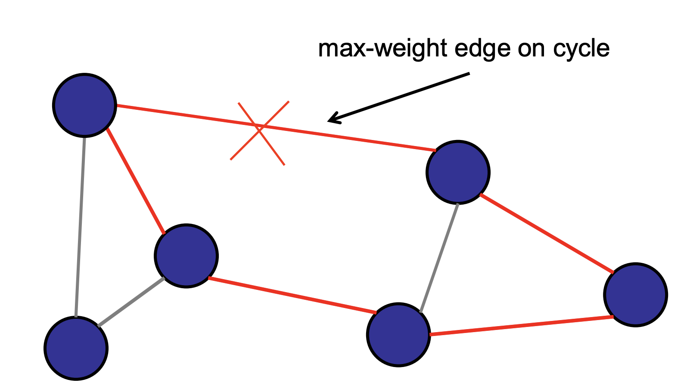
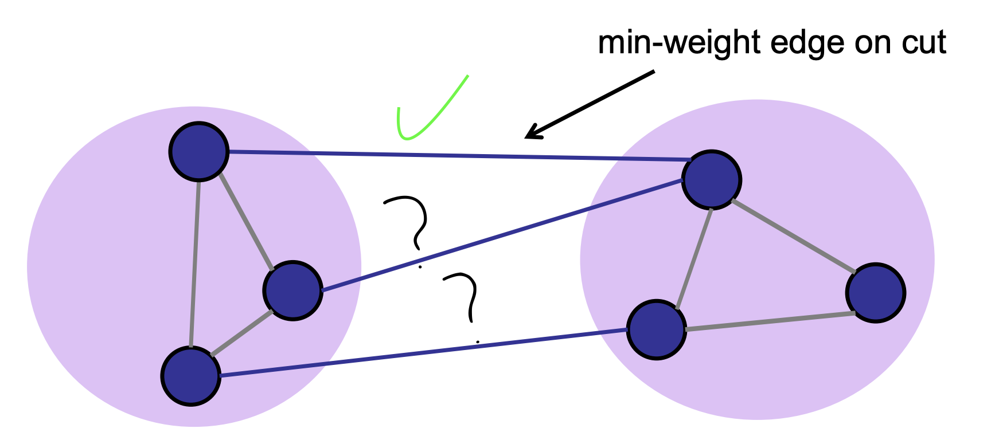
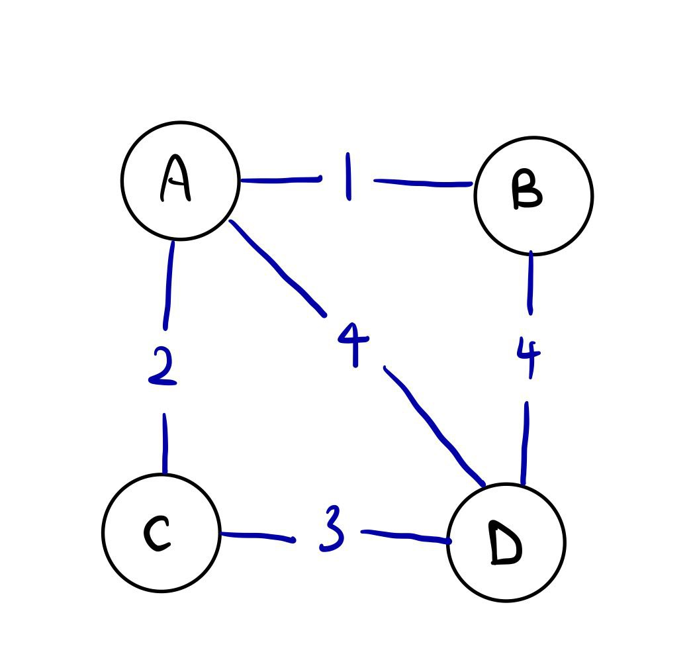
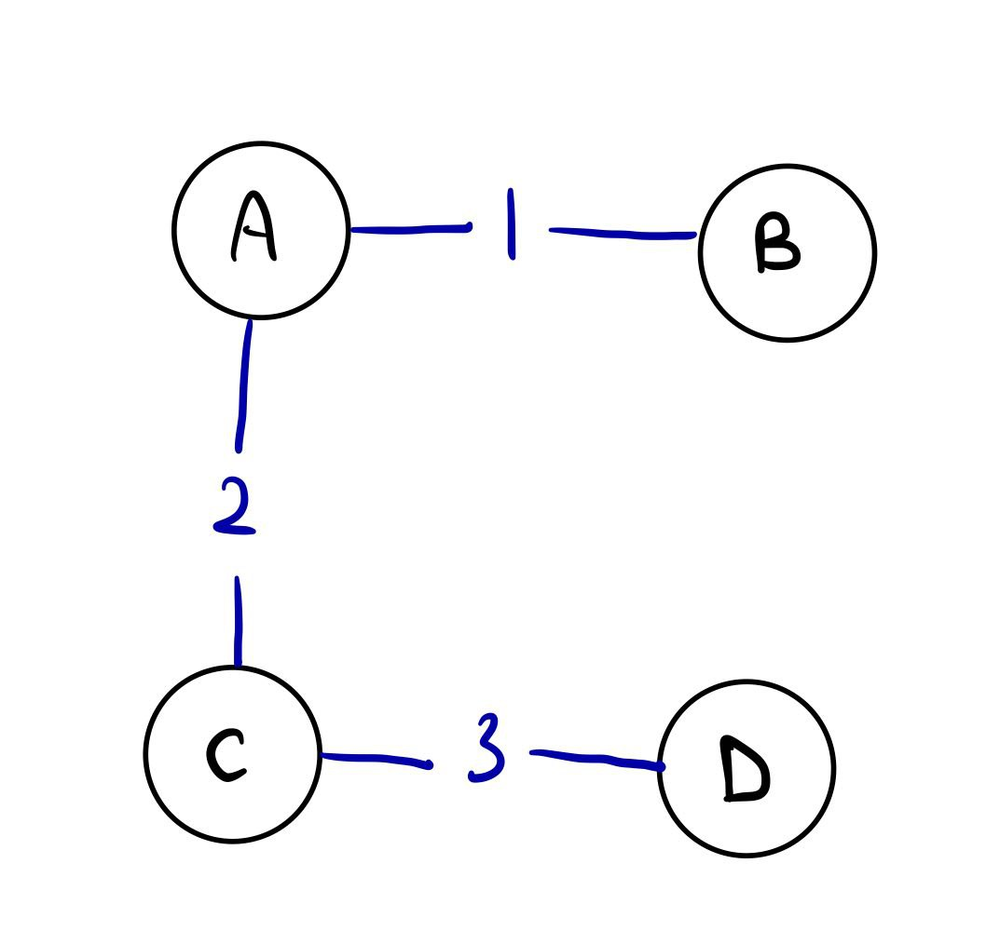
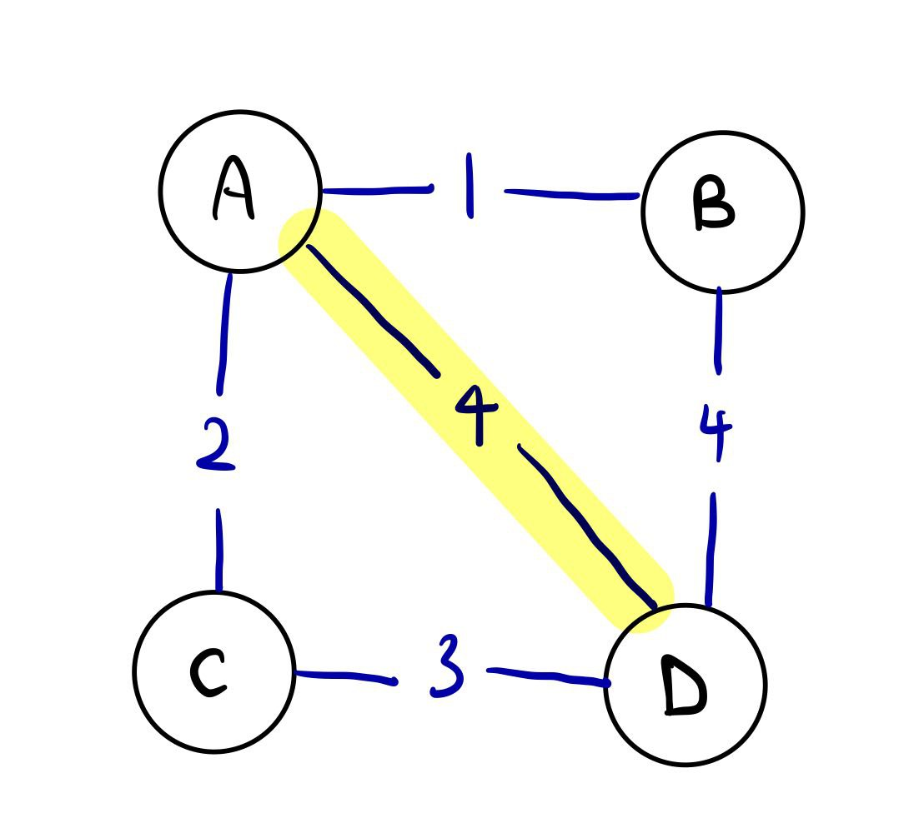
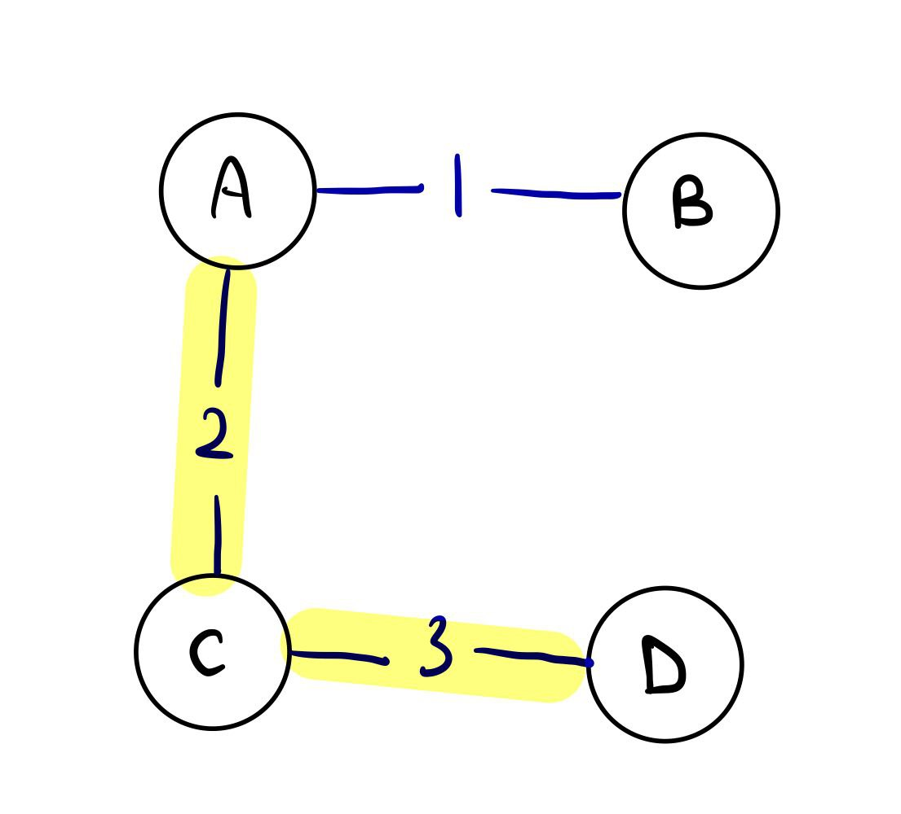

# Minimum Spanning Tree Algorithms

## Background

Minimum Spanning Tree (MST) algorithms are used to find the minimum spanning tree of a weighted, connected graph. A
spanning tree of a graph is a connected, acyclic subgraph that includes all the vertices of the original graph. An MST 
is a spanning tree with the minimum possible total edge weight.

### 4 Properties of MST
1. An MST should not have any cycles
2. If you cut an MST at any single edge, the two pieces will also be MSTs
3. **Cycle Property:** For every cycle, the maximum weight edge is not in the MST

Image Source: CS2040S 22/23 Sem 2 Lecture Slides

4. **Cut Property:** For every partition of the nodes, the minimum weight edge across the cut is in the MST

   
Image Source: CS2040S 22/23 Sem 2 Lecture Slides

Note that the other edges across the partition may or may not be in the MST.

## Prim's Algorithm and Kruskal's Algorithm

We will discuss more implementation-specific details and complexity analysis in the respective folders. In short,
1. [Prim's Algorithm](prim) is a greedy algorithm that finds the minimum spanning tree of a graph by starting from an
arbitrary node (vertex) and adding the edge with the minimum weight that connects the current tree to a new node, adding
the node to the current tree, until all nodes are included in the tree.
<<<<<<< HEAD
2. [Kruskal's Algorithm](kruskal) is a greedy algorithm that finds the minimum spanning tree of a graph by sorting the
edges by weight and adding the edge with the minimum weight that does not form a cycle into the current tree.

## Notes

### Difference between Minimum Spanning Tree and Shortest Path
It is important to note that a Minimum Spanning Tree of a graph does not represent the shortest path between all the
nodes. See below for an example:

The below graph is a weighted, connected graph with 5 nodes and 6 edges:

The following is the Minimum Spanning Tree of the above graph:

Taking node A and D into consideration, the shortest path between them is A -> D, with a total weight of 4.

However, the shortest path between A and D in the Minimum Spanning Tree is A -> C -> D, with a total weight of 5, which
is not the shortest path in the original graph.

