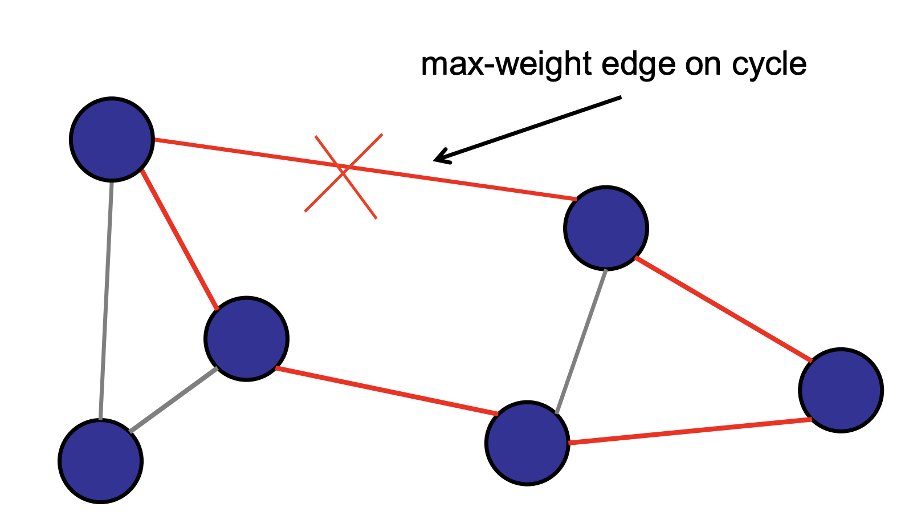
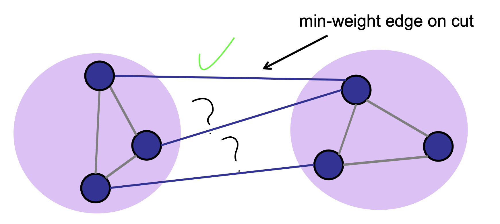

# Minimum Spanning Tree Algorithms

## Background

A **Minimum Spanning Tree (MST)** of a connected, weighted, undirected graph is a subset of edges that:
1. Connects all vertices (spanning)
2. Forms a tree (no cycles)
3. Has minimum total edge weight

**Key properties of any spanning tree:**
- Contains exactly `V - 1` edges (where V = number of vertices)
- Has no cycles
- Is connected

**Intuition:** Greedily pick edges that connect components without creating cycles, always preferring lighter edges.

## MST Properties

### 1. No Cycles
An MST cannot have cycles. If it did, we could remove the heaviest edge in the cycle and still have a connected tree with lower total weight.

### 2. Uniqueness
If all edge weights are distinct, the MST is unique. If some weights are equal, there may be multiple valid MSTs (all with the same total weight).

### 3. Cycle Property
For any cycle in the graph, the maximum weight edge in that cycle is **NOT in the MST**.



Image Source: CS2040S 22/23 Sem 2 Lecture Slides

**Why?** If we include the max-weight edge, we can remove it and still stay connected via the other cycle edges, reducing total weight.

### 4. Cut Property
For any partition of vertices into two sets, the minimum weight edge crossing the cut **must be in the MST**.



Image Source: CS2040S 22/23 Sem 2 Lecture Slides

**Why?** If we don't include the minimum crossing edge, we must include some heavier edge to connect the two sets. Swapping would give a lighter tree.

## Kruskal's vs Prim's Algorithm

| Aspect | Kruskal's | Prim's |
|--------|-----------|--------|
| Strategy | Process edges globally by weight | Grow tree from a starting vertex |
| Data Structure | Disjoint Set (Union-Find) | Priority Queue (min-heap) |
| Core Operation | Union-Find to detect cycles | Extract-min to get lightest crossing edge |
| Property Used | Cycle property | Cut property |
| Time Complexity | `O(E log E)` | `O(E log V)` with binary heap |
| Best For | Sparse graphs, edge list input | Dense graphs, adjacency list input |
| Parallelizable | Yes (sort is parallelizable) | Harder (sequential growth) |

### When to Use Which

**Use Kruskal's when:**
- Graph is sparse (E ~= V)
- Edges are given as a list
- You want to process edges in weight order

**Use Prim's when:**
- Graph is dense (E ~= V²)
- Graph is given as adjacency list/matrix
- You want to grow the tree from a specific vertex

## Implementations

| Algorithm | Description |
|-----------|-------------|
| [./kruskal](./kruskal) | Sort edges, add if no cycle (uses Disjoint Set) |
| [./prim](./prim) | Grow tree greedily using Priority Queue |

## MST vs Shortest Path

It is important to note that an MST does **not** represent shortest paths between vertices.

**Example:**

Original graph:
```
    A ---4--- D
    |         |
    2         3
    |         |
    B ---1--- C
```

MST (total weight = 6):
```
    A         D
    |         |
    2         3
    |         |
    B ---1--- C
```

- Shortest path A → D in original graph: `A → D` (weight 4)
- Path A → D in MST: `A → B → C → D` (weight 6)

The MST minimizes **total** edge weight, not individual path lengths.

## Applications

| Application | Why MST? |
|-------------|----------|
| Network design | Minimize cable/wire to connect all nodes |
| Clustering | Remove heaviest edges to find clusters |
| Approximation algorithms | MST gives 2-approximation for Traveling Salesman |
| Image segmentation | Graph-based image partitioning |

## LeetCode Problems

| Problem | Description |
|---------|-------------|
| [1584. Min Cost to Connect All Points](https://leetcode.com/problems/min-cost-to-connect-all-points/) | Classic MST on point coordinates |
| [1135. Connecting Cities With Minimum Cost](https://leetcode.com/problems/connecting-cities-with-minimum-cost/) | Direct MST application |
| [1489. Find Critical and Pseudo-Critical Edges](https://leetcode.com/problems/find-critical-and-pseudo-critical-edges-in-minimum-spanning-tree/) | MST edge classification |
| [1168. Optimize Water Distribution](https://leetcode.com/problems/optimize-water-distribution-in-a-village/) | MST with virtual node |
