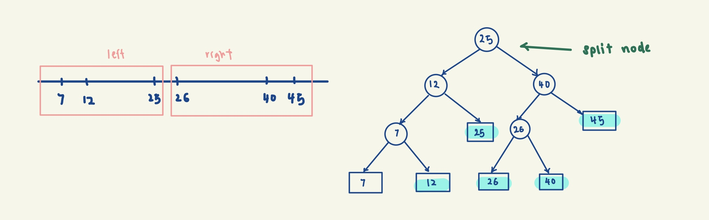
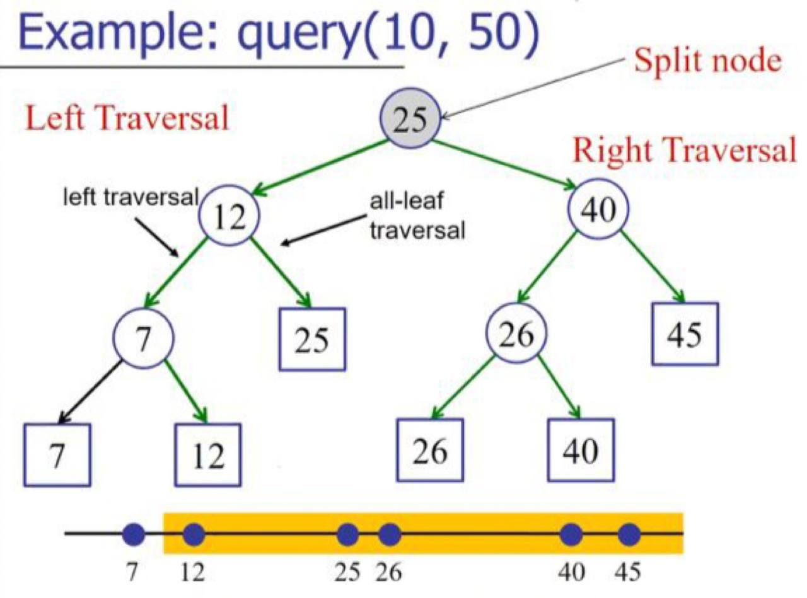
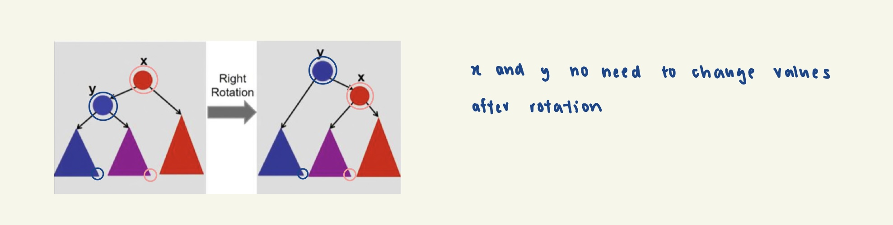

# 1D Orthogonal Range Searching

1D orthogonal range searching is a computational problem where you search for elements or data points within a 
specified 1D range (interval) in a collection of 1D data (e.g. Find me everyone between ages 22 and 27). Additionally,
we also want to support efficient insertions of new data points into the maintained set.

One strategy would be to sort all the data points in O(nlogn) time, then insertion would take O(n). We can binary 
search the low and high of the specified range to return the start and end indices of all the data points within 
in O(logn) time. This would be a reasonable approach if the no. of queries >> no. of insertions.

In cases where the no. of insertions >> no. of queries, we might want to further optimise the time complexity of
insertions to O(logn) using a 1D range tree.

Strategy:
1. Use a binary search tree
2. Store all points in the leaves of the tree (internal nodes only store copies)
3. Each internal node v stores the MAX of any leaf in the left sub-tree (**range tree property**)

Say we want to find all the nodes between 10 and 50 i.e. query(10, 50). We would want to:
1. Find split node: highest node where search includes both left & right subtrees
=> we want to make use of the range tree property to perform binary search to find our split node. See findSplit(root, low, high) in code. 
2. Left traversal & right traversal 
- Left traversal covers the range within [low, splitNode]
- Right traversal covers the range within (splitNode, high]

Image Source: Lecture Slides

## Complexity Analysis
**Time**:

Build Tree (cost incurred once only): 
- if given an unsorted array, O(nlogn) limited by sorting step
- if given a sorted array, O(n)

Querying: O(k + logn)
- Find Split Node: O(logn) (binary search)
- Left Traversal: at every step, we either
    1. output all-right subtree (O(k) where k is no. of leaves) and recurse left
    2. recurse right (at most logn times)
- Right Traversal: similar to left traversal

**Space**: S(n) = S(n / 2) + O(n) => O(nlogn)

## Notes
### Dynamic Updates
If we need to dynamically update the tree, insertion and deletion is done in a manner similar to AVL trees 
(insert/delete and rotate to maintain height balance), except now we need to ensure that we are adding the new node
as a leaf node, and we still need to adhere to the range tree property. 

Note how the ORS tree property enables efficient dynamic updating of the tree, as the value of the nodes do not need 
to change after rotation. 

For more implementation details, refer to the code below "// Functions from here onwards are designed to support 
dynamic updates."
