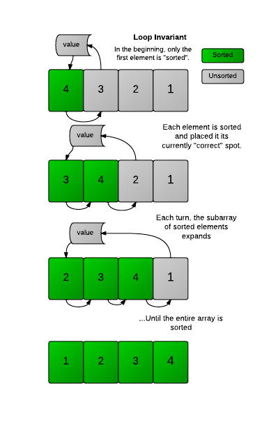

# 1D Orthogonal Range Searching

1D orthogonal range searching is a computational problem where you search for elements or data points within a 
specified 1D range (interval) in a collection of 1D data (e.g. Find me everyone between ages 22 and 27). 

While we can simply sort (and binary search the low and high of the specified range) to return all data points within 
the specified range, each query will minimally take O(nlogn) due to the sorting step, assuming dynamic updating of 
the data.

The goal of 1D Orthogonal Range Searching is to efficiently identify and retrieve all data points that fall within the 
given range.

## Complexity Analysis
**Time**:
- Overall:

- Build Tree (cost incurred once only): O(nlogn) limited by sorting step

Querying: O(k + logn)
- Find Split Node: O(logn) (binary search)
- Left Traversal: at every step, we either
    1. output all-right subtree (O(k) where k is no. of leaves) and recurse left
    2. recurse right (at most logn times)
- Right Traversal: similar to left traversal

**Space**: S(n) = S(n / 2) + O(n) => O(nlogn)

## Notes
### Common Misconception