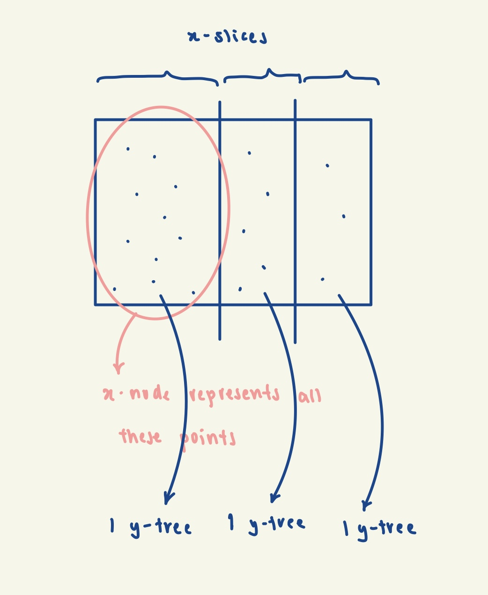
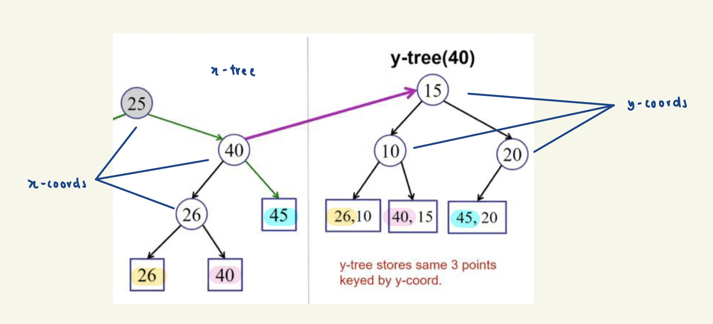
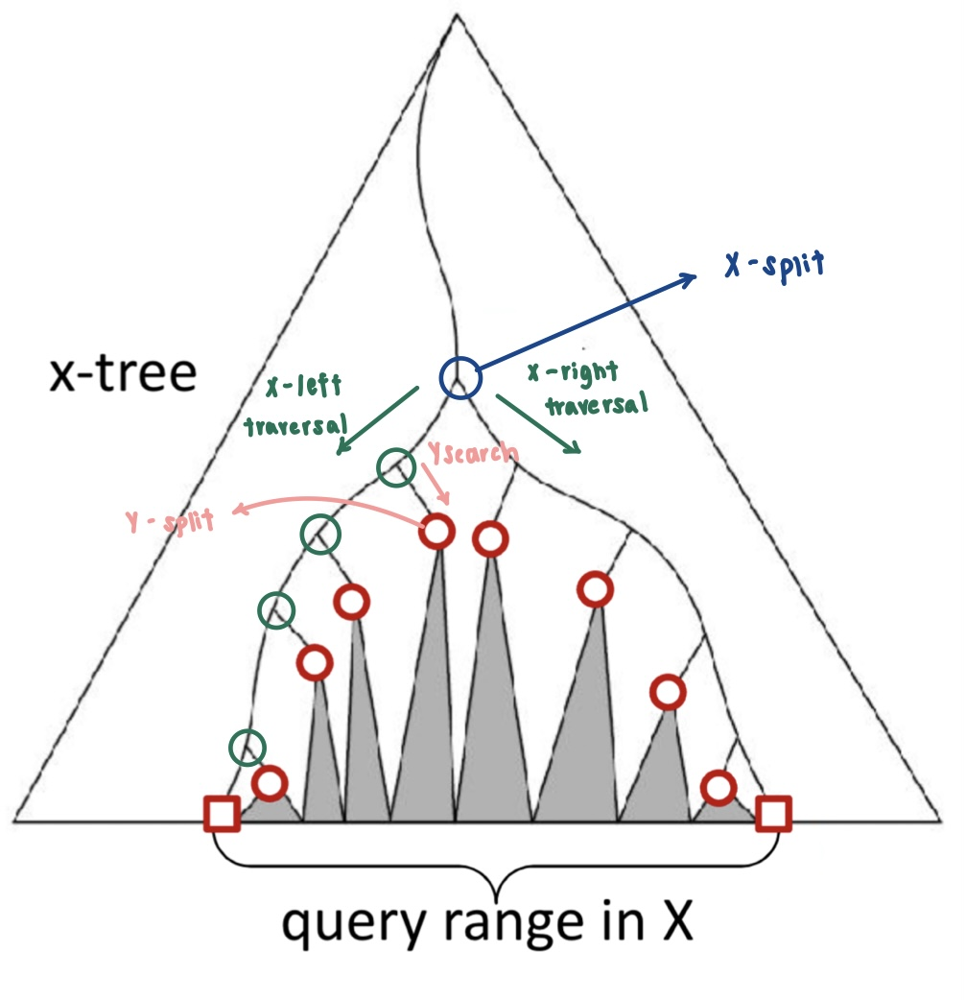

# 2D Orthogonal Range Searching

2D orthogonal range searching is a computational problem that involves efficiently answering queries about points 
in a two-dimensional space that fall within a specified axis-aligned rectangular range (orthogonal range). In other 
words, given a set of points in 2D, find me all the points that lie within a specific rectangle. 

To do so, we can extend the idea of 1D range trees to the 2D context. 

Strategy
- Each node in the x-tree has a set of points in its subtree
- Store a y-tree at each x-node containing all the points in the x-subtree

1. Build an x-tree using only x-coordinates. 
   - This should be done in the exact same way as you would for a 1D range tree. 
2. For every node in the x-tree, build a y-tree out of nodes in the x-subtree using only y-coordinates. 

Given the 2D range tree, we now want to query the points in a given rectangle 
i.e. search(tree, xLow, xHigh, yLow, yHigh). 

We first want to find the points that will satisfy the x-condition i.e. find me all points whose x-coordinates are 
between xLow and xHigh. To do so, we first need to find our split node in the x-tree, by performing binary search while 
traversing the x-tree - similar to how we found the split node in a 1D range tree. This will give us our X-split. 

Now given our X-split, we want to find points that satisfy both our x-condition and y-condition. 

Let's first explore our x-left subtree (X-left traversal). If (xLow <= x-coordinate of curr node), we are confident 
that the entire right subtree of the curr node satisfies our x-condition (because of BST property). 

Now we want to perform a Y-search to find the points that also satisfy the y-condition. To do so, we first need to
find our split node in the y-tree i.e. Y-split. Notice that the problem is now reduced to a 1D ORS problem. Once we 
have found Y-split, we can simply perform left traversal and right traversal from Y-split, similar to how it is done 
in 1D ORS. 

A similar symmetric logic applies in exploring our x-right subtree.

Image Source: https://www.cse.wustl.edu/~taoju/cse546/lectures/Lecture21_rangequery_2d.pdf

## Complexity Analysis
**Time**:

Build Tree (cost incurred once only): O(nlog^2n) 

Querying: O(k + log^2n)
- O(logn) to find X-split
- O(logn) recursing steps in X-left traversal/X-right-traversal
- O(logn) y-tree searches of cost O(logn) => overall: O(log^2n)
- O(k) enumerating output

**Space**: O(nlogn)
- Each point appears in at most 1 y-tree per level. (Refer to 1st image for visualisation)
- There are O(logn) levels in the x-tree.
- Therefore, each node appears in at most O(logn) y-trees. => overall: O(nlogn)
- The x-tree takes O(n) space. 

## Notes
### Dynamic Updates
Unlike 1D range trees, dynamic updates in a 2D range tree are inefficient as rotations in the x-tree might involve 
entirely rebuilding the y-trees for the rotated notes. Therefore, 2D ORS is mainly used for static querying. 

### d-dimensional Range Trees
- Query cost: O(k + log^dn)
- Build tree cost: O(nlog^(d-1)n)
- Space: O(nlog^(d-1)n)