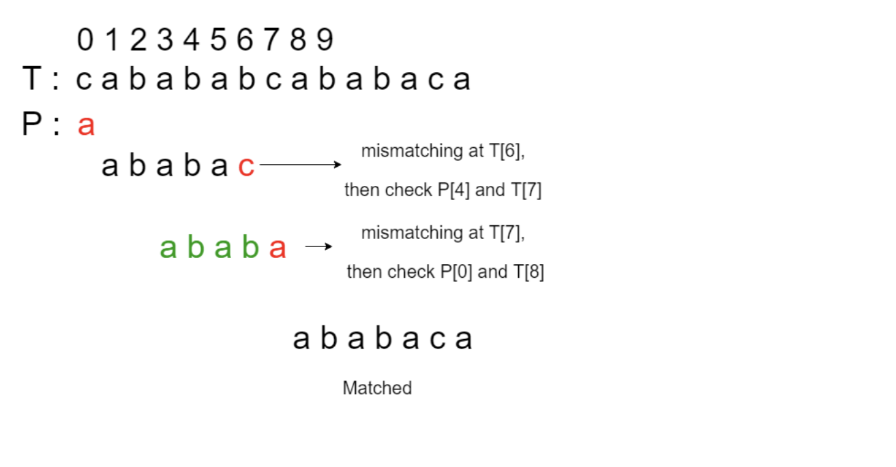

# Knuth-Moris-Pratt Algorithm

## Background
KMP match is a type of pattern-searching algorithm that improves the efficiency of naive search by avoiding unnecessary
comparisons. It is most notable when the pattern has repeating sub-patterns.
 
Pattern-searching problems is prevalent across many fields of CS, for instance,
in text editors when searching for a pattern, in computational biology sequence matching problems,
in NLP problems, and even for looking for file patterns for effective file management.
It is hence crucial that we develop an efficient algorithm.

Image Source: GeeksforGeeks

### Intuition
It's efficient because it utilizes the information gained from previous character comparisons. When a mismatch occurs, 
the algorithm uses this information to skip over as many characters as possible.

Considering the string pattern:  

                "XYXYCXYXYF" 

and string: 

                XYXYCXYXYCXYXYFGABC

KMP has, during its initial processing of the pattern, identified that "XYXY" is a repeating sub-pattern. 
This means when the mismatch at F (10th character of the pattern) and C (10th character of the string) occurs, 
KMP doesn't need to start matching again from the very beginning of the pattern.  
Instead, it leverages the information that "XYXY" has already been matched.

Therefore, the algorithm continues matching from the 5th character of the pattern string (C in "XYXYCXYXYF").   
It checks this against the 10th character of the string (C in "XYXYCXYXYCXYXYFGABC").  
Since they match, the algorithm continues from there without re-checking the initial "XYXY".

## Complexity Analysis
Let k be the length of the pattern and n be the length of the string to match against.
**Time complexity**: O(n+k)

Naively, we can look for patterns in a given sequence in O(nk) where n is the length of the sequence and k
is the length of the pattern. We do this by iterating every character of the sequence, and look at the
immediate k-1 characters that come after it. This is not a big issue if k is known to be small, but there's
no guarantee this is the case.

KMP does this in O(n+k) by making use of previously identified sub-patterns. It identifies sub-patterns
by first processing the pattern input in O(k) time, allowing identification of patterns in
O(n) traversal of the sequence. More details found in the src code.

**Space complexity**: O(k) auxiliary space to store suffix that matches with prefix of the pattern string

## Notes
1. A detailed illustration of how the algorithm works is shown in the code.
But if you have trouble understanding the implementation,
here is a good [video](https://www.youtube.com/watch?v=EL4ZbRF587g) as well. 
2. A subroutine to find Longest Prefix Suffix (LPS) is commonly involved in the preprocessing step of KMP. 
It may be useful to interpret these numbers as the number of characters matched between the suffix and prefix.  
Knowing the number of characters of prefix would help in informing the position of the next character of the pattern to
match.
