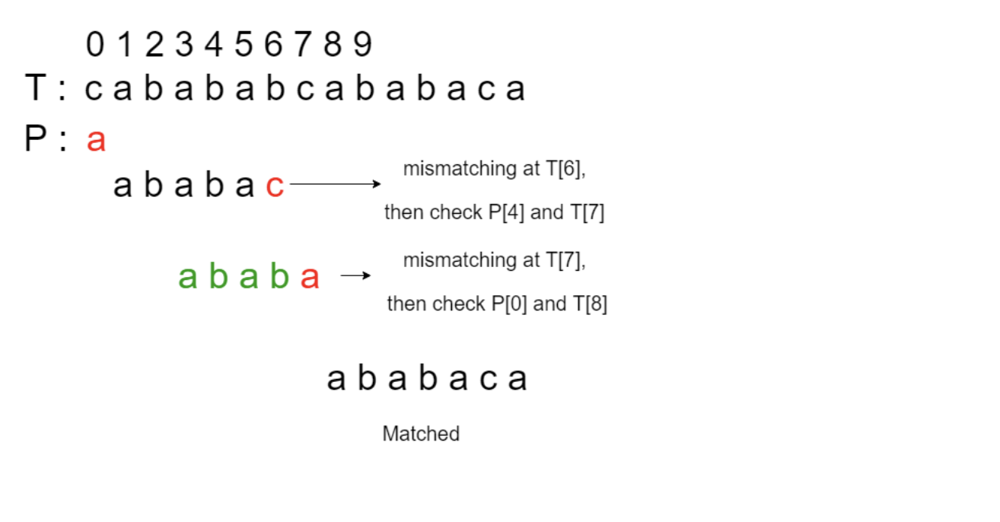

# Knuth-Morris-Pratt (KMP) Algorithm

## Background
KMP match is a type of pattern-searching algorithm that improves the efficiency of naive search by avoiding unnecessary
comparisons. It is most notable when the pattern has repeating sub-patterns.
<br>
Pattern-searching problems is prevalent across many fields of CS, for instance,
in text editors when searching for a pattern, in computational biology sequence matching problems,
in NLP problems, and even in looking for file patterns for effective file management.
It is hence crucial that we develop an efficient algorithm.

Typically, the algorithm returns a list of indices that denote the start of each occurrence of the pattern string.

<div align="center">
    
    <br/>
    <em>Source: GeeksforGeeks</em>
</div>

### Intuition
It's efficient because it utilizes the information gained from previous character comparisons. When a mismatch occurs, 
the algorithm uses this information to skip over as many characters as possible.

Considering the string pattern: 

Pattern:| X | Y | X | Y | C | X | Y | X | Y | F |
|-------|---|---|---|---|---|---|---|---|---|---|
Position:| 1 | 2 | 3 | 4 | 5 | 6 | 7 | 8 | 9 | 10|

and string: 

String:  | X | Y | X | Y | C | X | Y | X | Y | C | X | Y | X | Y | F | G | A | B | C |
|--------|---|---|---|---|---|---|---|---|---|---|---|---|---|---|---|---|---|---|---|
Position:| 1 | 2 | 3 | 4 | 5 | 6 | 7 | 8 | 9 | 10| 11| 12| 13| 14| 15| 16| 17| 18| 19|

KMP has, during its initial processing of the pattern, identified that "XYXY" is a repeating sub-pattern. 
This means when the mismatch at F (10th character of the pattern) and C (10th character of the string) occurs, 
KMP doesn't need to start matching again from the very beginning of the pattern. <br>
Instead, it leverages the information that "XYXY" has already been matched.

Therefore, the algorithm continues matching from the 5th character of the pattern string.

This is the key idea behind KMP and is applied throughout the string.

### The LPS Table

How does KMP know how far to fall back on a mismatch? It precomputes a small table called the **Longest Prefix Suffix (LPS)** table. The table below is 1-indexed — position 0 holds the sentinel `-1`, and the pattern itself lives in positions 1..n.

`LPS[i]` is the **number of characters at the start of the pattern that also reappear at the end of `pattern[1..i]`**. Equivalently, the length of the longest proper prefix of `pattern[1..i]` that is also a suffix of `pattern[1..i]`.

```
Pattern: |   | X | Y | X | Y | C | X | Y | X | Y | F |
|--------|---|---|---|---|---|---|---|---|---|---|---|
Position:| 0 | 1 | 2 | 3 | 4 | 5 | 6 | 7 | 8 | 9 | 10|
LPS:     | -1| 0 | 0 | 1 | 2 | 0 | 1 | 2 | 3 | 4 | 0 |
```

For example, at position 9 the pattern so far is `XYXYCXYXY`, and `LPS[9] = 4` because the prefix `XYXY` reappears as the suffix `XYXY` (4 characters overlap).

**Why this is useful**: Suppose we've already matched the first `j-1` characters of the pattern against the text and we hit a mismatch at pattern position `j`. The naive approach would shift the pattern by one and re-compare from scratch. KMP does better — it knows the **last `LPS[j-1]` characters** of what it just matched are also the **first `LPS[j-1]` characters** of the pattern. Those characters are already aligned, so we can resume comparing from pattern position `LPS[j-1] + 1` without ever moving the text pointer back.

**Worked example**: Take pattern `XYXYC` (positions 1..5, LPS = `[-1, 0, 0, 1, 2, 0]`) against text `XYXYXYC`.
- Match `X, Y, X, Y` against text positions 1..4. Now `pattern[5] = C` vs `text[5] = X` — mismatch.
- *Naive*: shift the pattern right by one, restart from text position 2. Several wasted re-comparisons.
- *KMP*: we just matched 4 chars, so we look at `LPS[4] = 2`. That tells us the last 2 matched chars (`XY`) are also the pattern's first 2 chars — already in the right place. We resume comparing `pattern[3]` against `text[5]`, with no backtracking on the text and no recomparing the `XY` prefix.

In short: **the LPS table lets KMP reuse what it already knows about the matched prefix, so it never re-scans text it has already seen**. This is what brings the worst case from `O(nk)` down to `O(n + k)`.

## Complexity Analysis
Let k be the length of the pattern and n be the length of the string to match against.

Naively, we can look for patterns in a given sequence in O(nk) where n is the length of the sequence and k
is the length of the pattern. We do this by iterating every character of the sequence, and look at the
immediate k-1 characters that come after it. This is not a big issue if k is known to be small, but there's
no guarantee this is the case.

**Time complexity**: O(n+k)

KMP does this in O(n+k) by making use of previously identified sub-patterns. It identifies sub-patterns
by first processing the pattern input in O(k) time, allowing identification of patterns in
O(n) traversal of the sequence. More details found in the src code.

**Space complexity**: O(k) auxiliary space to store suffix that matches with prefix of the pattern string

## Notes
1. A detailed illustration of how the algorithm works is shown in the code.
If you have trouble understanding the implementation,
here is a good [video](https://www.youtube.com/watch?v=EL4ZbRF587g) walkthrough as well.
2. The LPS table itself is built in `O(k)` using a similar two-pointer trick, each pattern character
is compared at most twice. See the implementation for the step-by-step build.
