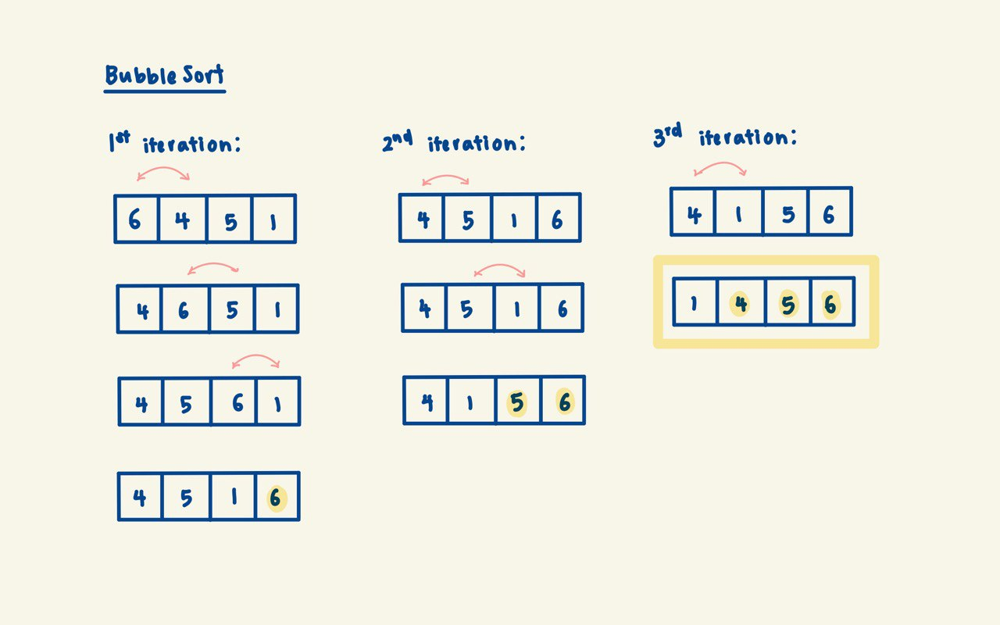

# Bubble Sort

## Background

Bubble sort is one of the more intuitive comparison-based sorting algorithms.
It makes repeated comparisons between neighbouring elements, 'bubbling' (side-by-side swaps)
the largest (or smallest) element in the unsorted region to the sorted region.

    

### Implementation Invariant

**After the kth iteration, the biggest k items are correctly sorted at the final k positions of the array**.

The job of the kth iteration of the outer loop is to bubble the kth-largest element to the kth position
from the right (i.e., its correct position). This is done by repeatedly comparing adjacent elements and
swapping them if they are in the wrong order.

## Complexity Analysis

| Case | Time | Space |
|------|------|-------|
| Worst (reverse sorted) | `O(n²)` | `O(1)` |
| Average | `O(n²)` | `O(1)` |
| Best (already sorted) | `O(n)` | `O(1)` |

In the worst case, during each iteration of the outer loop, the number of adjacent comparisons is
upper-bounded by n. Since BubbleSort requires (n-1) iterations to sort the entire array, the total
number of comparisons is bounded by `(n-1) * n ≈ n²`.

Our implementation terminates early if no swaps occur in a pass, giving `O(n)` best case for sorted input.

## Notes

1. **Stability**: Bubble sort is stable - equal elements maintain their relative order since we only
   swap when `arr[j] > arr[j+1]` (strictly greater).

2. **Adaptive**: The early termination optimization makes it adaptive - it performs better on
   partially sorted arrays.

3. **In-place**: Only requires `O(1)` extra space for the swap variable.

4. **Comparison to other O(n²) sorts**: Despite its simplicity, bubble sort typically performs worse
   than insertion sort in practice due to more swaps. Insertion sort is generally preferred.

## Applications

Bubble sort is rarely used in practice due to its poor average performance. However, it can be useful for:

| Use Case | Why? |
|----------|------|
| Educational purposes | Simple to understand and implement |
| Nearly sorted data | `O(n)` best case with early termination |
| Small datasets | Overhead is minimal for tiny arrays |
| Detecting if array is sorted | Single pass with no swaps confirms sorted |

**Interview tip:** Bubble sort's main value is educational. If asked to implement a simple sort,
insertion sort is usually a better choice as it has the same complexity but fewer swaps on average.
