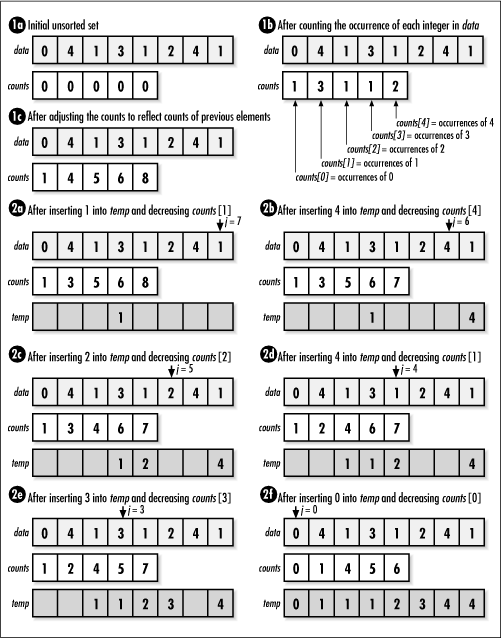

# Counting Sort

## Background

Counting sort is a non-comparison-based sorting algorithm that isn't bounded by the `O(n log n)` lower
bound of comparison-based sorts. It achieves `O(n + k)` time by counting element occurrences rather
than comparing elements.

The algorithm works in three steps:
1. **Count**: Build a frequency map counting occurrences of each element
2. **Accumulate**: Convert to prefix sums (cumulative counts) - this tells us where each element belongs
3. **Place**: Iterate through the original array (backwards for stability), placing each element in its
   correct position using the prefix sum array

Image Source: https://www.oreilly.com/library/view/mastering-algorithms-with/1565924533/ch12s13.html

_To align with our implementation: data → arr, counts → freq, temp → sorted._

### Implementation Invariant

**At the end of the ith iteration, the ith element from the back of the original array is placed in
its correct position**.

Note: Iterating from the back maintains stability. An alternative front-to-back implementation is
possible but would not be stable.

<b>Common Misconception</b>

_"Counting sort does not require total ordering since it's non-comparison based."_

This is incorrect. It requires total ordering to determine relative positions in the sorted output.
The total ordering is reflected in the structure of the frequency map - index 0 comes before index 1,
which comes before index 2, etc.

## Complexity Analysis

| Metric | Complexity | Notes |
|--------|------------|-------|
| Time | `O(n + k)` | n = number of elements, k = range of values |
| Space | `O(n + k)` | Frequency array (k) + output array (n) |

Counting sort is most efficient when `k = O(n)`, i.e., the range of values doesn't greatly exceed the
number of elements. When `k >> n`, the overhead of the frequency array dominates.

**Note**: This is NOT an in-place algorithm - it requires `O(n + k)` auxiliary space.

## Notes

1. **Non-negative integers only**: Our implementation works only on non-negative integers. To handle
   negative integers, add an offset of `abs(min)` to all elements before sorting, then subtract it after.

2. **Stability**: Our implementation is stable (equal elements maintain relative order) because we
   iterate backwards through the input array when placing elements.

3. **Not in-place**: Requires additional space for the frequency map and output array.

4. **Integer keys only**: Unlike comparison-based sorts, counting sort only works on integer keys
   (or values that can be mapped to integers).

## Applications

| Use Case | Why Counting Sort? |
|----------|-------------------|
| Small integer range | `O(n + k)` beats `O(n log n)` when k is small |
| **[Radix Sort](../radixSort) subroutine** | Stable `O(n + k)` sort for each digit/segment |
| Sorting characters | ASCII/Unicode values form a bounded range |
| Histogram generation | Frequency map is a useful byproduct |

**Key application - Radix Sort**: Counting sort's stability makes it the ideal subroutine for
[Radix Sort](../radixSort). Radix sort processes numbers digit-by-digit, and stability ensures that
the ordering from previous digit passes is preserved. Without stability, radix sort would produce
incorrect results.

**Interview tip:** When asked about `O(n)` sorting, counting sort is the go-to answer for bounded
integer ranges. Know the trade-off: `O(n + k)` time/space means it's only practical when `k` (the
range) is not much larger than `n`.

Supplementary: [Video explanation](https://www.youtube.com/watch?v=OKd534EWcdk).
