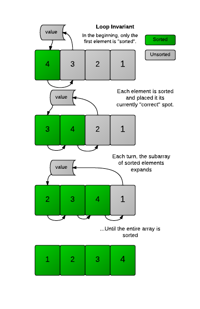

# Insertion Sort

## Background

Insertion sort is a comparison-based sorting algorithm that builds the final sorted array one element
at a time. It works by repeatedly taking an element from the unsorted portion and inserting it into
its correct position within the sorted portion. Note that the position is not final since subsequent
elements may displace previously inserted elements. What matters is the sorted region remains sorted.

More succinctly, at the kth iteration, we take `arr[k]` and insert it into `arr[0..k-1]` following
sorted order, giving us `arr[0..k]` in sorted order.

    
     
    <em>Source: HackerRank</em>

### Implementation Invariant

**At the end of the kth iteration, the first (k+1) items in the array are in sorted order**.

At the end of the (n-1)th iteration, all n items will be in sorted order.

## Complexity Analysis

| Case | Time | Space |
|------|------|-------|
| Worst (reverse sorted) | `O(n²)` | `O(1)` |
| Average | `O(n²)` | `O(1)` |
| Best (already sorted) | `O(n)` | `O(1)` |

In the worst case, inserting an element into a sorted array of length m requires iterating through
the entire array: `O(m)`. Since we do this (n-1) times: `1 + 2 + ... + (n-1) = O(n²)`.

In the best case (already sorted), each insertion takes `O(1)` as the element is already in position.
Total: `O(1) * (n-1) = O(n)`.

## Notes

1. **Stability**: Insertion sort is stable - equal elements maintain their relative order.

2. **Adaptive**: Performs well on partially sorted arrays. If each element is at most k positions
   from its sorted position, time complexity is `O(nk)`.

3. **Online**: Can sort elements as they arrive (streaming) without needing the entire input upfront.

4. **In-place**: Only requires `O(1)` extra space.

<b>Common Misconception: Insertion vs Selection Sort</b>

The invariants are often confused:
- **Insertion sort**: Elements in sorted region are in sorted order, but not necessarily in their
  *final* positions (may be displaced by future insertions).
- **Selection sort**: Elements in sorted region are in their *final* positions (smallest k elements
  are correctly placed).

This "looser" invariant is what allows insertion sort's `O(n)` best case - we can skip elements
that are already in position.

## Applications

| Use Case | Why Insertion Sort? |
|----------|---------------------|
| Small datasets (n < 50) | Low overhead, simple implementation |
| Nearly sorted data | `O(n)` performance when few inversions |
| Online sorting | Can process elements as they arrive |
| Hybrid algorithms | Used as base case in quicksort/mergesort for small subarrays |

**Interview tip:** Insertion sort is the preferred "simple" `O(n²)` sort. It outperforms bubble and
selection sort on average, and its `O(n)` best case makes it excellent for nearly-sorted data.
Many production sorting algorithms (like Timsort) use insertion sort for small subarrays.
