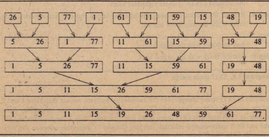

# Merge Sort

### Background
The iterative implementation of MergeSort takes a bottom-up approach, where the sorting process starts by merging
intervals of size 1. Intervals of size 1 are trivially in sorted order. The algorithm then proceeds to merge
adjacent sorted intervals, doubling the interval size with each merge step, until the entire array is fully sorted.

Image Source: https://www.chelponline.com/iterative-merge-sort-12243

### Implementation Invariant
At each iteration of the merging process, the main array is divided into sub-arrays of a certain interval
size (interval). Each of these sub-arrays is sorted within itself. The last sub-array may not be of size
interval, but it is still sorted since its size is necessarily less than interval.

### Complexity Analysis
Time:
- Worst case: O(nlogn)
- Average case: O(nlogn)
- Best case: O(nlogn)

Given two sorted arrays of size p and q, we need O(p + q) time to merge the two arrays into one sorted array, since
we have to iterate through every element in both arrays once.

- At the 1st level of the merge process, our merging subroutine involves n sub-arrays of size 1, taking O(n) time.
- At the 2nd level of the merge process, our merging subroutine involves (n/2) sub-arrays of size 2, taking O(n) time.
- At the kth level of the merge process, our merging subroutine involves (n/(2^(k-1))) sub-arrays of size (2^(k-1)),
taking O(n) time.

Since interval doubles at every iteration of the merge process, there are logn such levels. Every level takes
O(n) time, hence overall time complexity is n * logn = O(nlogn)

Regardless of how sorted the input array is, MergeSort carries out the partitioning and merging process, so the
time complexity of MergeSort is O(nlogn) for all cases.

Space:
- O(n) since we require a temporary array to temporarily store the merged elements in sorted order