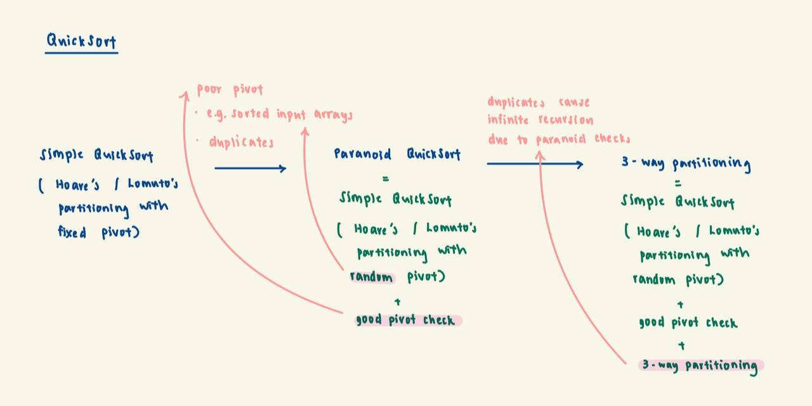

# QuickSort

This page will provide a high-level overview of the different types of QuickSort and the significance of each
enhancement.

We start off with Simple QuickSort, which utilises Hoare's / Lomuto's partitioning with a fixed pivot. But the time
complexity of Simple QuickSort degrades to O(n^2) when pivots chosen are continuously bad. This could be because of
inputs such as sorted arrays, where picking the first element as the pivot will always lead to an extremely imbalanced
partitioning. This could also be because of the presence of duplicates, as we now handle duplicates by putting them to
one side of the pivot.

Therefore, we introduced randomisation in pivot selection to prevent fixed pivot selection from continuously choosing
a bad pivot. We also added a good pivot check (Paranoid) to Simple QuickSort to ensure that the pivots we select are
"good" and will not cause extremely imbalanced partitions. However, the presence of the good pivot checks will cause
infinite recursion when the array contains many duplicates, since any pivot you choose in the array will fail the good
pivot check.

So, we introduced 3-way partitioning to handle duplicates by partitioning the array into three sections: elements less
than the pivot, elements equal to the pivot, and elements greater than the pivot. Now the good pivot check ignores the
size of the segment that comprises elements = to pivot.

## Recommended Order of Reading
1. [Hoares](./hoares)
2. [Lomuto](./lomuto)
3. [Paranoid](./paranoid)
4. [3-way partitioning](./threeWayPartitioning)
