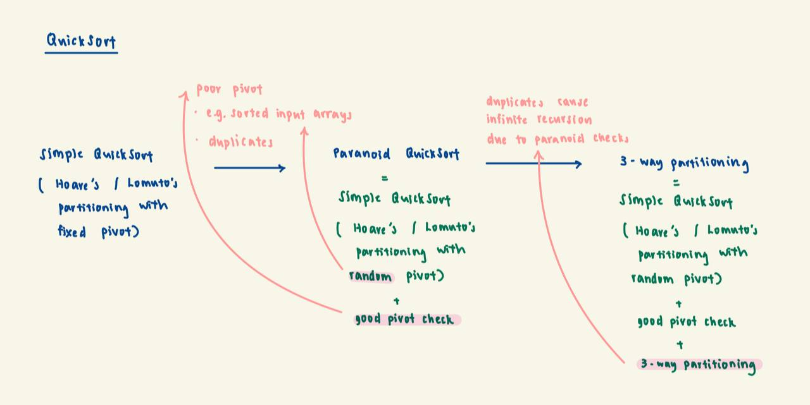

# QuickSort

This page will provide a high-level overview of the different types of QuickSort and the significance of each
enhancement.

## Background

QuickSort is a divide-and-conquer sorting algorithm that works by selecting a pivot element and partitioning
the array around it. It's one of the most widely used sorting algorithms in practice.

    

## Variants Summary

| Variant | Time (Avg) | Time (Worst) | Handles Duplicates? | Notes |
|---------|------------|--------------|---------------------|-------|
| [Hoare's](./hoares) | `O(n log n)` | `O(n²)` | Poorly | Two pointers, fewer swaps |
| [Lomuto's](./lomuto) | `O(n log n)` | `O(n²)` | Poorly | Single pointer, simpler |
| [Paranoid](./paranoid) | `O(n log n)` | `O(n log n)`* | Infinite loop | Guarantees good pivots |
| [3-Way](./threeWayPartitioning) | `O(n log n)` | `O(n log n)` | Yes | Best for duplicates |

*Paranoid quicksort infinite loops on arrays with many duplicates.

## Evolution of QuickSort

We start off with **Simple QuickSort**, which utilizes Hoare's/Lomuto's partitioning with a fixed pivot. But
the time complexity degrades to `O(n²)` when pivots chosen are continuously bad. This could be because of
inputs such as sorted arrays, where picking the first element as the pivot always leads to extremely
imbalanced partitioning. This could also be because of the presence of duplicates, as we handle duplicates
by putting them to one side of the pivot.

Therefore, we introduced **randomization in pivot selection** to reduce the probability of continuously
choosing bad pivots. To further guarantee good pivots, we added a good pivot check (**Paranoid**) that
re-partitions if the pivot doesn't create at least a 1/10-9/10 split. A good pivot is important because
balanced partitions give `O(log n)` recursion depth, while extremely imbalanced ones degrade to `O(n)`. However, the good pivot
check causes infinite recursion when the array contains many duplicates, since any pivot you choose will
fail the good pivot check.

So, we introduced **3-way partitioning** to handle duplicates by partitioning the array into three sections:
elements less than the pivot, elements equal to the pivot, and elements greater than the pivot. Now the
good pivot check ignores the size of the segment that comprises elements equal to pivot.

## Recommended Order of Reading

1. [Hoare's](./hoares) - Classic two-pointer partitioning
2. [Lomuto's](./lomuto) - Simpler single-pointer variant
3. [Paranoid](./paranoid) - Good pivot guarantees
4. [3-Way Partitioning](./threeWayPartitioning) - Duplicate handling

**Interview tip:** Know that quicksort is `O(n log n)` average but `O(n²)` worst case, and why (bad pivots).
The standard fix is randomized pivot selection. For duplicate-heavy data, mention 3-way partitioning.
Quicksort is preferred over merge sort when `O(1)` extra space is needed (in-place), but merge sort is
preferred when stability or worst-case guarantees matter.
