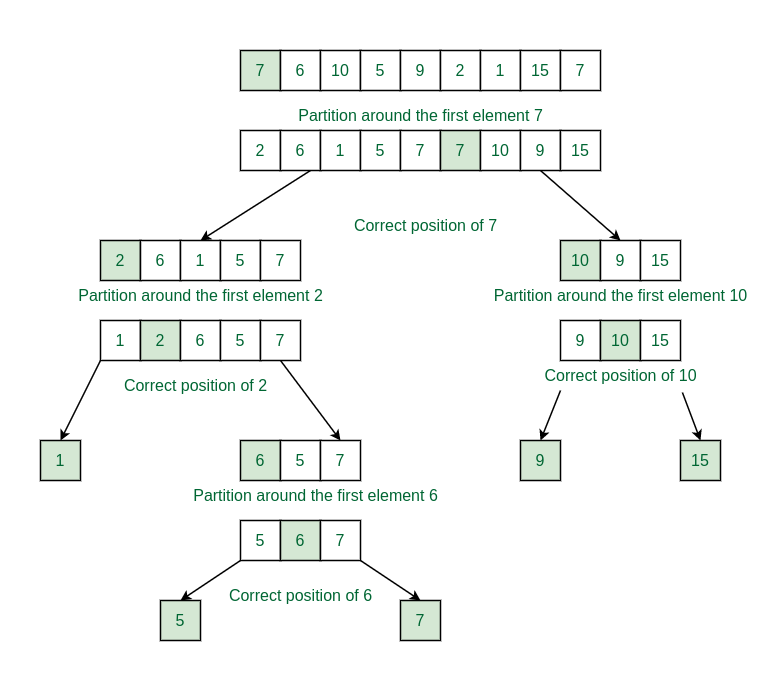
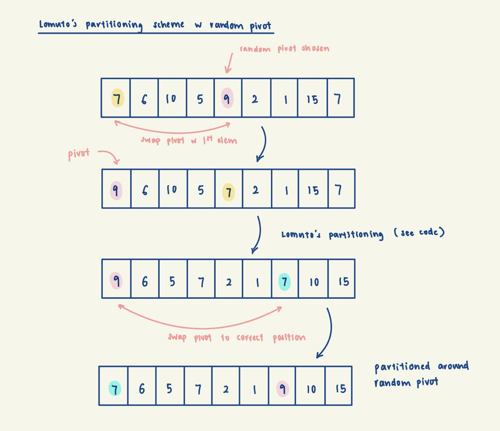

# Lomuto's QuickSort

## Background
QuickSort is a divide-and-conquer sorting algorithm. The basic idea behind Quicksort is to choose a pivot element,
places it in its correct position in the sorted array, and then recursively sorts the sub-arrays on either side of
the pivot. When we introduce randomization in pivot selection, every element has equal probability of being
selected as the pivot. This means the chance of an extreme element getting chosen as the pivot is decreased, so we
reduce the probability of encountering the worst-case scenario of imbalanced partitioning.

This is how QuickSort works if we always pick the first element as the pivot with Lomuto's partitioning.

Image Source: https://www.geeksforgeeks.org/implement-quicksort-with-first-element-as-pivot/

If we use randomised pivot selection, the idea is very similar to the above implementation. All we
need to do is to swap the random pivot to the first element in the array, then partition as per usual,
then swap the pivot back to its correct position. Below is an illustration:

## Implementation Invariant
The pivot is in the correct position, with elements to its left being <= it, and elements to its right being > it.

## Complexity Analysis:
Time:
- Expected worst case (poor choice of pivot): O(n^2)
- Expected average case: O(nlogn)
- Expected best case (balanced pivot): O(nlogn)

In the best case of a balanced pivot, the partitioning process divides the array in half, which leads to log n
levels of recursion. Given a sub-array of length m, the time complexity of the partition subroutine is O(m) as we
need to iterate through every element in the sub-array once.
Therefore, the recurrence relation is: T(n) = 2T(n/2) + O(n) => O(nlogn).

Even in the average case where the chosen pivot partitions the array by a fraction, there will still be log n levels
of recursion. (e.g. T(n) = T(n/10) + T(9n/10) + O(n) => O(nlogn))

However, if there are many duplicates in the array, e.g. {1, 1, 1, 1}, the 1st pivot will be placed in the 3rd idx,
and 2nd pivot in 2nd idx, 3rd pivot in the 1st idx and 4th pivot in the 0th idx. As we observe, the presence of many
duplicates in the array leads to extremely unbalanced partitioning, leading to a O(n^2) time complexity.

Space:
- O(1) excluding memory allocated to the call stack, since partitioning is done in-place

## Notes
### Lomuto's vs Hoare's QuickSort

Lomuto's partition scheme is in contrast to Hoare's partition scheme. Hoare's uses two pointers, while Lomuto's uses
one. Hoare's partition scheme is generally more efficient as it requires less swaps. See more at
https://www.geeksforgeeks.org/hoares-vs-lomuto-partition-scheme-quicksort/.