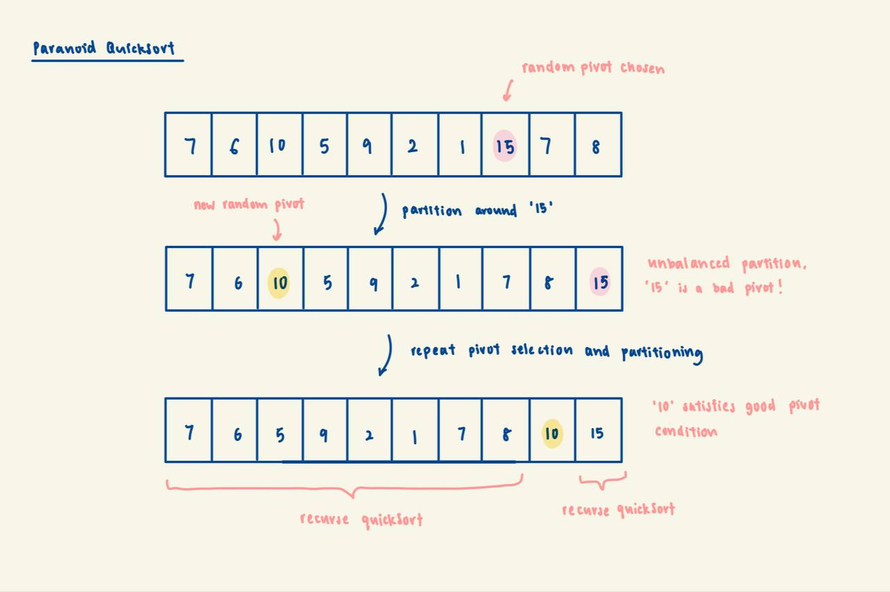

# Paranoid QuickSort

## Background 
Paranoid Quicksort is the naive quicksort with that allow additional attempts to guarantee a good pivot selection.

## Complexity Analysis:
Time: (this analysis assumes the absence of many duplicates in our array)
- Expected worst case: O(nlogn)
- Expected average case: O(nlogn)
- Expected best case: O(nlogn)

The additional check to guarantee a good pivot guards against the worst case scenario where the chosen pivot results
in an extremely imbalanced partitioning. Since the chosen pivot has to at least partition the array into a
1/10, 9/10 split, the recurrence relation will be: T(n) = T(n/10) + T(9n/10) + n(# iterations of pivot selection).

The number of iterations of pivot selection is expected to be <2 (more precisely, 1.25). This is because
P(good pivot) = 8/10. Expected number of tries to get a good pivot = 1 / P(good pivot) = 10/8 = 1.25.

Therefore, the expected time-complexity is: T(n) = T(n/10) + T(9n/10) + 1.25n => O(nlogn).

- Edge case: does not terminate
The presence of this additional check and repeating pivot selection means that if we have an array of
length n >= 10 containing all/many duplicates of the same number, any pivot we pick will be a bad pivot and we will
enter an infinite loop of repeating pivot selection.

Space:
- O(1) excluding memory allocated to the call stack, since partitioning is done in-place