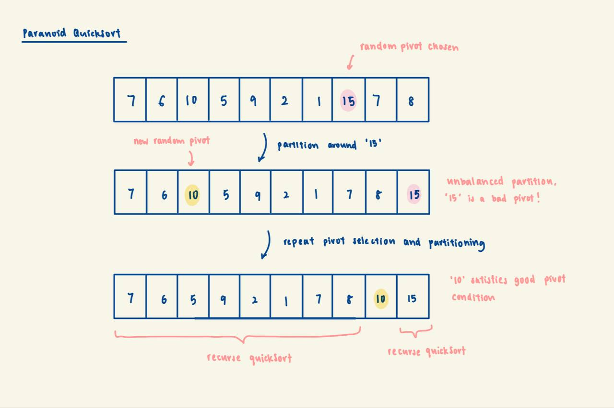

# Paranoid QuickSort

## Background 
Paranoid Quicksort is the naive quicksort with that allow additional attempts to guarantee a good pivot selection.

    

## Complexity Analysis

| Metric | Complexity | Notes |
|--------|------------|-------|
| Time (all cases)* | `O(n log n)` | Good pivot guarantee ensures balanced partitions |
| Space | `O(log n)` | Call stack; partitioning is in-place |

*Assumes absence of many duplicates (see edge case below).

The good pivot check guards against worst-case imbalanced partitioning. Since the pivot must create at
least a 1/10-9/10 split, the recurrence relation is: `T(n) = T(n/10) + T(9n/10) + n × (# pivot attempts)`.

The expected number of pivot selection attempts is ~1.25:
- `P(good pivot) = 8/10` (middle 80% of elements are good pivots)
- Expected tries = `1 / P(good pivot) = 10/8 = 1.25`

Therefore: `T(n) = T(n/10) + T(9n/10) + 1.25n` => `O(n log n)`.

## Notes

1. **Edge case - infinite loop**: For arrays of length n >= 10 containing all/many duplicates of the same
   number, any pivot will be a "bad" pivot (fails the 1/10-9/10 check), causing an infinite loop. This is
   solved by [Three-Way Partitioning](../threeWayPartitioning).

2. **Why 1/10-9/10?**: This threshold ensures `O(n log n)` while having high probability (80%) of success
   per attempt. Stricter thresholds would require more re-partitioning attempts.