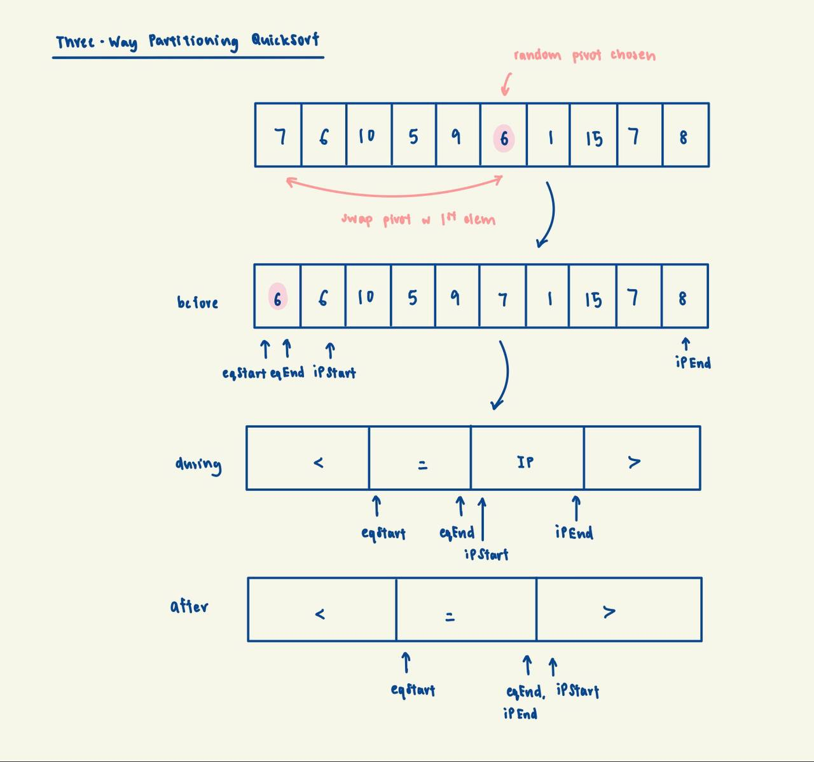

# Three-Way Partitioning

### Background
Three-way partitioning is used in QuickSort to tackle the scenario where there are many duplicate elements in the
array being sorted.

The idea behind three-way partitioning is to divide the array into three sections: elements less than the pivot,
elements equal to the pivot, and elements greater than the pivot. By doing so, we can avoid unnecessary comparisons
and swaps with duplicate elements, making the sorting process more efficient.

### Implementation Invariant:
The pivot and any element numerically equal to the pivot will be in the correct positions in the array. Elements
to their left are < them and elements to their right are > than them.

### Complexity Analysis:
Time:
- Worst case: O(nlogn)
- Average case: O(nlogn)
- Best case: O(nlogn)

Space:
- O(1) excluding memory allocated to the call stack, since partitioning is done in-place

