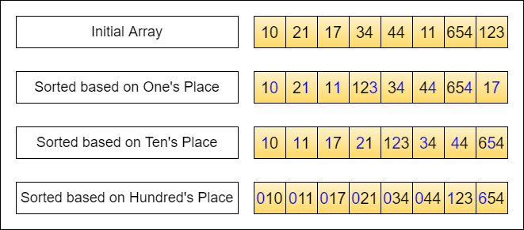

# Radix Sort

## Background
Radix Sort is a non-comparison based, stable sorting algorithm that conventionally uses counting sort as a subroutine.

Radix Sort performs counting sort several times on the numbers. It sorts starting with the least-significant segment 
to the most-significant segment. What a 'segment' refers to is explained below. 

### Idea
The definition of a 'segment' is user-defined and could vary depending on implementation.

Let's consider sorting an array of integers. We interpret the integers in base-10 as shown below.  
Here, we treat each digit as a 'segment' and sort (counting sort as a sub-routine here) the elements 
from the least significant digit (right) to most significant digit (left). In other words, the sub-routine sort is just
focusing on 1 digit at a time.

    
     
    Credits: Level Up Coding

The astute would note that a **stable version of counting sort** has to be used here, otherwise the relative ordering
based on previous segments might get disrupted when sorting with subsequent segments.

### Segment Size
Naturally, the choice of using just 1 digit in base-10 for segmenting is an arbitrary one. The concept of Radix Sort 
remains the same regardless of the segment size, allowing for flexibility in its implementation.

In practice, numbers are often interpreted in their binary representation, with the 'segment' commonly defined as a 
bit chunk of a specified size (usually 8 bits/1 byte, though this number could vary for optimization).

For our implementation, we utilize the binary representation of elements, partitioning them into 8-bit segments. 
Given that an integer is typically represented in 32 bits, this results in four segments per integer. 
By applying the sorting subroutine to each segment across all integers, we can efficiently sort the array. 
This method requires sorting the array four times in total, once for each 8-bit segment,

### Implementation Invariant
At the end of the *ith* iteration, the elements are sorted based on their numeric value up till the *ith* segment.

### Common Misconception
While Radix Sort is a non-comparison-based algorithm, 
it still necessitates a form of total ordering among the elements to be effective. 
Although it does not involve direct comparisons between elements, Radix Sort achieves ordering by processing elements 
based on individual segments or digits. This process depends on Counting Sort, which organizes elements into a 
frequency map according to a **predefined, ascending order** of those segments.

## Complexity Analysis
Let b-bit words be broken into r-bit pieces. Let n be the number of elements.

*b/r* represents the number of segments and hence the number of counting sort passes. Note that each pass
of counting sort takes *(2^r + n)* (or more commonly, O(k+n) where k is the range which is 2^r here).

**Time**: *O((b/r) * (2^r + n))*

**Space**: *O(2^r + n)*  
Note that our implementation has some slight space optimization - creating another array at the start so that we can
repeatedly recycle the use of original and the copy (saves space!), 
to write and update the results after each iteration of the sub-routine function.

### Choosing r
Previously we said the number of segments is flexible. Indeed, it is, but for more optimised performance, r needs to be
carefully chosen. The optimal choice of r is slightly smaller than logn which can be justified with differentiation.

Briefly, r=logn --> Time complexity can be simplified to (b/lgn)(2n).  
For numbers in the range of 0 - n^m, b = number of bits = log(n^m) = mlogn  
and so the expression can be further simplified to *O(mn)*.

## Notes
- Radix Sort doesn't compare elements against each other, which can make it faster than comparative sorting algorithms 
like QuickSort or MergeSort for large datasets with a small range of key values
  - Useful for large sets of numeric data, especially if stability is important
  - Also works well for data that can be divided into segments of equal size, with the ordering between elements known
  
- Radix sort's efficiency is closely tied to the number of digits in the largest element. So, its performance 
might not be optimal on small datasets that include elements with a significantly higher number of digits compared to 
others. This scenario could introduce more sorting passes than desired, diminishing the algorithm's overall efficiency.
  - Avoid for datasets with sparse data
