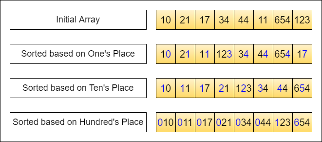

# Radix Sort

## Background

Radix Sort is a non-comparison based, stable sorting algorithm that uses counting sort as a subroutine.
It sorts by processing individual digits/segments from least-significant to most-significant.

### Idea

Consider sorting integers by their decimal digits. We sort all numbers by their least significant digit
first (ones place), then by the next digit (tens place), and so on. Each digit position is a "segment".

    
     
    Credits: Level Up Coding

The key insight: a **stable** counting sort must be used as the subroutine. If the sort isn't stable,
the relative ordering established by previous segments gets disrupted in subsequent passes.

<b>LSD vs MSD Radix Sort</b>

There are two variants of Radix Sort:
- **LSD (Least Significant Digit first)**: What we implement. Processes from rightmost to leftmost digit.
  Requires a stable subroutine but is simpler to implement.
- **MSD (Most Significant Digit first)**: Processes from leftmost to rightmost. Works recursively on
  subgroups, similar to quicksort. Doesn't require stability but is more complex. Can short-circuit
  on variable-length strings (e.g., stop early when a bucket has one element).

LSD is typically preferred for fixed-width integers due to its simplicity.

### Segment Size

The choice of segment size is flexible. Using single decimal digits (as above) is intuitive but arbitrary.

In practice, numbers are interpreted in binary, with segments defined as bit chunks of a fixed size
(commonly 8 bits). Why 8 bits? It balances the number of passes against the counting sort's range:
- Fewer bits per segment → more passes but smaller counting arrays
- More bits per segment → fewer passes but larger counting arrays (and more memory)

Our implementation uses 8-bit segments on 32-bit integers. This means 4 passes of counting sort, with each
pass handling 256 possible values (`2^8`). The sorting subroutine processes one 8-bit segment at a time,
from least significant to most significant.

### Implementation Invariant

At the end of the *i*th iteration, elements are sorted based on their numeric value up to the *i*th segment.

<b>Common Misconception</b>

While Radix Sort is non-comparison-based, it still necessitates a form of total ordering to be effective.
Although it does not involve direct comparisons between elements, Radix Sort achieves ordering by processing
elements based on individual segments. This process depends on Counting Sort, which organizes elements into
a frequency map according to a **predefined ascending order** of those segments.

## Complexity Analysis

**Time: `O(n)`** for fixed-width integers. **Space: `O(n)`** auxiliary.

Let `b`-bit words be broken into `r`-bit pieces. Let `n` be the number of elements.

`b/r` represents the number of segments and hence the number of counting sort passes. Each pass of counting
sort takes `O(2^r + n)` (or more commonly `O(k + n)` where `k` is the range, which is `2^r` here).

| Metric | General Formula | Our Implementation (b=32, r=8) |
|--------|-----------------|--------------------------------|
| Time | `O((b/r) * (2^r + n))` | `O(4 * (256 + n))` = **`O(n)`** |
| Space | `O(2^r + n)` | `O(256 + n)` = **`O(n)`** |

With fixed `b` and `r`, the constants fold away, leaving `O(n)`. Our implementation alternates between two
arrays instead of allocating new ones each pass.

<b>Choosing r (segment size)</b>

The number of segments is flexible, but for optimized performance, `r` needs to be carefully chosen.
The optimal choice of `r` is slightly smaller than `log(n)`, which can be justified with differentiation.

With `r = log(n)`:
- Time complexity simplifies to `(b/log n) * 2n`
- For numbers in range `0` to `n^m`: `b = log(n^m) = m * log(n)`
- Final complexity: **`O(mn)`**

**Interview tip:** For sorting `n` integers in a known range, Radix Sort achieves `O(n)` which beats the
`O(n log n)` lower bound of comparison-based sorts.

## Notes

1. **Non-negative integers only**: Our implementation only works for non-negative integers. Negative numbers
   cause incorrect ordering due to the sign bit. To handle negatives, separate them, sort absolute values,
   then merge (with negatives reversed).

2. **Stability is critical**: Radix Sort's correctness depends on using a stable sort for each pass. If
   the subroutine isn't stable, the ordering from previously sorted segments gets disrupted.

   

   
Why stability matters (example)

   Consider sorting `[12, 22, 11]` by decimal digits:
   - **Pass 1 (ones digit)**: Group by ones → `[11, 12, 22]` (1s before 2s)
   - **Pass 2 (tens digit)**: All have tens digit 1 or 2

   If Pass 2 is **stable**: elements with the same tens digit keep their relative order from Pass 1.
   Result: `[11, 12, 22]` ✓

   If Pass 2 is **unstable**: `12` and `11` (both have tens=1) might swap arbitrarily.
   Result: `[12, 11, 22]` ✗
   

3. **Space optimization**: We alternate between the original array and a temp buffer instead of allocating
   new arrays each pass, reducing space overhead.

4. **Bit masking**: We use bit masking to extract segments efficiently. See
   [this reference](https://cheever.domains.swarthmore.edu/Ref/BinaryMath/NumSys.html) for details on
   binary math and masking.

5. **Performance trade-offs**: Radix Sort's efficiency is tied to the number of digits in the largest
   element. Performance may not be optimal on small datasets or when elements have significantly varying
   digit counts (sparse data with outliers).

## Applications

| Use Case | Why Radix Sort? |
|----------|-----------------|
| Large numeric datasets | `O(n)` beats `O(n log n)` comparison sorts |
| Fixed-width keys | Known bit-width allows optimal segment sizing |
| Stability required | Maintains relative order of equal elements |
| Suffix arrays | Used in linear-time suffix array construction |

**When to avoid**:
- **Large range relative to n**: If the maximum value requires many more bits than typical, the number of
  passes increases. For numbers in range `0` to `n^m`, complexity becomes `O(mn)` where `m` is effectively
  the "number of digits" needed. When `m` is large (sparse data with outliers), comparison sorts may win.
- **Small datasets**: The overhead of multiple passes and auxiliary arrays isn't worth it.
- **Variable-length keys**: If key sizes vary widely, fixed segment size becomes suboptimal.
