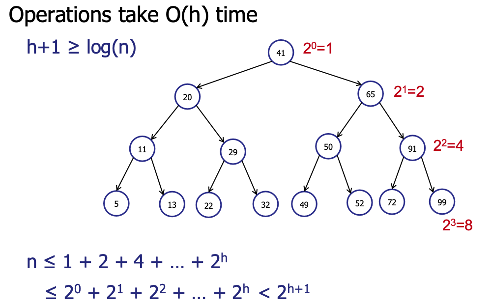
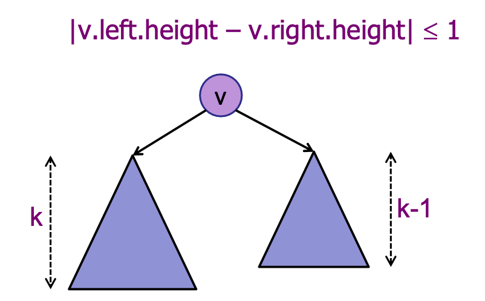
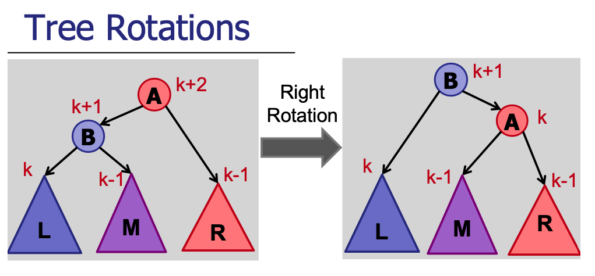

# AVL Trees

## Background
Say you want to search of a data in an array. If the array were sorted, lucky you! You can do it with binary search in 
`O(logn)` time. But if the array weren't sorted, you can't avoid that `O(n)` linear search loop. Now, one idea is to 
first sort the array, and incur a 1-time cost of `O(n)` and subsequent search operations can enjoy that `O(logn)` query 
cost. This is all gucci, but it assumes that there will be no additional data streaming in. If incoming data is not 
infrequent, you'll have to incur `O(n)` insertion cost each time to maintain sorted order, and this can undermine 
performance as a whole. If only there were some structure that allows us to enjoy `O(logn)` operations across..

We have seen binary search trees (BSTs), which always maintains data in sorted order. This allows us to avoid the
overhead of sorting before we search. However, we also learnt that unbalanced BSTs can be incredibly inefficient for
insertion, deletion and search operations, which are O(height) in time complexity (in the case of degenerate trees, 
think of a linked list, operations can go up to O(n)).

Here we discuss a type of self-balancing BST, known as the AVL tree, that avoids the worst case O(n) performance 
across the operations by ensuring careful updating of the tree's structure whenever there is a change 
(e.g. insert or delete).

 <b>Terminology</b> 

<li>
Level: Refers to the number of edges from the root to that particular node. Root is at level 0.
</li>
<li>
Depth: The depth of a node is the same as its level; i.e. how far a node is from the root of the tree.
</li>
<li>
Height: The number of edges on the longest path from that node to a leaf. A leaf node has height 0.
</li>

### Definition of Balanced Trees
Balanced trees are a special subset of trees with **height in the order of log(n)**, where n is the number of nodes. 
This choice is not an arbitrary one. It can be mathematically shown that a binary tree of n nodes has height of at least
log(n) (in the case of a complete binary tree). So, it makes intuitive sense to give trees whose heights are roughly
 in the order of log(n) the desirable 'balanced' label.

    
     
    Credits: CS2040s Lecture 9

### Height-Balanced Property of AVL Trees
There are several ways to achieve a balanced tree. Red-black tree, B-Trees, Scapegoat and AVL trees ensure balance 
differently. Each of them relies on some underlying 'good' property to maintain balance - a careful segmenting of nodes 
in the case of RB-trees and enforcing a depth constraint for B-Trees. Go check them out in the other folders!  
What is important is that this **'good' property holds even after every change** (insert/update/delete).

The 'good' property in AVL Trees is the **height-balanced** property. Height-balanced on a node is defined as  
**difference in height between the left and right child node being not more than 1**.  
We say the tree is height-balanced if every node in the tree is height-balanced. Be careful not to conflate 
the concept of "balanced tree" and "height-balanced" property. They are not the same; the latter is used to achieve the
former.

 <b>Ponder..</b> 

Can a tree exists where there exists 2 leaf nodes whose depths differ by more than 1? What about 2? 10?

 <b>Answer</b> 

Yes! In fact, you can always construct a large enough AVL tree where their difference in depth is > some arbitrary x!

It can be mathematically shown that a **height-balanced tree with n nodes, has at most height <= 2log(n)** (
in fact, using the golden ratio, we can achieve a tighter bound of ~1.44log(n)).
Therefore, following the definition of a balanced tree, AVL trees are balanced.

    
     
    Credits: CS2040s Lecture 9

## Complexity Analysis
**Search, Insertion, Deletion, Predecessor & Successor queries Time**: O(height) = O(logn)

**Space**: O(n)  
where n is the number of elements (whatever the structure, it must store at least n nodes)

## Operations
Minimally, an implementation of AVL tree must support the standard **insert**, **delete**, and **search** operations. 
**Update** can be simulated by searching for the old key, deleting it, and then inserting a node with the new key. 

Naturally, with insertions and deletions, the structure of the tree will change, and it may not satisfy the 
"height-balance" property of the AVL tree. Without this property, we may lose our O(log(n)) run-time guarantee. 
Hence, we need some re-balancing operations. To do so, tree rotation operations are introduced. Below is one example.

    
     
    Credits: CS2040s Lecture 10

Prof Seth explains it best! Go re-visit his slides (Lecture 10) for the operations :P  
Here is a [link](https://www.youtube.com/watch?v=dS02_IuZPes&list=PLgpwqdiEMkHA0pU_uspC6N88RwMpt9rC8&index=9) 
to prof's lecture on trees.  
_We may add a summary in the near future._

## Application
While AVL trees offer excellent lookup, insertion, and deletion times due to their strict balancing, 
the overhead of maintaining this balance can make them less preferred for applications 
where insertions and deletions are significantly more frequent than lookups. As a result, AVL trees often find itself
over-shadowed in practical use by other counterparts like RB-trees, 
which boast a relatively simple implementation and lower overhead, or B-trees which are ideal for optimizing disk 
accesses in databases.

That said, AVL tree is conceptually simple and often used as the base template for further augmentation to tackle 
niche problems. Orthogonal Range Searching and Interval Trees can be implemented with some minor augmentation to 
an existing AVL tree.
