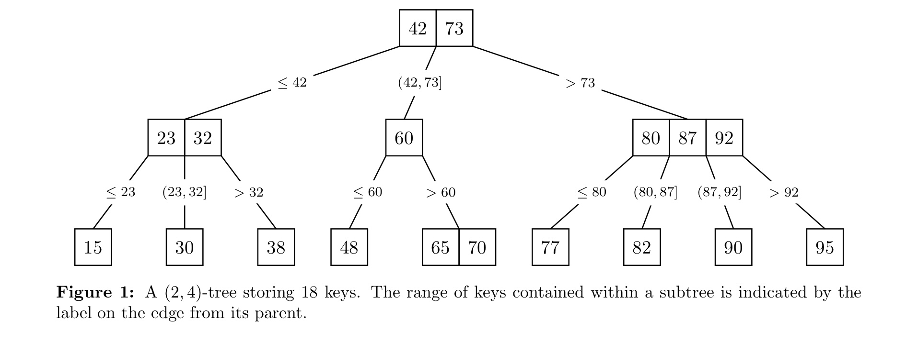
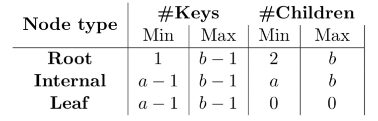
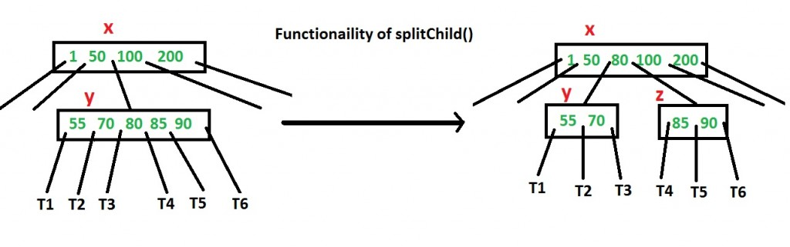

# B-Trees

## Background

Is the fastest way to search for data to store them in an array, sort them and perform binary search? No. This will incur minimally `O(n log n)` sorting cost, and `O(n)` cost per insertion to maintain sorted order.

We have seen binary search trees (BSTs), which always maintains data in sorted order. This allows us to avoid the overhead of sorting before we search. However, maintaining balance may not be easy. Unbalanced BSTs can be incredibly inefficient for insertion, deletion and search operations, which are `O(h)` in time complexity (i.e. can go up to `O(n)` for unbalanced BSTs).

Then, we learnt about self-balancing BSTs such as AVL Trees, that help us cap the time complexity of insertion, deletion and search operations to `O(h)` ≈ `O(log n)`.

B-tree is another self-balancing search tree data structure that maintains sorted data and allows for efficient insertion, deletion and search operations. Interestingly, B-trees "grow upwards" (see `insert` operation).

> **Note**: The accompanying implementation is simplified and educational. In practice, understanding B-tree **theory and properties** is far more valuable than memorizing implementation details. What matters is knowing the theoretical bounds, why B-trees are preferred for disk-based storage, and their practical use cases.

## Why B-Trees? (The Disk I/O Problem)

A normal binary search tree stores one key per node, leading to a **tall tree** with height `O(log₂ n)`. When data lives on disk, each node access is a **disk I/O** — and disk I/O is slow (milliseconds vs nanoseconds for RAM).

### The Problem with Tall Trees

For a BST with 1 million keys:
- Height ≈ 20 levels
- Worst case: 20 disk reads per search

### The B-Tree Solution

A **B-tree** stores:
- Many keys per node (hundreds or thousands)
- Many child pointers per node

This gives:
- **Very high branching factor** (e.g., 100-1000 children per node)
- **Very small height** (e.g., 3-4 levels for millions of keys)
- **Fewer disk reads** per operation

### Disk Pages and Node Size

Operating systems read/write data in fixed-size **pages** (typically 4KB or 16KB). B-tree nodes are designed to fit exactly one page:

| Page Size | Keys per Node (approx) | Height for 1B keys |
|-----------|------------------------|-------------------|
| 4 KB | ~200-500 | 3-4 |
| 16 KB | ~500-2000 | 2-3 |

**Key insight**: One disk read brings in an entire node with hundreds of keys. Instead of 20+ random disk accesses (BST), you do only 3-4 (B-tree).

## (a,b) Trees

Before we talk about B-trees, we first introduce its family (generalized form) - (a,b) trees.

- In an (a,b) tree, `a` and `b` refer to the minimum and maximum number of children of an internal node.
- Parameters satisfy: `2 <= a <= (b+1)/2`

Unlike binary trees, each node can have more than 2 children and store multiple keys.

<div align="center">
    
</div>

### Implementation Invariants

**Rule #1: (a,b)-child Policy**

The min and max of keys and children each node can have are bounded as follows:

<div align="center">
    
</div>

Note: The number of children is always one more than the number of keys (except for leaves).

The min height is `O(log_b(n))` and max height is `O(log_a(n))`.

How do we pick `a` and `b`? `b` is dependent on hardware (page size), and we want to maximize `a` to make the tree fatter and shorter.

**Rule #2: Key Ranges**

A non-leaf node must have one more child than its number of keys, ensuring all value ranges are covered in subtrees.

For a non-leaf node with k keys (v₁, v₂, ..., vₖ) and (k+1) children (t₁, t₂, ..., tₖ₊₁):
- First child t₁ has key range ≤ v₁
- Final child tₖ₊₁ has key range > vₖ
- All other children tᵢ have key range (vᵢ₋₁, vᵢ]

**Rule #3: Leaf Depth**

All leaf nodes must be at the same depth from root. This property forces the tree to be balanced.

## Complexity Analysis

| Operation | Time | Notes |
|-----------|------|-------|
| Search | `O(b·log_a(n))` = `O(log n)` | At most `log_a(n)` levels, `b` comparisons per node |
| Insert | `O(log n)` | May require splits up the tree |
| Delete | `O(log n)` | May require merges/borrows |

**Space**: `O(n)`

## How do B-Trees relate to (a,b) Trees?

A B-Tree is an (a,b) tree with `a = ceil(b/2)`.

Following the CLRS definition: a B-tree is parameterized by a value `t >= 2`, known as its **minimum degree**.
- Every internal node (except root) has at least `t` children
- Every node has at most `2t` children
- Following this definition, `t = a` in (a,b) tree naming

## Operations

### Search Operation

1. Begin at the root
2. If key is in current node, return true
3. Otherwise, find the appropriate child based on key comparisons
4. Recursively search in that child
5. If a leaf is reached and key not found, return false

### Insert Operation

**Intuition**: Insert always happens at a leaf. If the leaf becomes full (`b-1` keys), split it and promote the middle key to the parent. This may cascade up to the root. Because it promotes a key to the parent, this is why we say B-trees "grow upwards".

**Why `a = ceil(b/2)` matters**: When a full node (`b-1` keys, `b` children) splits:
- Each half gets `ceil((b-1)/2) >= a-1` keys and `a` children
- Both halves satisfy the minimum requirement of `a` children
- This is why the choice of `a = ceil(b/2)` is not arbitrary — it guarantees splits produce valid nodes

See [GeeksforGeeks: B-Tree Insertion](https://www.geeksforgeeks.org/insert-operation-in-b-tree/) for detailed walkthrough.

### Split Child Method

<div align="center">
    
    <br/>
    <em>Source: GeeksforGeeks</em>
</div>

### Delete Operation

**Intuition**: Delete from a leaf if possible. If the key is in an internal node, replace it with its predecessor (or successor) from a leaf, then delete from the leaf. If a node becomes underfull (`< a-1` keys), either:
- **Borrow** a key from a sibling (if sibling has spare keys)
- **Merge** with a sibling (pulling down a key from parent)

**Why `a = ceil(b/2)` matters for merges**: Two minimum nodes (`a-1` keys each) plus one parent key combine to `2(a-1) + 1 = 2a - 1 <= b - 1` keys — exactly fitting within the maximum.

See [GeeksforGeeks: B-Tree Deletion](https://www.geeksforgeeks.org/delete-operation-in-b-tree/) for detailed walkthrough.

---

## B-Trees vs B+ Trees

<details>
<summary><b>Key Differences</b></summary>

| Feature | B-Tree | B+ Tree |
|---------|--------|---------|
| Data storage | All nodes can store data | Only leaf nodes store data |
| Internal nodes | Keys + data + child pointers | Keys + child pointers only |
| Leaf linking | Not linked | Doubly linked list |
| Range queries | Must traverse tree | Follow leaf links |
| Duplicate keys | Not needed | Internal keys are copies/routing keys |

### B-Tree Structure
```
       [30, 60]              ← data can be here
      /    |    \
   [10,20] [40,50] [70,80]   ← data can be here too
```

### B+ Tree Structure
```
       [30, 60]              ← routing keys only (no data)
      /    |    \
   [10,20]↔[30,40,50]↔[60,70,80]  ← all data here, linked
```

### Why Internal Nodes Only Store Keys

In B+ trees, internal nodes contain **routing keys** (also called boundary keys or separator keys). These are copies of keys that exist in the leaves — they exist purely for **navigation**.

For example, if leaves contain `[10,20,30]` and `[40,50,60]`:
- The parent stores key `40` as a separator
- This key guides searches: go left if `< 40`, go right if `>= 40`
- The actual data for key `40` is in the right leaf

This means internal nodes can fit **more keys per page** (no data payload), giving higher branching factor.

### Why Leaves are Linked

Leaf nodes in B+ trees are connected via a **doubly linked list**. This enables efficient **range queries**:

```sql
SELECT * FROM users WHERE age BETWEEN 25 AND 35
```

Instead of traversing the tree multiple times:
1. Find leaf containing `25`
2. Follow links to scan `25 → 26 → ... → 35`
3. Stop when value exceeds `35`

</details>

## B+ Trees vs Hash Indexes

<details>
<summary><b>When to Use Which</b></summary>

Hash indexes are excellent for **exact equality lookups**:
```sql
SELECT * FROM users WHERE id = 42
```

But they have significant drawbacks for disk-based storage:

### Problems with Hash Indexes

**1. No Natural Ordering**

Hash functions destroy ordering. This makes these operations inefficient:
- `BETWEEN` queries
- `<`, `>`, `<=`, `>=` comparisons
- Prefix scans (`LIKE 'abc%'`)
- `ORDER BY` without extra sorting

**2. Poor Locality**

Nearby logical keys (e.g., `user_100`, `user_101`) may hash to completely different buckets. This means:
- More random disk seeks
- Poor cache utilization
- Can't benefit from sequential reads

**3. Overflow and Collisions**

When a bucket overflows:
- Collision chains grow
- Overflow pages are allocated
- More I/Os required

**4. Under-utilization**

If buckets are sparse, reading a page brings in mostly empty space — wasted I/O.

### When B+ Trees Win

B+ trees excel when:
- Range queries are common
- Data needs to be ordered
- Prefix searches are needed
- Sequential scans are frequent

**Rule of thumb**: For on-disk databases with ordered workloads, B+ trees are almost always preferred.

</details>

---

## Application: Database Indexing

B+ trees are the dominant index structure in relational databases. Understanding clustered vs secondary indexes is crucial.

### Clustered Index

A **clustered index** is a B+ tree where the **leaf nodes store the actual row data**, indexed by the primary key. This determines the **physical storage order** of rows.

| Property | Description |
|----------|-------------|
| Ordering | Rows are physically sorted by the primary key |
| Limit | Only **one** clustered index per table (data can only be sorted one way) |
| Lookup | Single traversal: find key in tree → data is right there |

**Example (InnoDB/MySQL)**:
- The **primary key** automatically becomes the clustered index
- Leaf nodes contain: `(primary_key, col1, col2, col3, ...)` — the entire row
- Searching by primary key requires only one B+ tree traversal

```
Clustered Index on emp_id:

       [500, 1000]
      /     |     \
  [emp_id=1,...] [emp_id=501,...] [emp_id=1001,...]
   ↑ actual row data stored here
```

### Secondary Index (Non-Clustered)

**Why secondary indexes?** The clustered index only supports efficient lookups by primary key. But applications often need to search by other columns:

```sql
SELECT * FROM employees WHERE last_name = 'Garcia';   -- Can't use emp_id index
```

Without an index on `last_name`, these queries require a **full table scan** — reading every row. A **secondary index** provides an efficient lookup path for non-primary-key columns.

| Step | Action |
|------|--------|
| 1 | Traverse secondary index → find matching primary key(s) |
| 2 | Use primary key to traverse clustered index → get full row |

**Example**:
```sql
CREATE INDEX idx_lastname ON employees(last_name);
```

```
Secondary Index (last_name):              Clustered Index (emp_id):
              [Garcia, Smith]                    [500, 1000]
             /       |       \                  /     |     \
  [Adams,PK=5] [Garcia,PK=12] [Smith,PK=3]  [row1] [row501] [row1001]
        ↑                                              ↑
  stores (last_name, emp_id)                 stores actual row data
```

Query: `WHERE last_name = 'Garcia'`
1. Secondary index lookup → `emp_id = 12`
2. Clustered index lookup with `emp_id = 12` → full row

This double lookup is why secondary index queries are slower than primary key queries.

### Covering Index

A **covering index** includes all columns needed by a query in the index itself, avoiding the second lookup:

```sql
CREATE INDEX idx_covering ON employees(last_name, first_name, salary);

-- This query can be satisfied from the index alone:
SELECT first_name, salary FROM employees WHERE last_name = 'Smith';
```

<details>
<summary><b>MongoDB and Non-Clustered Storage</b></summary>

Not all databases use clustered indexes:

**MongoDB (WiredTiger)**:
- Documents are stored in a **heap** (unordered storage)
- The `_id` field has a **B-tree index** by default
- This index maps `_id` → document location (RecordId)
- Functionally similar to a secondary index in MySQL

```
_id Index:                    Document Storage (Heap):
       [id_500]               ┌──────────────────────┐
      /        \              │ {_id: 1, name: "A"}  │
  [id_1→loc1]  [id_501→loc2]  │ {_id: 501, name: "B"}│
                              └──────────────────────┘
```

**Why still have a B-tree index?** Without it, finding a document by `_id` would require a full collection scan. The B-tree index provides efficient `O(log n)` lookups.

**Additional indexes**: You can create more indexes with `db.collection.createIndex()` on any field. These also map field values → document locations.

**Trade-off vs clustered**:
- No "free" ordering by primary key
- But inserts don't need to maintain physical order
- All indexes (including `_id`) work the same way — lookup in index, then fetch from heap

</details>

---

### File System Indexing

<details>
<summary><b>B+ Trees for File Systems</b></summary>

File systems (NTFS, HFS+, ext4) use B+ trees to organize:
- File metadata (names, permissions, timestamps)
- Directory structures
- Block allocation maps

**Workflow**:
- Root node often cached in RAM
- Internal nodes guide navigation
- Leaf nodes contain file metadata or pointers to data blocks

**Optimized for Disk**:
- Nodes sized to match disk pages (4KB/16KB)
- Single read brings in many keys
- Leaf linking enables directory listing without re-traversing

</details>

---

## Notes

1. The implementation in this repository is **simplified and educational**. Production databases use heavily optimized variants with:
   - Lock-free concurrency
   - Write-ahead logging
   - Page-level compression
   - Prefix/suffix truncation in keys

2. **B+ trees dominate** in practice because:
   - Higher fanout (internal nodes have no data)
   - Sequential leaf scans for range queries
   - Better cache utilization

## References

- CS2040S Recitation Sheet 4
- [Database Internals by Alex Petrov](https://www.databass.dev/)
- [Use The Index, Luke](https://use-the-index-luke.com/)
