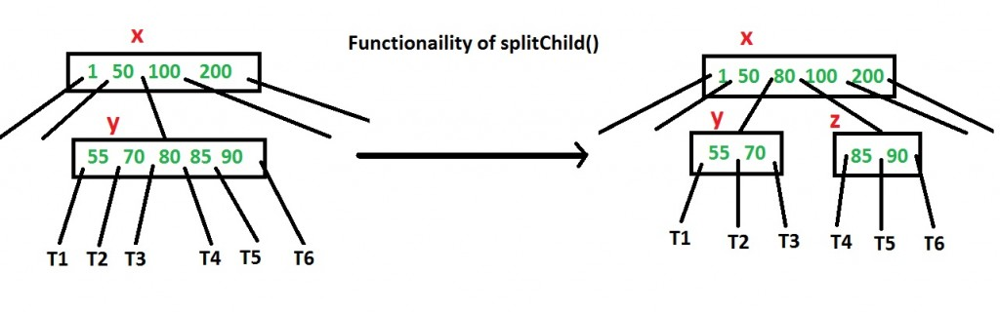

# B-Trees

## Background
Is the fastest way to search for data to store them in an array, sort them and perform binary search? No. This will
incur minimally O(nlogn) sorting cost, and O(n) cost per insertion to maintain sorted order.  

We have seen binary search trees (BSTs), which always maintains data in sorted order. This allows us to avoid the 
overhead of sorting before we search. However, we also learnt that unbalanced BSTs can be incredibly inefficient for 
insertion, deletion and search operations, which are O(h) in time complexity (i.e. can go up to O(n) for unbalanced 
BSTs).  

Then, we learnt about self-balancing BSTs such as AVL Trees, that will help us cap the time complexity of insertion, 
deletion and search operations to O(h) ~= O(logn).  

B-tree is another of self-balancing search tree data structure that maintains sorted data and allows for efficient
insertion, deletion and search operations. 

### (a,b) trees

Before we talk about B-trees, we first introduce its family (generalized form) - (a,b) trees.   

- In an (a,b) tree, a and b refer to the minimum and maximum number of children of an internal node in the tree.  
- a and b are parameters where 2 <= a <= (b+1)/2. 

Note that unlike binary trees, in (a,b) trees, each node can have more than 2 children and each node can store multiple 
keys.

Here is a (2,4) tree to aid visualisation as we go through the (a,b) tree rules/invariants. 
tree.jpg)

### Implementation Invariant/(a,b) Tree Rules
Rule #1: (a,b)-child Policy
The min and max of keys and children each node can have are bounded as follows:
childpolicy.jpg)

Note: With the exception of leaves, realize that the number of children is always one more than the number of keys. 
(See rule 2)

The min height of an (a,b) tree will be O(logb(n)) and the max height of an (a,b) tree will be O(loga(n)).  

How do we pick the values of a and b? b is dependent on the hardware, and we want to maximise a to make the tree fatter
and shorter. 

Rule #2: Key ranges

A non-leaf node (i.e. root or internal) must have one more child than its number of keys. This is to ensure that all 
value ranges due to its keys are covered in its subtrees. 

The permitted range of keys within a subtree is referred to be its key range. 

Specifically, for a non-leaf node with k keys and (k+1) children:
- its keys in sorted order are v1, v2, ..., vk
- the subtrees due to its keys are t1, t2, ..., tk+1

Then: 
- first child t1 has key range <= v1
- final child tk+1 has key range > vk
- all other children ti have key range (vi-1, vi]

Rule #3: Leaf depth

All leaf nodes must be at the same depth from root. 
- This property forces the tree to be balanced. 

## Complexity Analysis

**Search, Insertion, Deletion Time**:  O(bloga(n)) = O(logn)

- The max height of an (a,b) tree is O(loga(n)).
- Linear search takes maximally b nodes per level.

**Space**: O(n)

where n is the number of elements (whatever the structure, it must store at least n nodes)

## How do B Trees relate to (a,b) trees?
A B-Tree is an (a,b) tree with a = ceil(b/2).

There are varying definitions of B-trees but we will be following the CLRS definition: a B tree is parameterized by
a value t >= 2, known as its minimum degree. 
- Every internal node other than the root has at least t children. 
- Following this definition, t = a in the naming convention of (a,b) trees. 

## Search Operation 
Here is an outline of the search operation:
1. Begin the search at the root of the B tree. 
2. If the key being searched for is in the current node, return true (i.e. found). 
3. Else, determine the child node where the key might be located based on comparison with the keys in the current node. 
4. Recursively perform the search operation in the determined child node. 
5. If the search reaches a leaf node, and the key is not found, return false (i.e. not found). 

## Insert Operation
You can read more about how the insert operation works 
[here](https://www.geeksforgeeks.org/insert-operation-in-b-tree/).

### Split Child Method

Image Source: https://www.geeksforgeeks.org/insert-operation-in-b-tree/

## Delete Operation
The delete operation has a similar idea as the insert operation, but involves a lot more edge cases. If you are
interested to learn about it, you can read more [here](https://www.geeksforgeeks.org/delete-operation-in-b-tree/).

## Application
There are many uses of B-Trees but the most common is their utility in database management systems in handling large 
datasets by optimizing disk accesses.

Large amounts of data have to be stored on the disk. But disk I/O operations are slow and not knowing where to look 
for the data can drastically worsen search time. B-Tree is used as an index structure to efficiently locate the 
desired data. Note, the B-Tree itself can be partially stored in RAM (higher levels) and and partially on disk 
(lower, less freq accessed levels).

Consider a database of all the CS modules offered in NUS. Suppose there is a column "Code" (module code) in the 
"CS Modules" table. If the database has a B-Tree index on the "Code" column, the keys in the B-Tree would be the 
module code of all CS modules offered.

Each key in the B-Tree is associated with a pointer, that points to the location on the disk where the corresponding 
data can be found. For e.g., a key for "CS2040s" would have a pointer to the disk location(s) where the row(s) 
(i.e. data) with "CS2040s" is stored. This efficient querying allows the database quickly navigate through the keys 
and find the disk location of the desired data without having to scan the whole "CS Modules" table.

The choice of t will impact the height of the tree, and hence how fast the query is. Trade-off would be space, as a 
higher t means more keys in each node and they would have to be (if not already) loaded to RAM.

## References
This description heavily references CS2040S Recitation Sheet 4. 