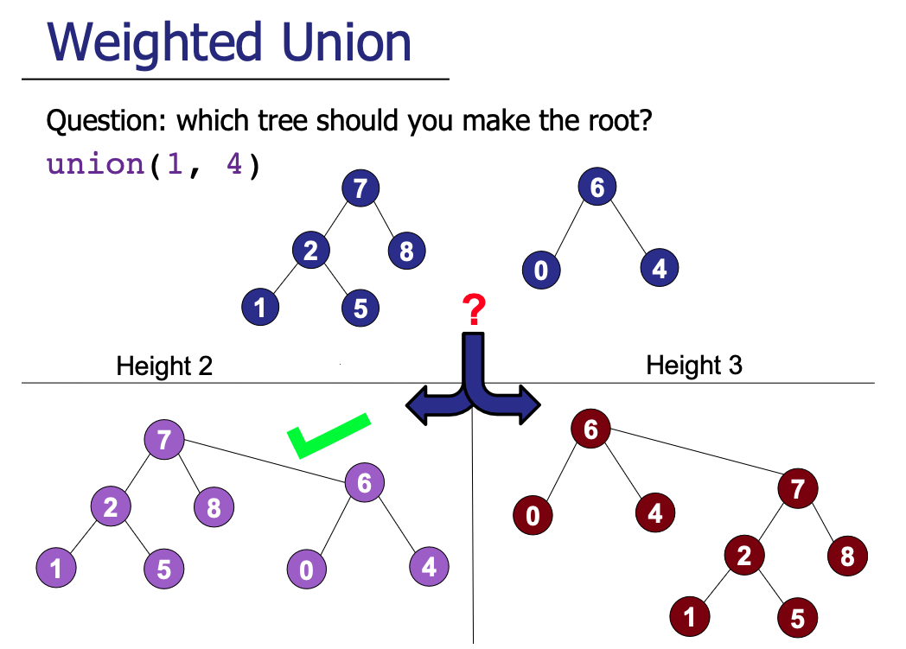
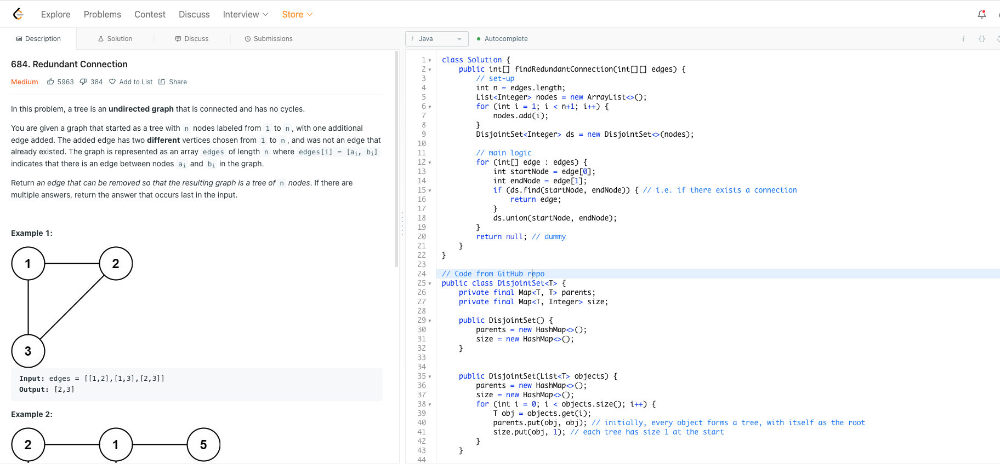

# Quick Union
If you wish to jump to [weighted union](#Weighted-Union).
## Background
Here, we consider a completely different approach. We consider the use of trees. Every element can be
thought of as a tree node and starts off in its own component. Under this representation, it is likely
that at any given point, we might have a forest of trees, and that's perfectly fine. A forests of trees would simply be
interpreted as different components, with elements in the same tree belonging to the same component.
The root node of each tree is used as the identity for all elements in the same component.  
Note that the trees here are not necessarily binary trees. In fact, more often than not, we will have nodes
with multiple children nodes.

### Union
Between the two components, decide on the component to represent the combined set as before.
Now, union is simply assigning the root node of one tree to be the child of the root node of another. Hence, its name.
Identifying the component of the object involves traversing to the root node of the tree. Also, note that
union operations **can result in a forest**.

### Find
For each of the node, we traverse up the tree from the current node until the root. Check if the
two roots are the same

## Complexity Analysis
**Time**: O(n) for Union and Find operations. While union-ing is indeed quick, it is possibly undermined
by O(n) traversal in the case of a degenerate tree. Note that at this stage, there is nothing to ensure the trees
are balanced.

**Space**: O(n), implementation still involves wrapping the n elements with some structure / wrapper (e.g. Node class).

# Weighted Union

## Background
Now, we improve upon the Quick Union structure by ensuring trees constructed are 'balanced'. Balanced
trees have a nice property that the height of the tree will be upper-bounded by O(log(n)). This considerably speeds
up Union operations.  
We additionally track the size of each tree and ensure that whenever there is a union between 2 elements, **the smaller
tree becomes a child of the larger tree.**
It can be mathematically shown the height of the tree is bounded by O(log(n)).

    
     
    Credits: CS2040s Lecture Slides

### Intuition - Why It Works
First, it is crucial to know that Weighted Union's efficiency relies on careful **construction** of the trees.  
Every element / object starts off in its own tree (i.e. its own component). When two components are merged, the smaller 
objects of the smaller tree becomes part of the larger tree (by setting the root node of the smaller tree as a child).
 Note that if the trees are of the same size, it does not matter which is assigned.

Notice that trees will only increase in height when it's size is doubled. Working on this intuition, one can show 
(by induction) that a tree of height h has at least 2^h elements. Consequently, 
**a tree of size n is at most height of logn**.  
_Note: n = 2^(logn)_

### Implementation Details
The concept introduces the idea of constructing trees and forests and certainly, one can similarly implement a 
Node wrapper class to represent objects as nodes in a tree.  
But notice that the operations only need knowledge of the parent node and the size of the tree. 
In other words, using internal arrays or hash maps to track is sufficient to simulate the construction of trees.

Our implementation uses hash map to account for arbitrary object type.

## Complexity Analysis
**Time**: O(log(n)) for Union and Find operations.

**Space**: Remains at O(n)

### Path Compression
We can further improve on the time complexity of Weighted Union by introducing path compression. Specifically, during
the traversal of a node up to the root, we re-assign each node's parent to be the root (or as shown in CS2040s,
assigning to its grandparent actually suffice and yield the same big-O upper-bound! This allows path compression to be
done in a single pass.). By doing so, we greatly reduce the height of the trees formed.

The analysis with compression is a bit trickier here and talks about the inverse-Ackermann function. 
Interested readers can find out more [here](https://dl.acm.org/doi/pdf/10.1145/321879.321884).

**Time**: O(alpha)

**Space**: O(n)

## Notes
### Sample Demo - LeetCode 684: Redundant Connections
The 'objects' in the question are given to be integers. Using int arrays instead of HashMap mapping in our 
implementation would suffice. But below uses the code exactly from our implementation to show its versatility.

