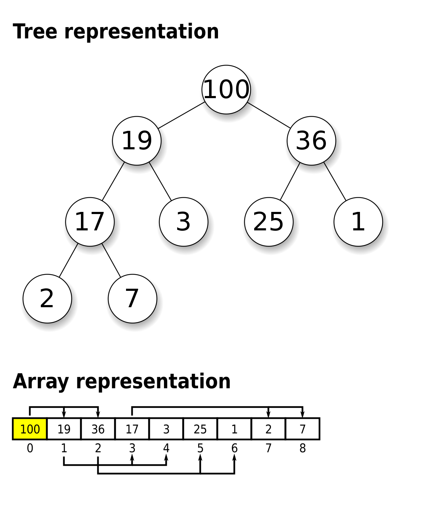

# Heap

## Background

### Binary Heap

A binary heap is often used to introduce the concept of heaps. It is a tree-based data structure that satisfies the
following properties:

1. Complete binary tree - every level, except possibly the last, is completely filled
2. Max (min) heap property - the value of every vertex in the binary tree is >= (<=) than that of its child nodes

This makes it a powerful data structure that provides efficient access to the highest (or lowest) priority element,
making it suitable as an underlying implementation of the ADT, priority queue.

### Array-based Heap

The complete binary tree property actually allows the heap to be implemented as a contiguous array (since no gaps!).
The parent-child relationships are derived based on the indices of the elements.

Theoretically, there isn't any fundamental difference in order of growth for either implementation.
Both implementation provide the same asymptotic time complexity, and supports most operations in O(log(n)).

That said, in practice, the array-based implementation of a heap often provides better performance as opposed to the
former, in cache efficiency and memory locality. This is due to its contiguous memory layout. As such,
the implementation shown here is a 0-indexed array-based heap.

### Relevance of increaseKey and decreaseKey operations

The decision not to include explicit "decrease key" and "increase key" operations in the standard implementations of
heaps in Python and Java is primarily due to design choices and considerations of the typical intended use cases.
Further, this operation, without augmentation, would take O(n) due to having to search for the object to begin with
(see under Notes).

One can circumvent the lack of such operations by simply removing and re-inserting (albeit, still O(n)).

**This is worth a mention:**  
In cases like Dijkstra algorithm, there is no need to strictly maintain V nodes in the priority queue for O(nlogn).
One can just insert all edges rather than constantly updating (hence, no need for updateKey operations).  
After all, the log factor in the order of growth will turn log(E) = log(V^2) in the worst case of a complete graph,
to 2log(V) = O(log(V)).

### Heapify - Choice between bubbleUp and bubbleDown

Heapify deals with bubbling down (for max heap) all elements starting from the back.  
What about bubbling-up all elements starting from the front instead?  
**No issue with correctness, problem lies with efficiency of operation.**

The number of operations required for bubbleUp and bubbleDown (to maintain heap property), is proportional to the
distance the node have to move. bubbleDown starts from the bottom level whereas bubbleUp starts from the top level.
Only 1 node is at the top whereas (approx) half the nodes is at the bottom level. It therefore makes sense to use
bubbleDown.

## Complexity Analysis

**Time**: O(log(n)) in general for most native operations,
except heapify (building a heap from a sequence of elements) that takes o(n)

**Space**: O(n)

where n is the number of elements (whatever the structure, it must store at least n nodes)

## Notes

1. Heaps are often presented as max-heaps (eg. in textbooks), hence the implementation follows a max-heap structure
    - Still, it is not too difficult to convert a max heap to a min heap, simply negate the values of the nodes
2. The heap implemented here is actually augmented with a Map data type. This allows identification of nodes by key.
    - Java's PriorityQueue and Python's heap actually support the removal of a node identified by its value / key.
      Note that this is not a typical operation introduced alongside the concept heap simply because the time complexity
      would now be O(n), no longer log(n). And indeed, both Java's and Python's version have time complexities
      of O(n) for this remove operation since their underlying implementation is not augmented.
    - The trade-off would be that the heap does not support insertion of duplicate objects else the Map would not work
      as intended.
3. Rather than using Java arrays, where size must be declared upon initializing, we use list here in the implementation.
4. [Good read](https://stackoverflow.com/questions/9755721/how-can-building-a-heap-be-on-time-complexity?) on the
   time complexity of heapify and making the correct choice between bubbleUp and bubbleDown.
