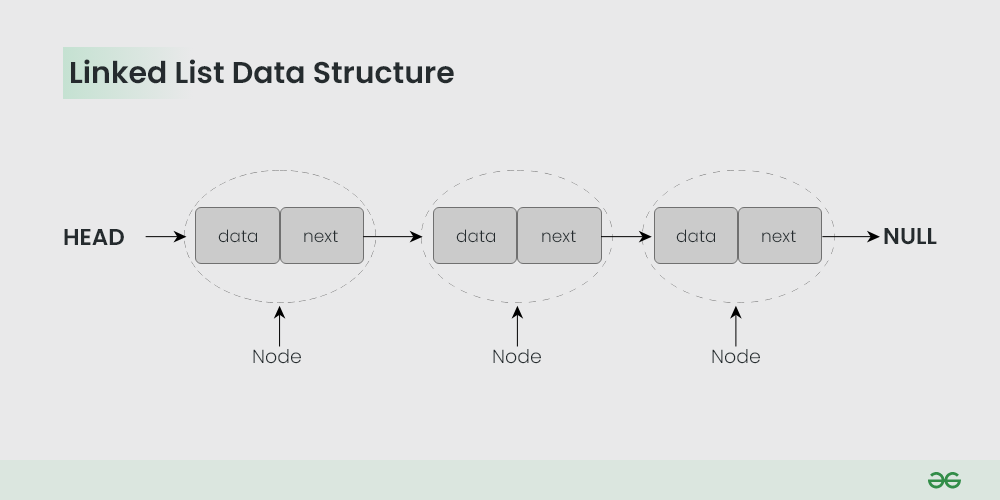
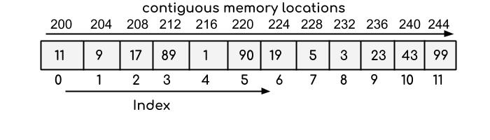
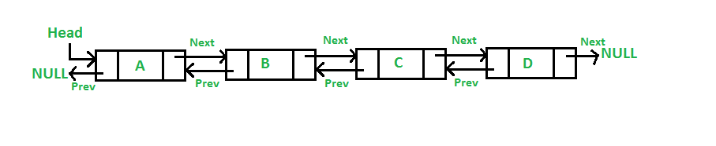
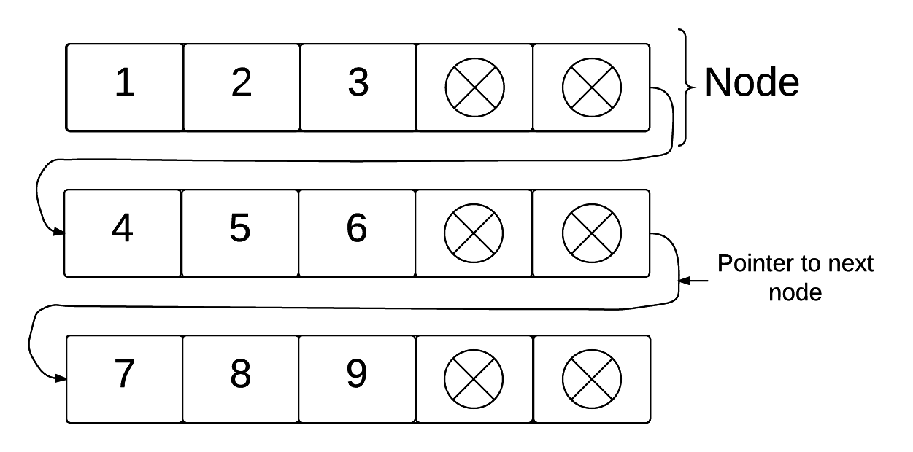

# Linked List

## Background

A **linked list** is a linear data structure where elements (nodes) are connected via pointers rather than stored contiguously in memory.

    
     
    <em>Source: GeeksForGeeks</em>

Each node contains:
- **Data**: The value stored
- **Next pointer**: Reference to the next node (and optionally **prev** for doubly-linked)

### Linked List vs Array

| Aspect | Array | Linked List |
|--------|-------|-------------|
| Memory layout | Contiguous | Scattered (pointer-connected) |
| Size | Fixed at creation | Dynamic |
| Random access | `O(1)` | `O(n)` |
| Insert/delete at ends | `O(n)` or `O(1)` amortized | `O(1)` with tail pointer |
| Insert/delete middle | `O(n)` | `O(1)` if node reference known |
| Memory overhead | None | Pointer(s) per node |
| Cache performance | Excellent | Poor (pointer chasing) |

    
     
    <em>Source: BeginnersBook</em>

## Complexity Analysis

| Operation | Time | Notes |
|-----------|------|-------|
| `insertFront()` | `O(1)` | Update head |
| `insertEnd()` | `O(n)` | Must traverse (or `O(1)` with tail pointer) |
| `insert(idx)` | `O(n)` | Traverse to position |
| `remove(idx)` | `O(n)` | Traverse to position |
| `get(idx)` | `O(n)` | Traverse to position |
| `search(val)` | `O(n)` | Linear search |
| `reverse()` | `O(n)` | Single pass |
| `sort()` | `O(n log n)` | Merge sort |

**Space**: `O(n)` for n elements, plus pointer overhead

**Interview tip:** Know why merge sort is preferred for linked lists - random access is `O(n)`, so quicksort's partition and heapsort's heapify become `O(n²)`.

## Notes

1. **Our implementation**: Singly-linked with head pointer only. Adding a tail pointer would make `insertEnd()` `O(1)`.

2. **Sorting linked lists**: Merge sort is ideal because it:
   - Only needs sequential access (no random access)
   - Merging is `O(1)` extra space (just pointer manipulation)
   - Maintains `O(n log n)` time

3. **Reversing in-place**: Classic interview question. Iterate once, reversing pointers as you go.

4. **Used in hash tables**: Linked lists are the classic data structure for [hash table chaining](../hashSet/chaining/) - each bucket stores a linked list of elements that hash to that index.

## Variants

### Doubly Linked List

    
     
    <em>Source: GeeksForGeeks</em>

Each node has **prev** and **next** pointers, enabling:
- `O(1)` delete when given node reference (no need to find predecessor)
- Bidirectional traversal
- Clean implementation of [LRU Cache](../lruCache/) and [Deque](../queue/Deque/)

**Trade-off**: Extra pointer per node.

### Skip List

    

A probabilistic data structure with multiple levels of "express lanes" that skip over nodes. Achieves `O(log n)` search, insert, and delete on average.

Used as an alternative to balanced BSTs (simpler to implement, similar performance).

### Unrolled Linked List

    
     

Each node stores an array of elements instead of a single element. Combines linked list flexibility with array cache efficiency.

**Trade-off**: More complex insertion/deletion logic.

## Applications

| Use Case | Why Linked List? |
|----------|------------------|
| Hash table chaining | Dynamic bucket sizes, `O(1)` insert at front |
| LRU Cache | `O(1)` move-to-front with doubly-linked |
| Undo/Redo stacks | Dynamic size, only access ends |
| Memory allocators | Free lists track available blocks |
| Polynomial arithmetic | Sparse representation, easy term insertion |

**Interview tip:** When choosing between array and linked list, consider: Do you need random access? Is size fixed? Are insertions/deletions frequent and at known positions? Arrays win on cache performance; linked lists win on dynamic insert/delete.
