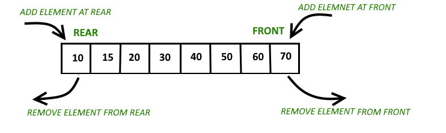

# Double-Ended Queue (Deque)

## Background

A deque (pronounced "deck") is a queue that supports insertion and removal at **both ends**. It generalizes both stacks and queues - you can use it as either.

<div align="center">
    
    <br/>
    <em>Source: GeeksForGeeks</em>
</div>

### Core Operations
| Front | Back |
|-------|------|
| `addFirst()` | `addElement()` (addLast) |
| `pollFirst()` | `pollLast()` |
| `peekFirst()` | `peekLast()` |

## Complexity Analysis

| Operation | Time | Notes |
|-----------|------|-------|
| `addFirst()` / `addElement()` | `O(1)` | Insert at either end |
| `pollFirst()` / `pollLast()` | `O(1)` | Remove from either end |
| `peekFirst()` / `peekLast()` | `O(1)` | Access either end |

**Space**: `O(n)` for n elements

## Notes

1. **Implementation**: Our implementation uses a doubly-linked list. Alternatives include circular arrays (Java's `ArrayDeque`) or two stacks.

2. **Versatility**: A deque can simulate:
   - **Queue**: `addElement()` + `pollFirst()` (FIFO)
   - **Stack**: `addFirst()` + `pollFirst()` (LIFO)

3. **Java's ArrayDeque**: Preferred over `LinkedList` for most use cases - faster due to cache locality and no node allocation overhead.

**Interview tip:** When asked to implement a queue using stacks (or vice versa), a deque provides both interfaces naturally. Understanding deque operations helps with these classic interview questions.

## Applications

| Use Case | Why Deque? |
|----------|-----------|
| Sliding window maximum/minimum | Remove expired elements from front, maintain order from back |
| Palindrome checking | Compare characters from both ends simultaneously |
| Work stealing (parallel computing) | Threads steal from opposite end to reduce contention |
| Undo/Redo with bounded history | Remove oldest when limit reached, add new at one end |
| Browser history | Back/forward navigation from current position |

### Sliding Window Pattern

Deques are essential for the **sliding window maximum/minimum** pattern:

```
Window slides right →
[1, 3, -1, -3, 5, 3, 6, 7], k=3

Window [1,3,-1]   → max = 3
Window [3,-1,-3]  → max = 3
Window [-1,-3,5]  → max = 5
...
```

A [Monotonic Queue](../monotonicQueue) (built on a deque) solves this in `O(n)` instead of `O(n*k)`.

**Interview tip:** When you see "sliding window" + "maximum/minimum", think deque. The key insight: elements that can never be the answer can be discarded early.
