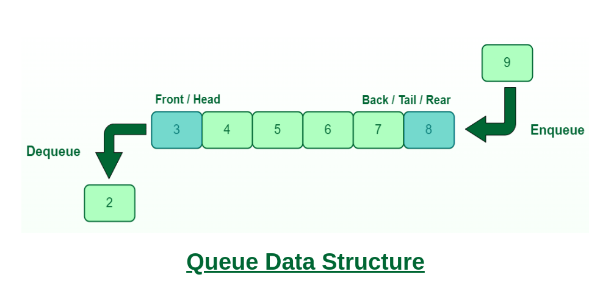

# Queue

## Background

A queue is a linear data structure that follows **FIFO** (First In, First Out) order - the earliest element added is the first one removed.

    
     
    <em>Source: GeeksForGeeks</em>

### Core Operations
- **enqueue** (offer/add): Add element to the back
- **dequeue** (poll/remove): Remove element from the front
- **peek**: View front element without removing

## Complexity Analysis

| Operation | Time | Notes |
|-----------|------|-------|
| `enqueue()` | `O(1)` | Add to back |
| `dequeue()` | `O(1)` | Remove from front |
| `peek()` | `O(1)` | Access front |
| `isEmpty()` | `O(1)` | Check size |

**Space**: `O(n)` for n elements

## Notes

1. **Array vs Linked List**: Our implementation uses a linked list, allowing unbounded growth. Array-based queues are faster (cache-friendly) but need resizing or circular buffer logic.

2. **Java equivalents**: `enqueue()` → `offer()`/`add()`, `dequeue()` → `poll()`/`remove()`

3. **Queue vs Stack**:
   - Queue (FIFO): Process in arrival order → BFS, task scheduling, buffering
   - [Stack](../stack) (LIFO): Process most recent first → DFS, undo/redo, parsing

## Applications

| Use Case | Why Queue? |
|----------|-----------|
| BFS traversal | Process nodes level by level |
| Task scheduling | First-come-first-served processing |
| Buffering | Handle producer-consumer speed mismatch |
| Print spooling | Documents printed in submission order |

## Variants

- [**Deque**](./Deque) - Double-ended queue, add/remove from both ends
- [**Monotonic Queue**](./monotonicQueue) - Maintains sorted order, useful for sliding window problems
- **Priority Queue** - Elements ordered by priority, not arrival time (see [Heap](../heap))
- **Circular Queue** - Fixed-size array with wrap-around, efficient for bounded buffers
