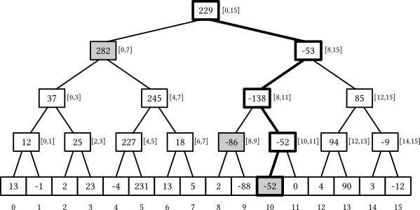

# Segment Tree

## Background
Segment Trees are primarily used to solve problems that require answers to queries on intervals of an array 
with the possibility of modifying the array elements. 
These queries could be finding the sum, minimum, or maximum in a subarray, or similar aggregated results.

Segment Tree is a more flexible data structure compared to Fenwick Tree (AKA Binary-Indexed Tree, 
as it can handle a wide variety of range queries (such as minimum, maximum, GCD, sum, etc.).

### Structure 
(Note: See below for a brief description of the array-based implementation of a segment tree)

A Segment Tree for an array of size *n* is a binary tree that stores information about segments of the array.
Each node in the tree represents an interval of the array, with the root representing the entire array. 
The structure satisfies the following properties:
1. Leaf Nodes: Each leaf node represents a single element of the array.
2. Internal Nodes: Each internal node represents the sum of the values of its children 
(which captures the segment of the array). Summing up, this node captures the whole segment.
3. Height: The height of the Segment Tree is O(log *n*), making queries and updates efficient.

## Complexity Analysis
**Time**: O(log(n)) in general for query and update operations,
except construction which takes O(nlogn)

**Space**: O(n), note for an array-based implementation, the array created should have size 4n (explained later)

where n is the number of elements in the array.

## Operations
### Construction
The construction of a Segment Tree starts with the root node representing the entire array and 
recursively dividing the array into two halves until each segment is reduced to a single element. 
This process is a divide-and-conquer strategy:
1. Base Case: If the current segment of the array is reduced to a single element, create a leaf node.
2. Recursive Case: Otherwise, split the array segment into two halves, construct the left and right children, 
and then merge their results to build the parent node.

This takes O(nlogn). logn in depth, and will visit each leaf node (number of leaf nodes could be roughly 2n) once.

### Querying
To query an interval, say to find the sum of elements in the interval (L, R), 
the tree is traversed starting from the root:
1. If the current node's segment is completely within (L, R), its value is part of the answer.
2. If the current node's segment is completely outside (L, R), it is ignored.
3. If the current node's segment partially overlaps with (L, R), the query is recursively applied to its children.

This approach ensures that each level of the tree is visited only once, time complexity of O(logn).

### Updating
Updating an element involves changing the value of a leaf node and then propagating this change up to the root 
to ensure the tree reflects the updated array. 
This is done by traversing the path from the leaf node to the root 
and updating each node along this path (update parent to the sum of its children). 

This can be done in O(logn).

## Array-based Segment Tree
The array-based implementation of a Segment Tree is an efficient way to represent the tree in memory, especially 
since a Segment Tree is a complete binary tree. 
This method utilizes a simple array where each element of the array corresponds to a node in the tree, 
including both leaves and internal nodes.

### Why 4n space
The size of the array needed to represent a Segment Tree for an array of size *n* is `2*2^ceil(log2(n)) - 1`.
We do `2^(ceil(log2(n)))` because `n` might not be a perfect power of 2, 
**so we expand the array size to the next power of 2**.
This adjustment ensures that each level of the tree is fully filled except possibly for the last level, 
which is filled from left to right.

**BUT**, `2^(ceil(log2(n)))` seems overly-complex. To ensure we have sufficient space, we can just consider `2*n`
because `2*n` >= `2^(ceil(log2(n)))`.
Now, these 2n nodes can be thought of as the 'leaf' nodes (or more precisely, an upper-bound). To account for the 
intermediate nodes, we use the property that for a complete binary that is fully filled, the number of leaf nodes 
= number of intermediate nodes (recall: sum i -> 0 to n-1 of `2^i` = `2^n`). 
So we create an array of size `2n * 2` = `4n` to guarantee we can house the entire segment tree.

 <b>Index Calculation for Child Nodes</b> 

Suppose the parent node is captured at index `i` of the array (1-indexed).
**1-indexed**:  
Left Child: `i x 2`  
Right Child:  `i x 2 + 1`  

The 1-indexed calculation is intuitive. So, when dealing with 0-indexed representation (as in our implementation),
one option is to convert 0-indexed to 1-indexed representation, do the above calculations, and revert.  
(Note: Now, we assume parent node is captured at index `i` (0-indexed))

**0-indexed**:  
Left Child: `(i + 1) x 2 - 1`  = `i x 2 + 1`  
Right Child: `(i + 1) x 2 + 1 - 1` = `i x 2 + 2`  

