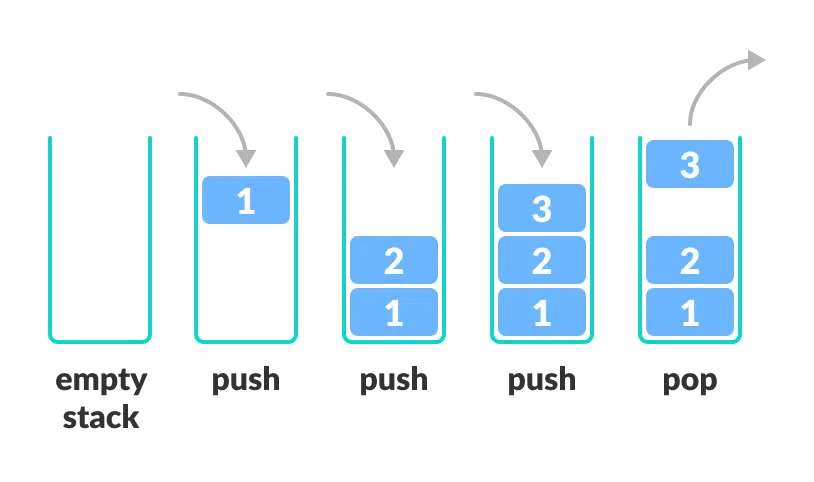

# Stack

## Background

A **stack** is a linear data structure that follows **LIFO (Last In, First Out)** order - the most recently added element is the first to be removed.

<div align="center">
    
    <br/>
    <em>Source: Programiz</em>
</div>

### Core Operations

| Operation | Description |
|-----------|-------------|
| `push(x)` | Add element to top |
| `pop()` | Remove and return top element |
| `peek()` | Return top element without removing |
| `isEmpty()` | Check if stack is empty |

A [queue](../queue/README.md) operates in the opposite order (FIFO - first in, first out).

## Complexity Analysis

| Operation | Time | Notes |
|-----------|------|-------|
| `push()` | `O(1)` | Add to top |
| `pop()` | `O(1)` | Remove from top |
| `peek()` | `O(1)` | Access top |
| `isEmpty()` | `O(1)` | Check size |

**Space**: `O(n)` for n elements

## Notes

1. **Array vs Linked List backing**:
   - **ArrayList**: Amortized `O(1)` push (occasional resize), cache-friendly
   - **LinkedList**: True `O(1)` push/pop, no resize needed, but more memory per element

   Our implementation uses ArrayList. For most use cases, ArrayList is preferred due to better cache locality.

2. **Stack in Java**: `java.util.Stack` exists but is considered legacy. Prefer `ArrayDeque` as a stack:
   ```java
   Deque<Integer> stack = new ArrayDeque<>();
   stack.push(1);    // addFirst
   stack.pop();      // removeFirst
   stack.peek();     // peekFirst
   ```

3. **Call stack**: Recursion uses the system call stack. Deep recursion can cause `StackOverflowError`. Convert to iterative with explicit stack when needed.

## Variants

### Min/Max Stack

A stack that also tracks the minimum (or maximum) element in `O(1)` time.

**Approach**: Maintain an auxiliary stack storing the min at each level.

```
Main:  [3, 5, 2, 1, 4]  ← top
Min:   [3, 3, 2, 1, 1]  ← top (min after each push)
```

**Interview tip:** LeetCode 155 (Min Stack) - the key insight is that the min can only change on push/pop, so we can track it incrementally.

### Monotonic Stack

A stack that maintains elements in sorted (increasing or decreasing) order. Used for "next greater/smaller element" problems.

See [Monotonic Queue/Stack](../queue/monotonicQueue/README.md) for detailed explanation and examples.

**Interview tip:** When you see `O(n²)` brute force for finding next greater/smaller elements, monotonic stack gives `O(n)`. Classic problems: Next Greater Element (LC 496), Daily Temperatures (LC 739), Largest Rectangle in Histogram (LC 84).

## Applications

| Use Case | Why Stack? |
|----------|-----------|
| Function call management | LIFO matches call/return order |
| Undo/Redo | Most recent action undone first |
| Expression evaluation | Operator precedence via stack |
| Parenthesis matching | Match most recent opening bracket |
| DFS (iterative) | Explicit stack replaces recursion |
| Backtracking | Return to most recent decision point |
| Browser back button | Most recent page visited first |

### Expression Evaluation

Stacks are fundamental for parsing and evaluating expressions:

| Application | Stack Usage |
|-------------|-------------|
| Infix to Postfix | Operators pushed/popped by precedence |
| Postfix evaluation | Operands pushed, operators pop and compute |
| Parenthesis matching | Push open, pop on close, check match |
