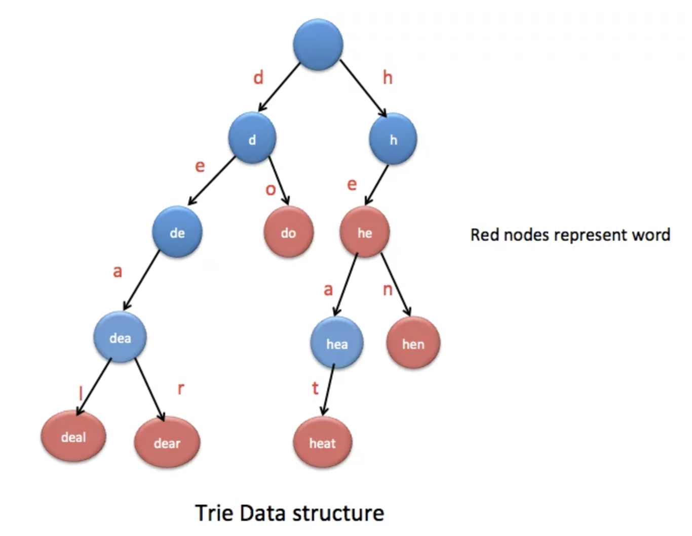

# Trie

## Background
A trie (pronounced as 'try') also known as a prefix tree, is often used for handling textual data, especially in 
scenarios involving prefixes. In fact, the term 'trie' comes from the word 'retrieval'.

Like most trees, a trie is composed of nodes and edges. But, unlike binary trees, its node can have more than 
2 children. A trie stores words by breaking down into characters and organising these characters within a hierarchical 
tree. Each node represents a single character, except the root, which does not represent any character 
but acts as a starting point for all the words stored. A path in the trie, which is a sequence of connected nodes 
from the root, represents a prefix or a whole word. Shared prefixes of different words are represented by common paths.

To distinguish complete words from prefixes within the trie, nodes are often implemented with a boolean flag. 
This flag is set to true for nodes that correspond to the final character of a complete word and false otherwise.

    
     
    <em>Source: <a href="https://java2blog.com/trie-data-structure-in-java/">Java2Blog</a></em>

### TrieNode
A TrieNode represents a single node within a trie, which is a specialized tree-like data structure 
used primarily for storing strings in a compact format. It typically encapsulates the following:

1. Some kind of data structure to track children nodes; usually a HashMap or an array where indices represent 
alphabets (e.g. an array of size 26 for chars a-z)
   - Our implementation uses HashMap which is more versatile since it doesn't restrict the type of characters. But
   it is not uncommon to see nodes with int or char array. In fact, PS5 of CS2040s does this!
2. Boolean flag to denote the end of a sequence of characters.
3. Optional: Additional fields to augment the trie. For instance, one can track the weight of the subtree rooted at each node to
easily query the number of words with some prefix.
4. Optional: Parent pointer. Some trie implementations include a back-pointer to the node's parent. This is not required
for basic trie operations but can be useful for certain algorithms that require traversing the trie in reverse, 
such as deletions or suffix trie constructions.
   - Our implementation features one such method where we prune the trie. But we used an array to track past nodes seen
   rather than rely on parent pointers.

## Complexity Analysis
Let the length of the longest word be _L_ and the number of words be _N_.

**Time**: O(_L_)
An upper-bound. For typical trie operations like insert, delete, and search, 
since it is likely that every char is iterated over.

**Space**: O(_N*L_)
In the worst case, we can have minimal overlap between words and every character of every word needs to be captured
with a node.

A trie can be space-intensive. For a very large corpus of words, with the naive assumption of characters being 
likely to occur in any position, another naive estimation on the size of the tree is O(_26^l_) where _l_ here is 
the average length of a word. Note, 26 is used since are only 26 alphabets.

## Operations 
Here we briefly discuss the typical operations supported by a trie. 

### Insert
Starting at the root, iterate over the characters and move down the trie to the respective nodes, creating missing
ones in the process. Once the end of the word is reached, the node representing the last character will set its 
boolean flag to true

### Search
Starting at the root, iterate over the characters and move down the trie to the respective nodes. 
If at any point the required character node is missing, return false. Otherwise, continue traversing until the end of
the word and check if the current node has its boolean flag set to true. If not, the word is not captured in the trie.

### Delete
Starting at the root, iterate over the characters and move down the trie to the respective nodes.
If at any point the required character node is missing, then the word does not exist in the trie and the process 
is terminated. Otherwise, continue traversing until the end of the word and un-mark boolean flag of the current node 
to false.

### Delete With Pruning
Sometimes, a trie can become huge. Deleting old words would still leave redundant nodes hanging around. These can 
accumulate over time, so it is crucial we prune away unused nodes.

Continuing off the delete operation, trace the path back to the root, and if any redundant nodes are found (nodes 
that aren't the end flag for a word and have no descendant nodes), remove them.

### Augmentation
Just like how Orthogonal Range Searching can be done by augmenting the usual balanced BSTs, a  trie can be augmented 
with additional variables captured in the TrieNode to speed up queries of a certain kind. For instance, if one wishes
to quickly find out how many complete words stored in a trie have a given prefix, one can track the number of 
descendant nodes whose boolean flag is set to true at each node.

## Notes
### Applications
- [auto-completion](https://medium.com/geekculture/how-to-effortlessly-implement-an-autocomplete-data-structure-in-javascript-using-a-trie-ea87a7d5a804)
- [spell-checker](https://medium.com/@vithusha.ravirajan/enhancing-spell-checking-with-trie-data-structure-eb649ee0b1b5)
- [prefix matching](https://medium.com/@shenchenlei/how-to-implement-a-prefix-matcher-using-trie-tree-1aea9a01013)
- sorting large datasets of textual data